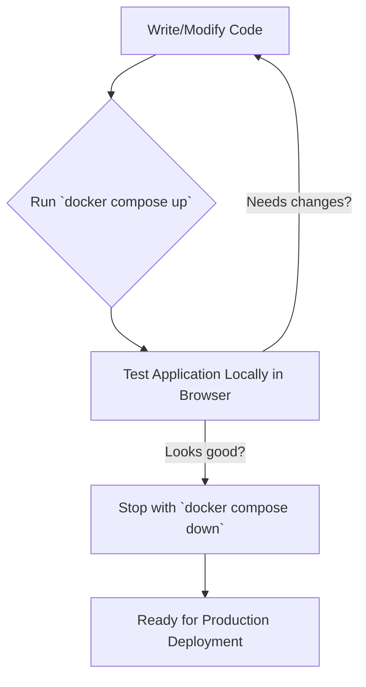
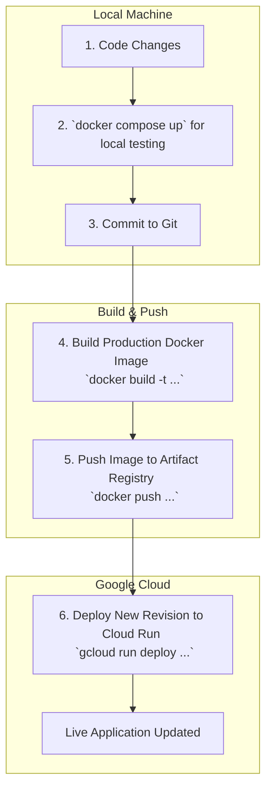

# Guide: Docker Development & Cloud Run Deployment Workflow

This guide provides a complete walkthrough for developing a containerized application locally with Docker and deploying it to Google Cloud Run. It's designed to be a general-purpose guide, using placeholders for project-specific names.

## Your Understanding is Correct!

The core workflow is indeed:
1.  **Develop Locally:** Make code changes and test them in a local environment managed by `docker-compose`.
2.  **Build for Production:** Once satisfied, build a final, production-ready Docker image.
3.  **Push to Registry:** Push this image to a container registry (like Google Artifact Registry).
4.  **Deploy:** Update your Cloud Run service to use the new image.

---

## 1. Prerequisites: The One-Time Setup

Before you start, ensure your machine is ready.

### Docker

You need Docker to build and run containers.

*   **Dependency:** Docker Desktop (or Docker Engine on Linux).
*   **How to Check:** The Docker daemon must be running. Open your terminal and run:
    ```bash
    docker info
    ```
    If you don't get an error, you're good to go.

### Google Cloud SDK (`gcloud`)

This is the command-line tool for interacting with your Google Cloud account.

*   **Dependency:** Google Cloud SDK.
*   **How to Check Login Status:**
    ```bash
    # See which account is active
    gcloud auth list
    ```
*   **How to Log In (if needed):**
    ```bash
    gcloud auth login
    ```
*   **Set Your Project:** Tell `gcloud` which project to work on.
    ```bash
    gcloud config set project YOUR_PROJECT_ID
    ```
*   **Enable APIs:** You only need to do this once per project.
    ```bash
    gcloud services enable run.googleapis.com artifactregistry.googleapis.com
    ```

---

## 2. The Development Workflow

This is the cycle you'll repeat as you build and improve your application.

### Step 1: Local Development with Docker Compose

`docker-compose` is perfect for local development. It reads a `docker-compose.yml` file to start your app and any other services it needs (like a database). This setup often uses a development-focused `Dockerfile` with tools like hot-reloading.

```bash
# Start the application in the background
docker compose up -d

# View logs
docker compose logs -f

# Stop the application
docker compose down
```

The local development loop looks like this:



---

## 3. The Deployment Workflow

Once your code is ready, it's time to deploy it to the world.

### Step 2: Build the Production Docker Image

This step uses your production `Dockerfile` to create a lean, optimized image for deployment.

#### Image Naming Best Practices
A good image name is descriptive and easy to track. The standard format for Google Artifact Registry is:

**`REGION-docker.pkg.dev/PROJECT_ID/REPO_NAME/IMAGE_NAME:TAG`**

*   **`REGION`**: e.g., `us-central1`
*   **`PROJECT_ID`**: Your unique Google Cloud project ID.
*   **`REPO_NAME`**: The name of the Artifact Registry repository you created.
*   **`IMAGE_NAME`**: The name of your application.
*   **`TAG`**: A version identifier. While `latest` is common, it's better to use a **Git commit hash** (`git rev-parse --short HEAD`) or a **semantic version** (e.g., `v1.2.1`) for traceability.

#### Build Command

```bash
# Best practice: use an environment variable for the full image name
export IMAGE_NAME="us-central1-docker.pkg.dev/YOUR_PROJECT_ID/YOUR_REPO_NAME/YOUR_APP_NAME:$(git rev-parse --short HEAD)"

# Build the image
docker build -t $IMAGE_NAME .
```

### Step 3: Push the Image to Artifact Registry

First, you need to authorize Docker to connect to your Google Cloud repository. You only need to do this once per region or until the login expires.

```bash
# Configure Docker credentials for your region
gcloud auth configure-docker us-central1-docker.pkg.dev

# Push the image
docker push $IMAGE_NAME
```

### Step 4: Deploy to Cloud Run

This command tells Cloud Run to create a new **revision** for your service using the image you just pushed.

*   **New vs. Existing Deployment:** The `gcloud run deploy` command is smart. If a service with the name `YOUR_SERVICE_NAME` already exists, it updates it. If it doesn't exist, it creates it. You don't need a different command.

```bash
gcloud run deploy YOUR_SERVICE_NAME \
  --image=$IMAGE_NAME \
  --region=us-central1 \
  --platform=managed \
  --allow-unauthenticated
  # ... add other flags for memory, CPU, etc. as needed
```

### Full Workflow Summary

Here is a diagram of the end-to-end process:



I hope this guide clarifies the entire process for you. It's a powerful and repeatable workflow once you get the hang of it!

<!--
[PROMPT_SUGGESTION]Create a `cloudbuild.yaml` file to automate the build and deploy steps whenever I push to the main branch.[/PROMPT_SUGGESTION]
[PROMPT_SUGGESTION]Explain the difference between the development `Dockerfile.dev` and the production `Dockerfile` and why both are useful.[/PROMPT_SUGGESTION]
