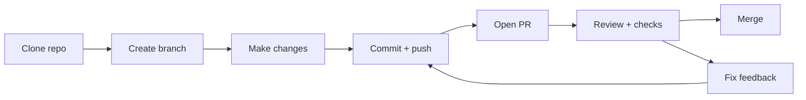

  Beginner friendly
  Visual walkthrough
  Safer shipping

  

    

      
The simple version

      <h2 className="m-0 text-3xl font-semibold tracking-tight text-slate-950 dark:text-white sm:text-4xl">Clone the repo, make your change on a branch, open a PR, get it checked, then merge safely.</h2>
      

        That really is the whole thing. Git gives you some breathing room. You can make a change, check it, and only bring it back into the shared codebase once it has had a proper look from people and from the usual automation.
      

      

        

          
Why Git

          
You can experiment without breaking everyone else's work.

        

        

          
Why branches

          
Each change stays isolated until the team is happy with it.

        

        

          
Why PRs

          
Reviews, tests, scans, and AI comments can all happen before merge.

        

      

    

    

      
Workflow snapshot

      

        {[
          "1. Clone the repo",
          "2. Create or switch to your branch",
          "3. Make the change",
          "4. Commit and push",
          "5. Open a pull request",
          "6. Review, fix, merge",
        ].map((item) => (
          

            +
            {item}
          

        ))}
      

    

  

If you are new to Git, this is the mindset shift that helps most:

> You are not editing the shared codebase directly.
>
> You are making a safe copy of the current state, doing your work on your own branch, and only asking to merge it back once it has been checked.

## Why teams work this way

  

    
Without a process

    <ul className="m-0 mt-4 space-y-3 pl-5 text-sm leading-6 text-slate-700 dark:text-slate-300">
      <li>People can overwrite each other.</li>
      <li>It is harder to understand what changed and why.</li>
      <li>Risky code can land without review.</li>
      <li>There is no obvious pause for tests, scans, or discussion.</li>
    </ul>
  

  

    
With branches and PRs

    <ul className="m-0 mt-4 space-y-3 pl-5 text-sm leading-6 text-emerald-900 dark:text-emerald-100">
      <li>Changes are isolated until they are ready.</li>
      <li>Teammates can review the diff and suggest fixes.</li>
      <li>Automated checks can run before merge.</li>
      <li>Extra review layers such as CodeRabbit or Devin-style PR review can join the process too.</li>
    </ul>
  

That is why PRs matter. They are not just some GitHub ceremony people go through because "that is the process." They are the handoff point between "I changed something" and "this now belongs in the main codebase."

## The workflow at a glance

## Step 1: Clone the repo

This gives you a local copy of the project on your machine.

<WorkflowFrame eyebrow="Step 1" title="Clone the repository" tone="ink" footer="You only need to clone a repo once per machine. After that, you just pull the latest changes.">
  

    <TerminalLine>git clone https://github.com/your-team/project-name.git</TerminalLine>
    <TerminalLine>cd project-name</TerminalLine>
    <TerminalNote>Cloning into 'project-name'...</TerminalNote>
    <TerminalNote>remote: Enumerating objects: 428, done.</TerminalNote>
    <TerminalNote>Receiving objects: 100% (428/428), done.</TerminalNote>
  

</WorkflowFrame>

At this point, nothing fancy has happened. You just have the project on your machine.

## Step 2: Switch to a branch for your work

Branches let you work on your own copy of the code history without disturbing `main`.

<WorkflowFrame eyebrow="Step 2" title="Create a branch for your change" tone="ocean" footer="Branch names are usually short descriptions of the work, for example `fix-login-copy` or `add-pricing-faq`.">
  

    

      <TerminalLine>git switch -c fix-homepage-cta</TerminalLine>
      <TerminalNote>Switched to a new branch 'fix-homepage-cta'</TerminalNote>
      

      <TerminalLine>git status</TerminalLine>
      <TerminalNote>On branch fix-homepage-cta</TerminalNote>
      <TerminalNote>nothing to commit, working tree clean</TerminalNote>
    

    

      
Why branch first?

      <ul className="m-0 space-y-2 pl-5 text-sm leading-6 text-slate-600 dark:text-slate-300">
        <li>Your work stays separate from the shared branch.</li>
        <li>If you make a mess, the mess stays on your branch.</li>
        <li>When you open a PR, GitHub can compare your branch against `main` clearly.</li>
      </ul>
    

  

</WorkflowFrame>

If your team already made changes since you last synced, pull the latest `main` before you begin.

## Step 3: Make your change and save it

Now you do the actual work: edit files, test locally, and check what changed.

<WorkflowFrame eyebrow="Step 3" title="Work locally and inspect the change" tone="forest" footer="Run your app or tests here if the project has them. The goal is to catch obvious mistakes before you involve the rest of the team.">
  

    

      
Your loop

      <ol className="m-0 mt-3 space-y-2 pl-5 text-sm leading-6 text-slate-700 dark:text-slate-200">
        <li>Edit the file.</li>
        <li>Refresh the app or run the relevant command.</li>
        <li>Check that the change behaves the way you expected.</li>
        <li>Run <code>git status</code> to see what Git noticed.</li>
      </ol>
    

    

      <TerminalLine>git status</TerminalLine>
      <TerminalNote>On branch fix-homepage-cta</TerminalNote>
      <TerminalNote>Changes not staged for commit:</TerminalNote>
      <TerminalNote>modified:   src/components/hero.tsx</TerminalNote>
      <TerminalNote>modified:   src/app/globals.css</TerminalNote>
    

  

</WorkflowFrame>

This part is a bit boring, and honestly that is good. Most healthy Git workflows are made up of small, understandable changes.

## Step 4: Commit and push your branch

A commit is a saved checkpoint with a message explaining what changed.

<WorkflowFrame eyebrow="Step 4" title="Save a checkpoint, then push it to GitHub" tone="ink" footer="Think of commits as named save points. The PR is the conversation around those save points.">
  

    <TerminalLine>git add src/components/hero.tsx src/app/globals.css</TerminalLine>
    <TerminalLine>git commit -m "Improve homepage CTA clarity"</TerminalLine>
    <TerminalNote>[fix-homepage-cta 8d21f7a] Improve homepage CTA clarity</TerminalNote>
    <TerminalLine>git push -u origin fix-homepage-cta</TerminalLine>
    <TerminalNote>Branch 'fix-homepage-cta' set up to track 'origin/fix-homepage-cta'.</TerminalNote>
  

</WorkflowFrame>

Once the branch is pushed, GitHub has something to compare against `main`.

## Step 5: Raise a pull request

This is the review stage. You are basically saying, "Here is my branch. Can someone compare it with `main` and tell me if this is ready to merge?"

<WorkflowFrame eyebrow="Step 5" title="What a healthy pull request is doing for you" tone="sunset" footer="The PR is where process protects the codebase: reviews, tests, scans, and discussion all happen before merge.">
  

    

      

        <ReviewPill tone="success">2 approvals</ReviewPill>
        <ReviewPill tone="success">CI checks passing</ReviewPill>
        <ReviewPill tone="neutral">Security scan complete</ReviewPill>
        <ReviewPill tone="neutral">Code review notes addressed</ReviewPill>
      

      

        
PR title

        
Improve homepage CTA clarity

        

          

            
Reviewers

            
Teammates check the code, the screenshots, and the reasoning.

          

          

            
Automation

            
Tests, linting, scans, and AI review tools can all comment here.

          

        

      

    

    

      
Why PRs help

      <ul className="m-0 mt-3 space-y-2 pl-5 text-sm leading-6 text-amber-900 dark:text-amber-50">
        <li>Someone else can spot bugs or edge cases you missed.</li>
        <li>Automated checks can block obvious breakage.</li>
        <li>Security and code scanning tools get a defined place to run.</li>
        <li>AI review tools can highlight risky diff patterns early.</li>
        <li>The team gets a clear record of why the change happened.</li>
      </ul>
    

  

</WorkflowFrame>

Examples of checks around a PR:

- a teammate reading the diff
- automated tests and linting
- security scanning
- code quality tools
- AI review systems such as CodeRabbit or Devin-style PR review interfaces

The exact tools vary from team to team, but the point stays the same. The PR is the safety checkpoint.

## GitHub Desktop is genuinely useful

If you do not enjoy the command line, that is fine. A lot of people find [GitHub Desktop](https://desktop.github.com/) much easier when they are getting started.

It is especially helpful for:

- seeing changed files without memorising commands
- reviewing diffs in a calmer way
- creating branches without worrying about syntax
- committing and pushing without hopping between tabs
- resolving simple conflicts with a more guided interface

The CLI is still worth learning over time because it gives you the most flexibility. But you do not need to prove terminal toughness to work well with Git. If GitHub Desktop helps you stay consistent and less stressed, use it.

## You can automate a lot of this with agents

This is the part that has changed a lot recently.

If you give an agent access to `git` and the `gh` CLI, a big chunk of the mechanics can be handled for you:

- creating or switching branches
- checking `git status`
- staging and committing changes
- pushing the branch
- opening a PR with `gh pr create`
- checking comments, reviews, and CI status with `gh pr view`

That does not mean "let the agent merge anything it wants." The useful pattern is usually:

1. let the agent handle the repetitive Git and GitHub steps
2. let humans review the actual change
3. keep merge permission and final judgment in the loop unless you really trust the automation

In practice this means the annoying parts can be mostly automated while the important decision-making still gets a proper review.

If you work this way, Git starts to feel less like a chore and more like a shared log of what changed, why, and what still needs a second pair of eyes.

## Step 6: Merge the PR

Once the reviews are complete and the checks are green, the PR can be merged into `main`.

<WorkflowFrame eyebrow="Step 6" title="Merge when the branch is ready" tone="ocean" footer="After merge, many teams delete the branch because the work is now part of the shared history.">
  

    

      
Before merge

      
Make sure the PR is targeting the correct base branch and all required checks passed.

    

    

      
At merge

      
GitHub combines your branch into `main`, preserving the review history and discussion.

    

    

      
After merge

      
Pull the latest `main` locally before starting your next piece of work.

    

  

</WorkflowFrame>

## What about merge conflicts?

Conflicts happen when Git cannot safely combine two sets of edits by itself.

It sounds worse than it usually is. The basic version is normally this:

- you changed a line
- someone else changed the same line
- Git needs a human to decide which version should win

<WorkflowFrame eyebrow="Conflicts" title="How a simple conflict looks" tone="sunset" footer="The only real job here is to decide what the final content should be, then mark the conflict as resolved.">
  

    

      <pre className="m-0 overflow-x-auto rounded-2xl bg-slate-950 p-4 text-[13px] leading-6 text-slate-100">
{`<<<<<<< HEAD
<button>Start free trial</button>
=======
<button>Book a demo</button>
>>>>>>> origin/main`}
      </pre>
    

    

      
What this means

      <ul className="m-0 mt-3 space-y-2 pl-5 text-sm leading-6 text-slate-700 dark:text-slate-200">
        <li><code>HEAD</code> is your version.</li>
        <li><code>origin/main</code> is the incoming version.</li>
        <li>You pick the right final text, then delete the conflict markers.</li>
      </ul>
    

  

</WorkflowFrame>

### A simple conflict-fix flow

<WorkflowFrame eyebrow="Conflict fix" title="Resolve, test, continue" tone="ink" footer="If you are unsure which version is correct, stop and ask. Guessing is worse than pausing.">
  

    <TerminalLine>git fetch origin</TerminalLine>
    <TerminalLine>git merge origin/main</TerminalLine>
    <TerminalNote>Auto-merging src/components/hero.tsx</TerminalNote>
    <TerminalNote>CONFLICT (content): Merge conflict in src/components/hero.tsx</TerminalNote>
    

    <TerminalNote>1. Open the file and remove the conflict markers.</TerminalNote>
    <TerminalNote>2. Keep the final version you actually want.</TerminalNote>
    <TerminalNote>3. Test the result.</TerminalNote>
    <TerminalLine>git add src/components/hero.tsx</TerminalLine>
    <TerminalLine>git commit</TerminalLine>
  

</WorkflowFrame>

If your team prefers rebasing instead of merging, the commands will look a bit different. The beginner-friendly idea stays the same: bring in the latest shared work, fix the conflicting file, then keep going.

## The cheat sheet

| Goal | Command or action |
| --- | --- |
| Clone the repo | `git clone <repo-url>` |
| Enter the project | `cd <repo-folder>` |
| Create and switch branch | `git switch -c <branch-name>` |
| See what changed | `git status` |
| Stage files | `git add <files>` |
| Save a checkpoint | `git commit -m "message"` |
| Push branch to GitHub | `git push -u origin <branch-name>` |
| Open PR | Usually done in GitHub after pushing |
| Bring in latest `main` | `git fetch origin` then `git merge origin/main` |

## Final takeaway

Git is not there to make life harder. It is there to stop a shared codebase from turning into guesswork.

The shape is simple:

1. Clone the repo.
2. Create a branch.
3. Make your change.
4. Commit and push.
5. Open a PR.
6. Let people and tools check it.
7. Merge when it is ready.

That little bit of process is what lets teams move quickly without turning the codebase into chaos.
