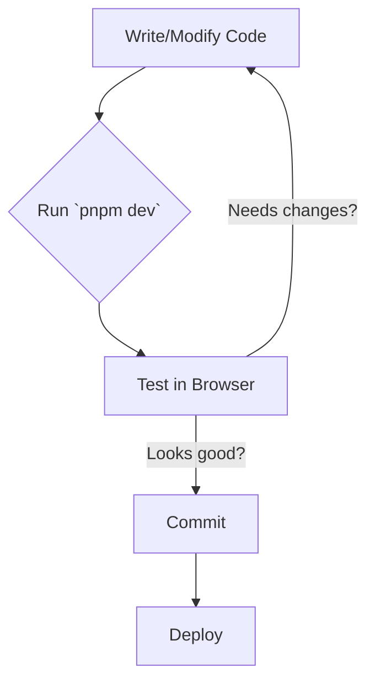

Welcome to your new blog powered by Velite + Next.js.

This post exercises our MDX → shadcn mapping. Try toggling dark mode and verify everything looks right.

## Table of contents

| Section |
| --- |
| [Headings](#headings) |
| [Paragraphs, links, and inline code](#paragraphs-links-and-inline-code) |
| [Blockquote → Alert](#blockquote-alert) |
| [Lists](#lists) |
| [Table](#table) |
| [Code blocks](#code-blocks) |

## Headings

# H1 Title

Some intro text under H1.

## H2 Section

### H3 Subsection

#### H4 Sub-subsection

##### H5

###### H6

## Paragraphs, links, and inline code

This paragraph has an internal link to [the blog index](/blog) and an external link to [shadcn/ui](https://ui.shadcn.com/). It also shows `inline code` within text.

You can also use strikethrough via GFM: ~~deprecated~~ now replaced.

---

## Blockquote → Alert

> Pro tip: Use MDX with a components map to render Markdown elements via shadcn/ui primitives for consistent styling.

---

## Lists

Unordered list:

- First item
- Second item
  - Nested item
- Third item

Ordered list:

1. Step one
2. Step two
3. Step three

Task list (GFM):

- [x] Set up MDX
- [x] Map components
- [ ] Polish visuals

---

## Table

| Feature        | Status     | Notes |
| -------------- | ---------- | ----- |
| MDX            | Enabled    | via `s.mdx()` |
| GFM            | Enabled    | tables, task lists |
| Headings       | Autolinked | rehype-slug + autolink |
| Code blocks    | Highlighted| rehype-pretty-code + copy |

<small>Caption: Feature matrix</small>

---

## Code blocks

Typescript:

```ts
export function greet(name: string) {
  return `Hello, ${name}!`
}

console.log(greet("MDX"))
```

Shell:

```bash
pnpm add remark-gfm rehype-slug rehype-autolink-headings
```

---

## Mermaid diagram


