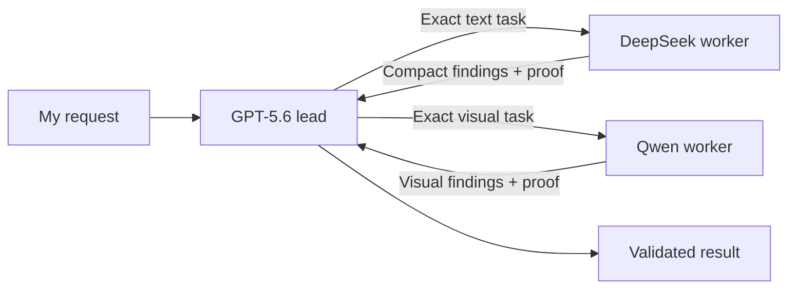

> **Canonical update (2026-08-29)**: This article is a field note in the multi-agent journey. The consolidated through-line is [The multi-agent journey](/blog/the-multi-agent-journey-what-survived-contact-with-reality).

  One lead, specialist workers
  OpenRouter-backed
  Measured where possible

<ArticleFigure
  src="/images/blog/multi-agent/openrouter-multi-agent-hero.png"
  alt="A central decision desk connected to specialist workstations that turn large piles of information into small evidence packets"
  eyebrow="The new shape of the work"
  title="The expensive model leads. The specialists carry the bulk."
  caption="Raw files, test output and visual checks are handled outside the lead model. Small, useful findings come back for a final decision."
/>

I had built an increasingly capable Codex setup, but I had also created an expensive habit.

The best OpenAI model was reading almost everything: source files, long logs, screenshots, repeated searches, build output and the full history of earlier decisions. It was acting as strategist, researcher, developer, tester and proofreader at the same time.

That works. It is also a poor use of the most expensive attention in the system.

So I changed the job. The OpenAI model now leads the work. It decides what needs doing, divides the task into bounded assignments, checks the returned evidence and makes the final call. Lower-cost models reached through OpenRouter do much of the reading, implementation and testing.

The simple version is this:

> I stopped paying the lead to sit through every page of supporting material. It now receives the brief, the important evidence and the decision it needs to make.

## The short version

  

    
Lead

    
GPT-5.6

    
Understands the request, assigns work, checks evidence and answers me.

  

  

    
Text workers

    
DeepSeek

    
Reads files, drafts, implements, researches and runs tests.

  

  

    
Visual worker

    
Qwen

    
Inspects screenshots, interfaces, diagrams and other visual evidence.

  

  

    
Working limit

    
3 slots

    
A small queue prevents a crowd of agents duplicating the same work.

  

All four roles use high reasoning effort. That matters to me: delegation should change who does the work, not quietly lower the standard of thought.

## Why tokens become a cost problem

AI systems do not read text as pages or words. They read **tokens**, small pieces of text. A short word may be one token; a longer word may be several. Code, data and tool output count too.

Every time the lead model needs the growing conversation again, much of that material can be processed again. A large result early in a long task can therefore keep affecting later turns.

  <ArticleExplain term="Token">A small piece of text read or written by a model. Model usage is commonly measured in tokens.</ArticleExplain>
  <ArticleExplain term="Context">The working material the model receives for a turn: instructions, conversation, files and tool results.</ArticleExplain>
  <ArticleExplain term="Compaction">A summary made when a conversation becomes too large to keep in full.</ArticleExplain>
  <ArticleExplain term="OpenRouter">A service that lets one application send work to models from different providers through one interface.</ArticleExplain>

The expensive part was not only the final answer. It was repeatedly carrying raw working material inside the OpenAI lead's context.

## The old flow and the new flow

  

    
Before

    <h3 className="mt-3 text-xl font-semibold text-rose-950 dark:text-rose-50">Everything passed through the lead</h3>
    

      
Read many source files

      
Run tools and absorb their full output

      
Implement the change

      
Run and interpret every test

      
Remember all of it while answering

    

    
Result: the premium model carries both the decision and the bulk material.

  

  

    
Now

    <h3 className="mt-3 text-xl font-semibold text-emerald-950 dark:text-emerald-50">Specialists return compact evidence</h3>
    

      
Lead defines one exact assignment

      
Worker receives only the files it needs

      
Worker reads, changes or tests them

      
Worker returns findings and proof

      
Lead checks the result and decides

    

    
Result: OpenAI sees the decision material, while OpenRouter handles more of the supporting work.

  

The workers do not receive the whole conversation by default. They get the smallest complete package: the goal, the relevant files and the evidence they need. Credentials and unrelated private material stay out of those packages.

## How this changes the bill

There is no magic removal of cost. The cost moves and, when the system behaves properly, shrinks at the expensive end.

  

    

      
OpenRouter workers receive

      
The bulky working material

      <ul className="mt-4 space-y-2 text-sm leading-6 text-slate-600 dark:text-slate-300">
        <li>Relevant files and documentation</li>
        <li>Test commands and their output</li>
        <li>Search results and comparisons</li>
        <li>Screenshots for visual review</li>
      </ul>
    

    

    

      
OpenAI lead receives

      
The smaller decision package

      <ul className="mt-4 space-y-2 text-sm leading-6 text-slate-300">
        <li>What the worker changed or found</li>
        <li>The evidence that it works</li>
        <li>Risks, failures and open questions</li>
        <li>Enough detail to verify the result</li>
      </ul>
    

  

Each model request is charged according to how much text it processes and produces. Keeping bulky working material away from the lead therefore reduces the amount OpenAI has to process. Large intermediate outputs are handled elsewhere and returned as shorter reports.

The OpenRouter calls have their own bill, so the honest comparison is not “paid versus free.” It is **work moved from the more expensive lead to lower-cost specialists**, plus a smaller lead-model review.

The exact saving will vary by task. A short question may not benefit at all. A long task involving dozens of files, test logs or screenshots can benefit much more.

## What the historical evidence says

I built a usage-reporting tool and froze a real, unusually large TradeHero session so the numbers could be reproduced. An independent checker then calculated the totals again with a separate parser.

  

    
257.5m

    
Measured parent workload

    
Tokens processed across the recorded context windows. This is workload evidence, not an invoice total.

  

  

    
13

    
Context windows

    
The conversation was compacted 12 times as it grew.

  

  

    
1,581

    
Parent worker-level calls

    
File, shell and other supporting work carried out in the main conversation.

  

  

    
5.67 MB

    
Tool-output text

    
The raw output returned by tools during the session.

  

  

    
~1.41m

    
Tool-output token proxy

    
An approximation, not a provider billing figure.

  

  

    
25,945

    
Recorded worker tokens

    
Prompt and completion tokens reported by three delegated worker calls.

  

The strongest signal is not a promised percentage saving. It is the amount of supporting material that could have been kept out of the OpenAI lead's working memory if more of the session had been delegated properly.

In other words: the old workflow gives us clear evidence of the problem. The new workflow gives us a credible mechanism for reducing it. More comparable sessions are needed before I publish a reliable percentage or cash figure.

## Reliability matters more than a clever diagram

Delegation only saves money if it does not create a second bill for correcting bad work.

The operating rules therefore make the lead responsible for quality:

1. The lead may inspect just enough to define the assignment.
2. A worker receives one bounded task and the exact material it needs.
3. The worker returns evidence, not merely “done.”
4. The lead checks that evidence before reporting completion.
5. A stalled worker is stopped and replaced with a narrower assignment.
6. Completed workers are closed immediately so work does not quietly duplicate.

  
Acceptance result

  
108 / 108 tests passed

  
The checks covered routing, high reasoning settings, duplicate watcher prevention, idle exit, stale process recovery, credential isolation, final delegation checks and reproducible usage totals.

The audit is session-scoped. It starts for significant work, watches only that Codex session and exits after 15 minutes without activity. There is no machine-wide job waking up every ten minutes when Codex is not in use.

## What this proves, and what it does not

  

    
What I can support

    <ul className="mt-4 space-y-3 text-sm leading-6 text-slate-600 dark:text-slate-300">
      <li>The previous workflow placed very large context and tool output in the OpenAI parent session.</li>
      <li>Delegation can move raw supporting work to lower-cost OpenRouter models.</li>
      <li>Compact reports reduce the candidate volume that must return to the lead.</li>
      <li>The routing and audit controls passed their test suite and an independent check.</li>
    </ul>
  

  

    
What I cannot support yet

    <ul className="mt-4 space-y-3 text-sm leading-6 text-slate-600 dark:text-slate-300">
      <li>A guaranteed percentage reduction for every task.</li>
      <li>An exact change to OpenAI account limits, because their quota formula is not present in local logs.</li>
      <li>The claim that worker tokens are free; OpenRouter usage is charged separately.</li>
      <li>A broad before-and-after average from only a handful of delegated sessions.</li>
    </ul>
  

That distinction is important. “We changed the plumbing, therefore the bill fell by 80%” would be a good headline and bad evidence.

The honest conclusion is still useful: I now have a working system designed to reserve OpenAI's expensive context for the work that benefits most from it. The supporting labour can be sent to capable, lower-cost specialists, and the lead remains accountable for the result.

## The part I like most

The biggest improvement is not that several models can run at once. Parallel activity is easy to make impressive and surprisingly easy to make wasteful.

The useful change is **separation of responsibility**.

The lead has to decide. The workers have to show their work. The visual specialist receives actual images. The text specialists receive exact files. A failed route has a defined fallback. A completed worker is closed. A significant session ends with a check that the delegation rules were followed.

That makes the setup easier to reason about, easier to test and much less likely to spend premium tokens on work that did not need a premium model.

The next stage is measurement rather than invention: compare several similar tasks, record the OpenAI parent tokens and OpenRouter worker tokens separately, and publish the real difference. Until then, I would rather show the mechanism and its limits than decorate an estimate with false certainty.

For the related local-model work, see [How I Ran Qwen Locally Inside Codex on an Apple Silicon Mac](/blog/how-i-ran-qwen-locally-inside-codex).
