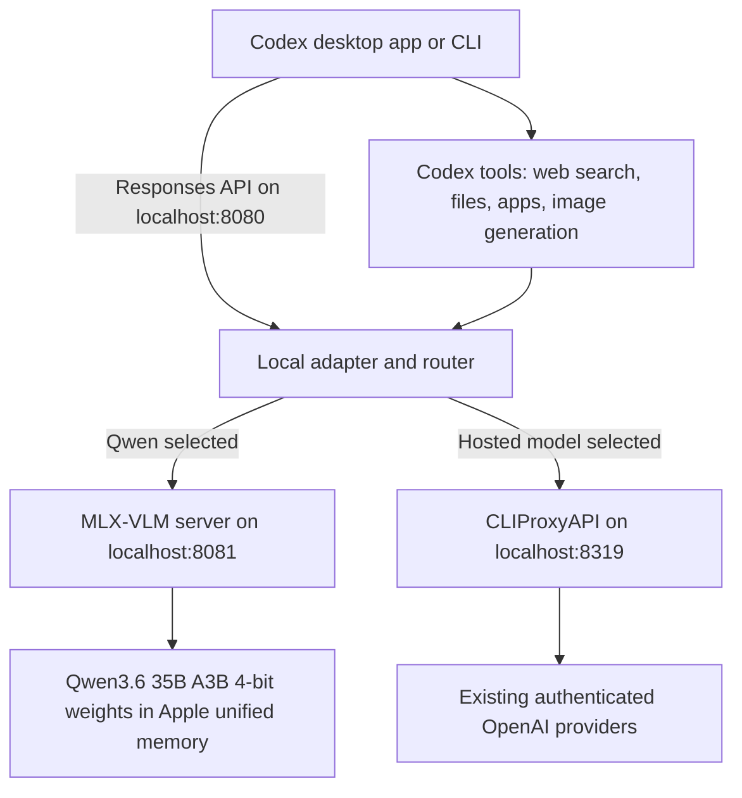
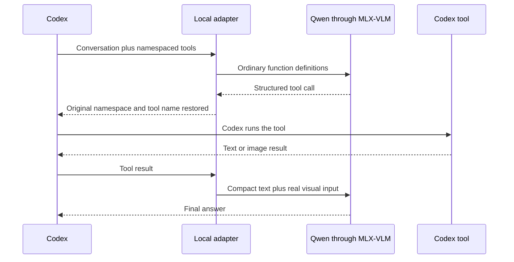
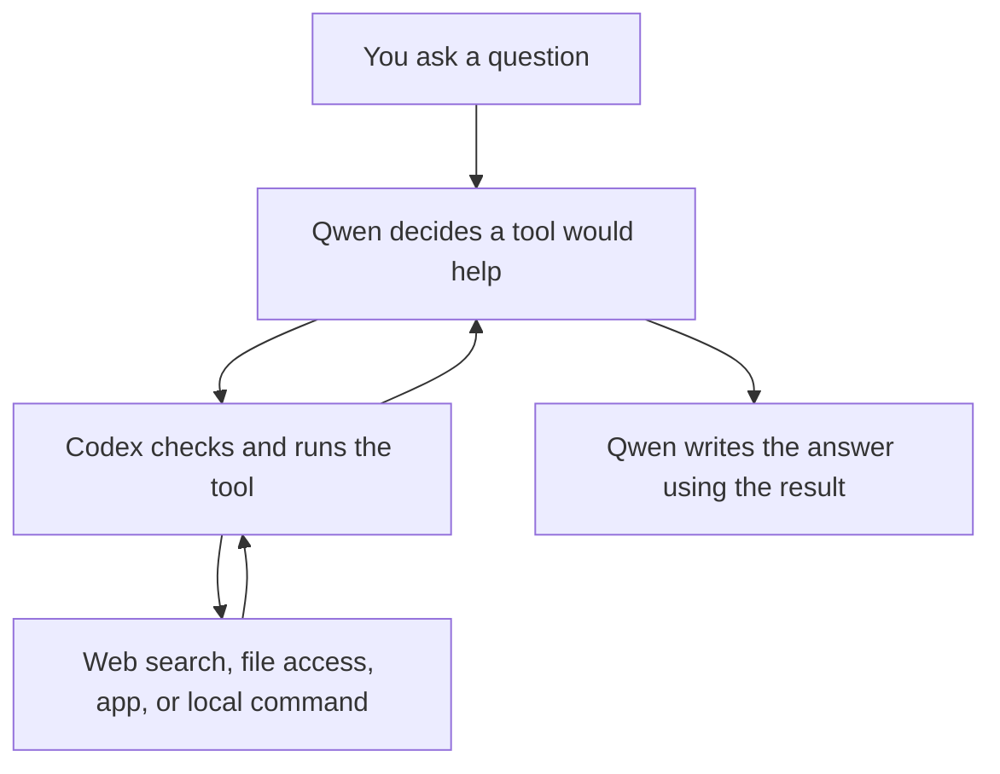

<div className="flex flex-wrap gap-2">
  <span className="inline-flex items-center rounded-full border border-emerald-200 bg-emerald-50 px-3 py-1 text-xs font-medium text-emerald-800 dark:border-emerald-500/25 dark:bg-emerald-500/10 dark:text-emerald-200">Runs on the Mac</span>
  <span className="inline-flex items-center rounded-full border border-sky-200 bg-sky-50 px-3 py-1 text-xs font-medium text-sky-800 dark:border-sky-500/25 dark:bg-sky-500/10 dark:text-sky-200">Text and images</span>
  <span className="inline-flex items-center rounded-full border border-amber-200 bg-amber-50 px-3 py-1 text-xs font-medium text-amber-800 dark:border-amber-500/25 dark:bg-amber-500/10 dark:text-amber-200">No ChatGPT.app modification</span>
</div>

<div className="not-prose my-8 overflow-hidden rounded-[32px] border border-slate-200 bg-[radial-gradient(circle_at_14%_12%,rgba(251,191,36,0.24),transparent_26%),radial-gradient(circle_at_86%_84%,rgba(14,165,233,0.20),transparent_30%),linear-gradient(145deg,rgba(255,255,255,0.98),rgba(248,250,252,0.96))] p-6 shadow-[0_26px_70px_-38px_rgba(15,23,42,0.48)] dark:border-slate-800 dark:bg-[radial-gradient(circle_at_14%_12%,rgba(251,191,36,0.15),transparent_26%),radial-gradient(circle_at_86%_84%,rgba(14,165,233,0.15),transparent_30%),linear-gradient(145deg,rgba(15,23,42,0.98),rgba(30,41,59,0.96))] sm:p-8">
  <div className="grid gap-7 lg:grid-cols-[1.08fr_0.92fr] lg:items-center">
    <div className="space-y-5">
      <div className="m-0 text-xs font-semibold uppercase tracking-[0.28em] text-slate-500 dark:text-slate-400">What I wanted</div>
      <h2 className="m-0 max-w-3xl text-3xl font-semibold tracking-tight text-slate-950 dark:text-white sm:text-4xl">A local Qwen model in the normal Codex model menu, with tools, screenshots, and sensible context limits.</h2>
      <div className="m-0 max-w-2xl text-base leading-7 text-slate-600 dark:text-slate-300">
        I already had the model weights on my Mac. The hard part was not downloading Qwen. It was making several pieces agree on one language: the format Codex sends, the format the local model server accepts, and the metadata the desktop app uses to build its model selector.
      </div>
    </div>
    <div className="rounded-[26px] border border-slate-900/10 bg-slate-950 p-5 text-slate-100 shadow-[inset_0_1px_0_rgba(255,255,255,0.06)]">
      <div className="m-0 text-[11px] font-semibold uppercase tracking-[0.24em] text-slate-400">The finished route</div>
      <div className="mt-5 space-y-3 text-sm">
        <div className="rounded-2xl border border-white/10 bg-white/5 px-4 py-3">
          <div className="text-slate-400">Codex</div>
          <div className="mt-1 font-medium">Desktop app or command line</div>
        </div>
        <div className="flex items-center gap-3 px-3 text-slate-500">
          <div className="h-px flex-1 bg-white/10" />
          <span>127.0.0.1:8080</span>
          <div className="h-px flex-1 bg-white/10" />
        </div>
        <div className="grid gap-3 sm:grid-cols-2">
          <div className="rounded-2xl border border-emerald-400/20 bg-emerald-400/10 p-4">
            <div className="text-xs font-semibold uppercase tracking-[0.18em] text-emerald-300">Local</div>
            <div className="mt-2 font-medium">Qwen through MLX-VLM</div>
          </div>
          <div className="rounded-2xl border border-sky-400/20 bg-sky-400/10 p-4">
            <div className="text-xs font-semibold uppercase tracking-[0.18em] text-sky-300">Hosted</div>
            <div className="mt-2 font-medium">OpenAI through CLIProxyAPI</div>
          </div>
        </div>
      </div>
    </div>
  </div>
</div>

The finished setup works. Qwen appears beside the hosted models in Codex, it can read an attached screenshot, it can ask Codex to use web search and other tools, and its automatic context compression starts at a limit chosen for this local runtime.

If you want to build it rather than read the explanation first, jump to [Build it yourself from a clean Mac](#build-it-yourself-from-a-clean-mac). That section now includes every install command, configuration file, checkpoint, and removal step. The matching [public example kit](https://github.com/Rajeev-SG/rajeevg.com/tree/main/examples/codex-local-qwen) contains the adapter and scripts with no private paths or credentials.

I also managed to break the ChatGPT desktop installation along the way by editing the application bundle. That was the wrong approach. The supported solution is much cleaner: use Codex's user configuration and a custom model catalog.

<ArticleFigure
  src="/images/blog/local-qwen-codex/model-selector.png"
  alt="The Codex model selector showing Qwen3.6 35B A3B Local MLX alongside hosted models"
  eyebrow="The result"
  title="The local model appears in the normal Codex selector"
  caption="This entry comes from a user-level model catalog. The signed ChatGPT application bundle is untouched."
/>

## The short version

There are five jobs in this setup:

1. **Qwen** is the model doing the thinking.
2. **MLX** lets that model run efficiently on Apple Silicon.
3. **MLX-VLM** turns the local model into a server that accepts text and images.
4. **CLIProxyAPI** keeps the existing authenticated hosted models available through the same local gateway.
5. **A small local adapter** translates between Codex and the two backends, including tool names and image-valued tool results.

Codex then reads one normal configuration file and one custom model catalog. That catalog is what puts Qwen in the selector and gives it its own context rules.



Everything binds to `127.0.0.1`, which means the services listen only on this Mac.

## First, what is this Qwen model?

The model is **Qwen3.6-35B-A3B**, using the 4-bit MLX conversion published by the `mlx-community` account on Hugging Face.

That name is a lot, so here is the useful translation:

<div className="not-prose my-8 grid gap-x-8 gap-y-5 border-y border-slate-200 py-7 dark:border-slate-800 md:grid-cols-2">
  <div>
    <div className="text-xs font-semibold uppercase tracking-[0.22em] text-slate-500 dark:text-slate-400">35B</div>
    <div className="mt-2 text-base font-semibold text-slate-950 dark:text-white">About 35 billion total parameters</div>
    <div className="mt-2 text-sm leading-6 text-slate-600 dark:text-slate-300">Parameters are the model's learned numbers. More is not automatically better, but they are one rough measure of model size.</div>
  </div>
  <div>
    <div className="text-xs font-semibold uppercase tracking-[0.22em] text-slate-500 dark:text-slate-400">A3B</div>
    <div className="mt-2 text-base font-semibold text-slate-950 dark:text-white">Roughly 3 billion are active for each token</div>
    <div className="mt-2 text-sm leading-6 text-slate-600 dark:text-slate-300">It is a mixture-of-experts model. Only a subset of the model is used for each small piece of text, which reduces the work per response.</div>
  </div>
  <div>
    <div className="text-xs font-semibold uppercase tracking-[0.22em] text-slate-500 dark:text-slate-400">4-bit</div>
    <div className="mt-2 text-base font-semibold text-slate-950 dark:text-white">The weights are compressed for local use</div>
    <div className="mt-2 text-sm leading-6 text-slate-600 dark:text-slate-300">This is called quantisation. The local files are about 19 GB, small enough to run on my 48 GB Mac while leaving room for the operating system and the model's working memory.</div>
  </div>
  <div>
    <div className="text-xs font-semibold uppercase tracking-[0.22em] text-slate-500 dark:text-slate-400">VLM</div>
    <div className="mt-2 text-base font-semibold text-slate-950 dark:text-white">Vision-language model</div>
    <div className="mt-2 text-sm leading-6 text-slate-600 dark:text-slate-300">It can work with language and visual input. In plain English: it can read text and inspect an image.</div>
  </div>
</div>

<div className="flex flex-wrap gap-2">
  <ArticleExplain term="Parameter">A learned number inside a model. Billions of them work together to turn input into predictions.</ArticleExplain>
  <ArticleExplain term="Token">A small piece of text the model reads or writes. A word may be one token or several.</ArticleExplain>
  <ArticleExplain term="Quantisation">Storing model numbers with fewer bits so the model uses less memory, usually with a small quality trade-off.</ArticleExplain>
  <ArticleExplain term="Unified memory">Apple Silicon lets the CPU and GPU use the same pool of memory instead of copying data between separate pools.</ArticleExplain>
</div>

The original Qwen model card advertises a context length of 262,144 tokens. I did not use that full number locally. Long context needs a large **KV cache**, the model's short-term working memory for the conversation. I capped the local runtime at 163,840 tokens so it would fit reliably on this machine.

## What MLX and MLX-VLM do

[MLX](https://github.com/ml-explore/mlx) is Apple's open-source machine-learning framework for Apple Silicon. It is designed around the Mac's unified memory, so the model can run on the same memory pool used by the CPU and GPU.

[MLX-VLM](https://github.com/Blaizzy/mlx-vlm) is the vision-language layer. It knows how to load models that understand images and expose them through HTTP endpoints that look like familiar AI APIs.

In this setup, MLX-VLM runs on port `8081`:

<WorkflowFrame eyebrow="Local model server" title="The important MLX-VLM settings" tone="ink" footer="The exact model path is pinned so the server does not silently fetch or switch revisions.">
  <div className="space-y-2 rounded-[22px] border border-white/8 bg-black/20 p-4">
    <TerminalLine>mlx_vlm.server --model /path/to/Qwen3.6-35B-A3B-4bit</TerminalLine>
    <TerminalLine>--host 127.0.0.1 --port 8081</TerminalLine>
    <TerminalLine>--max-kv-size 163840 --kv-bits 8</TerminalLine>
    <TerminalLine>--max-tokens 4096 --vision-cache-size 8</TerminalLine>
  </div>
</WorkflowFrame>

The server makes local Qwen look like an API. That is necessary, but it is not enough for Codex.

## Why Codex needs another layer

Codex is more than a chat box. It sends structured conversation items, tool definitions, tool calls, tool results, images, and streaming events. The protocol used here is the [OpenAI Responses API](https://developers.openai.com/api/reference/resources/responses/methods/create).

MLX-VLM supports the broad idea, but Codex has some details that a local model server does not understand on its own. Two examples caused real problems:

- Codex groups connected tools into named namespaces. Qwen's tool parser expects ordinary function definitions.
- A tool can return an image. That image must stay an image, not become a giant base64 text string.

The local adapter on port `8080` handles those differences.



For example, a Codex tool may arrive as a namespace called `mcp__brave` containing a function called `brave_web_search`. The adapter temporarily flattens that into one normal function name Qwen can call. When Qwen responds, the adapter restores the original namespace before sending the call back to Codex.

It also sends only the connected-tool groups relevant to the request. A local model does not need hundreds of unrelated definitions on every turn.

## What CLIProxyAPI is doing here

[CLIProxyAPI](https://github.com/router-for-me/CLIProxyAPI) is a local gateway that exposes compatible API endpoints for authenticated command-line model providers.

I use it so the hosted OpenAI models do not disappear when Codex is pointed at the local router. The adapter makes one decision:

- if the selected model is Qwen, send the request to MLX-VLM on `8081`;
- otherwise, send it to CLIProxyAPI on `8319`.

That gives Codex one provider URL while keeping both local and hosted models available.

<div className="not-prose my-8 grid gap-5 lg:grid-cols-[0.9fr_1.1fr]">
  <div className="rounded-[26px] border border-emerald-200 bg-emerald-50/70 p-5 dark:border-emerald-500/20 dark:bg-emerald-500/10">
    <div className="text-xs font-semibold uppercase tracking-[0.22em] text-emerald-800 dark:text-emerald-300">Qwen selected</div>
    <div className="mt-3 text-lg font-semibold text-emerald-950 dark:text-emerald-50">The request stays on the Mac</div>
    <div className="mt-2 text-sm leading-6 text-emerald-900 dark:text-emerald-100">The model inference runs through MLX-VLM. A connected tool may still contact an outside service when I explicitly ask Codex to use it.</div>
  </div>
  <div className="rounded-[26px] border border-sky-200 bg-sky-50/70 p-5 dark:border-sky-500/20 dark:bg-sky-500/10">
    <div className="text-xs font-semibold uppercase tracking-[0.22em] text-sky-800 dark:text-sky-300">Hosted model selected</div>
    <div className="mt-3 text-lg font-semibold text-sky-950 dark:text-sky-50">CLIProxyAPI forwards the request</div>
    <div className="mt-2 text-sm leading-6 text-sky-900 dark:text-sky-100">The existing authenticated provider handles the model request. Codex still sees the same front door on port 8080.</div>
  </div>
</div>

## The correct way to add Qwen to the Codex model selector

This was the part I initially got wrong.

I first treated the model list as if it were a hidden desktop-app feature that had to be patched inside `ChatGPT.app`. Changing files inside a signed macOS application invalidates the app bundle. The predictable result is an application that may stop opening and can be replaced by the next reinstall or update.

Codex already has a supported user-level route. The [Codex configuration reference](https://learn.chatgpt.com/docs/config-file/config-reference) documents `~/.codex/config.toml`, custom model providers, and `model_catalog_json`. The [advanced configuration guide](https://learn.chatgpt.com/docs/config-file/config-advanced) covers provider configuration in more detail.

The working user configuration is conceptually this:

```toml
model = "qwen3.6-35b-a3b-mlx"
model_provider = "local_qwen_router"
model_catalog_json = "/Users/you/path/to/codex-local-qwen/config/merged-model-catalog.json"

[model_providers.local_qwen_router]
name = "OpenAI + Local Qwen"
base_url = "http://127.0.0.1:8080/v1"
wire_api = "responses"
experimental_bearer_token = "replace-with-a-local-only-key"
requires_openai_auth = false
supports_websockets = false
```

Replace `/Users/you` with the actual home directory, and use the same local-only key in the router. `wire_api = "responses"` tells Codex which request format the provider accepts. CLIProxyAPI owns the hosted-model sign-in, so Codex only authenticates to the local router here.

The model catalog contains the entry Codex displays:

```json
{
  "slug": "qwen3.6-35b-a3b-mlx",
  "display_name": "Qwen3.6 35B A3B (Local MLX)",
  "visibility": "list",
  "input_modalities": ["text", "image"],
  "context_window": 163840,
  "auto_compact_token_limit": 150000,
  "truncation_policy": {
    "mode": "tokens",
    "limit": 156000
  }
}
```

Three fields do most of the visible work:

- `visibility: "list"` makes the model eligible for the selector.
- `display_name` gives it the readable label shown in the screenshot.
- `input_modalities` tells Codex the model accepts both text and images.

<div className="not-prose my-9 overflow-hidden rounded-[30px] border border-slate-200 dark:border-slate-800">
  <div className="grid md:grid-cols-2">
    <div className="bg-rose-50 p-6 dark:bg-rose-500/10">
      <div className="text-xs font-semibold uppercase tracking-[0.24em] text-rose-700 dark:text-rose-300">Wrong route</div>
      <div className="mt-3 text-xl font-semibold text-rose-950 dark:text-rose-50">Modify files inside ChatGPT.app</div>
      <ul className="mt-4 space-y-2 pl-5 text-sm leading-6 text-rose-900 dark:text-rose-100">
        <li>Breaks the signed macOS application bundle.</li>
        <li>Can stop the app from opening.</li>
        <li>Gets overwritten by reinstalling or updating.</li>
      </ul>
    </div>
    <div className="border-t border-slate-200 bg-emerald-50 p-6 dark:border-slate-800 dark:bg-emerald-500/10 md:border-l md:border-t-0">
      <div className="text-xs font-semibold uppercase tracking-[0.24em] text-emerald-700 dark:text-emerald-300">Supported route</div>
      <div className="mt-3 text-xl font-semibold text-emerald-950 dark:text-emerald-50">Use config.toml plus model_catalog_json</div>
      <ul className="mt-4 space-y-2 pl-5 text-sm leading-6 text-emerald-900 dark:text-emerald-100">
        <li>Keeps the official app untouched.</li>
        <li>Works for the desktop app and Codex CLI.</li>
        <li>Lets the local model carry its own limits and capabilities.</li>
      </ul>
    </div>
  </div>
</div>

The catalog is read when Codex starts. After changing it, restart Codex so the selector is rebuilt from the new file.

## Context compression, without the hand waving

Every turn adds more material to the conversation: messages, instructions, code, tool definitions, tool results, and sometimes images. The model cannot keep an unlimited amount in its working context.

Codex deals with long conversations by compacting older history into a shorter summary. The important detail is **when** that happens.

The local Qwen runtime is capped at 163,840 tokens. I set automatic compaction to start at 150,000, then set a truncation limit of 156,000. That leaves a small buffer for the next request and response.

<div className="not-prose my-9 rounded-[30px] border border-slate-200 bg-white p-6 shadow-sm dark:border-slate-800 dark:bg-slate-950/60">
  <div className="flex flex-col gap-3 sm:flex-row sm:items-end sm:justify-between">
    <div>
      <div className="text-xs font-semibold uppercase tracking-[0.24em] text-slate-500 dark:text-slate-400">Qwen context budget</div>
      <div className="mt-2 text-2xl font-semibold tracking-tight text-slate-950 dark:text-white">163,840 tokens available</div>
    </div>
    <div className="text-sm text-slate-500 dark:text-slate-400">Cloud model defaults stay unchanged</div>
  </div>
  <div className="mt-7 overflow-hidden rounded-full bg-slate-100 dark:bg-slate-800">
    <div className="flex h-8 text-[10px] font-semibold sm:text-xs">
      <div className="flex w-[91.55%] items-center justify-center bg-emerald-500 px-2 text-emerald-950">Normal history: 0 to 150k</div>
      <div className="flex w-[3.66%] items-center justify-center bg-amber-400 text-amber-950"><span className="sr-only">Compaction area from 150k to 156k</span></div>
      <div className="flex w-[4.79%] items-center justify-center bg-rose-400 text-rose-950"><span className="sr-only">Safety buffer from 156k to 163,840</span></div>
    </div>
  </div>
  <div className="mt-4 grid gap-3 text-sm sm:grid-cols-3">
    <div><span className="inline-block size-2.5 rounded-full bg-emerald-500" /> <span className="ml-2 text-slate-600 dark:text-slate-300">Use the full conversation normally</span></div>
    <div><span className="inline-block size-2.5 rounded-full bg-amber-400" /> <span className="ml-2 text-slate-600 dark:text-slate-300">Compact at 150,000</span></div>
    <div><span className="inline-block size-2.5 rounded-full bg-rose-400" /> <span className="ml-2 text-slate-600 dark:text-slate-300">Keep room before the hard limit</span></div>
  </div>
</div>

Because `auto_compact_token_limit` lives only on the Qwen catalog entry, selecting Qwen uses the local threshold while hosted models keep their own catalog settings. That was the requirement, and it is much safer than setting one global number for every model.

## Can local Qwen use web search and connected services?

Yes, but the wording matters.

The model itself does not secretly browse the web. Codex owns the tools. Qwen can decide to request one, Codex runs it, and then the result goes back to Qwen.



"Connected services" is a broad label for services Codex can reach through plugins or the Model Context Protocol, usually shortened to **MCP**. Examples include GitHub, Google Drive, Notion, Slack, and other installed services. Availability still depends on what is installed, enabled, authenticated, and allowed in that Codex session.

The adapter exposes web and image search by default. Other large tool groups are sent to Qwen when the request clearly names them. That keeps the tool list small enough for a local model to handle reliably.

## Images: understanding and generation are different

Qwen is a vision-language model, so it can inspect an image. That does not mean the Qwen model itself generates a new image.

There are two separate flows:

- **Image understanding:** the screenshot is sent through MLX-VLM to Qwen.
- **Image generation:** Codex calls a separate image-generation tool, then returns its result to the conversation.

The [OpenAI vision guide](https://developers.openai.com/api/docs/guides/images-vision) makes the same basic distinction between images used as model input and image-generation capabilities.

The first image test exposed the strangest bug in the whole setup.

<ArticleFigure
  src="/images/blog/local-qwen-codex/image-context-error.png"
  alt="Codex showing a Qwen context error after an image-valued tool result was incorrectly treated as text"
  eyebrow="The failure"
  title="One small screenshot somehow became a 305,961-token prompt"
  caption="The model had already viewed the image. The failure happened on the continuation, when the same image returned by a tool was serialised as base64 text."
  imgClassName="max-h-[780px]"
/>

The screenshot was about 281 KB. Inside a tool result, it was represented as a base64 data URL with 374,586 text characters. MLX-VLM's Responses conversion used `json.dumps()` on that non-string tool output, which placed the entire image inside a text-only tool message.

That is why the error looked like a context-compression problem. It was not. Compression never had a reasonable chance to help because a single image had been turned into hundreds of thousands of text tokens in one request.

## The image fix

The adapter now separates image blocks from the textual tool result:

```text
Before
function_call_output = "data:image/png;base64,iVBORw0KGgoAAA..."

After
tool text = "[Image output attached]"
visual input = the original image data
```

The tool text fell from 374,586 characters to 23. The image stayed intact as visual input.

This is currently a local workaround and an upstream contribution:

- [MLX-VLM issue #1760](https://github.com/Blaizzy/mlx-vlm/issues/1760) documents the reproduction and root cause.
- [MLX-VLM pull request #1761](https://github.com/Blaizzy/mlx-vlm/pull/1761) contains the proposed general fix and is ready for review.

The local acceptance test sent the screenshot only inside `function_call_output`, asked Qwen to read the six-digit number visible in it, and received HTTP 200. Qwen answered with `310057`, the correct number. The request used 2,383 input tokens instead of roughly 306,000.

<WorkflowFrame eyebrow="Live acceptance proof" title="The same visual continuation after the fix" tone="forest" footer="The installed MLX-VLM package remained unchanged during this test, so the passing result came from the local adapter's normalisation.">
  <div className="grid gap-4 sm:grid-cols-2">
    <div className="rounded-[22px] border border-emerald-200/80 bg-white/80 p-4 dark:border-emerald-500/20 dark:bg-slate-900/40">
      <div className="text-xs font-semibold uppercase tracking-[0.22em] text-emerald-700 dark:text-emerald-300">Request</div>
      <div className="mt-3 text-sm leading-6 text-slate-700 dark:text-slate-200">Read the six-digit request-token number from the image returned by the function.</div>
    </div>
    <div className="rounded-[22px] border border-slate-900/10 bg-slate-950 p-4">
      <TerminalNote>HTTP 200</TerminalNote>
      <TerminalNote>Input tokens: 2,383</TerminalNote>
      <TerminalNote>Qwen read: 310057</TerminalNote>
      <TerminalNote>Result: PASS</TerminalNote>
    </div>
  </div>
</WorkflowFrame>

## What the local services look like day to day

I wrapped the three local processes in small management commands and macOS user LaunchAgents. A LaunchAgent is simply a macOS way to start and supervise a process for the signed-in user.

<WorkflowFrame eyebrow="Daily use" title="Start, check, inspect, stop" tone="ink" footer="The start command warms Qwen before reporting success, so the first real prompt does not take the full cold-start delay.">
  <div className="space-y-2 rounded-[22px] border border-white/8 bg-black/20 p-4">
    <TerminalLine>codex-mlx-start</TerminalLine>
    <TerminalNote>Codex MLX vision service and CLIProxyAPI started.</TerminalNote>
    <TerminalNote>API: http://127.0.0.1:8080/v1</TerminalNote>
    <TerminalNote>Model: qwen3.6-35b-a3b-mlx</TerminalNote>
    <div className="my-3 h-px bg-white/10" />
    <TerminalLine>codex-mlx-status</TerminalLine>
    <TerminalLine>codex-mlx-logs --no-follow 100</TerminalLine>
    <TerminalLine>codex-mlx-stop</TerminalLine>
  </div>
</WorkflowFrame>

The start script does more than launch commands blindly. It checks whether ports `8080`, `8081`, or `8319` are already occupied, starts the pinned MLX model revision offline, warms it, checks each health endpoint, and stops cleanly if one stage fails.

The model itself uses about 19 GB of memory. On my 48 GB machine, macOS still had comfortable headroom during normal use, although long conversations and image-heavy work naturally add pressure.

<ArticleFigure
  src="/images/blog/local-qwen-codex/memory-pressure.png"
  alt="macOS Activity Monitor showing 48 GB physical memory with around 35 GB used and green memory pressure"
  eyebrow="Local cost"
  title="The model fits in 48 GB unified memory with room left for macOS"
  caption="This is one observed moment, not a universal requirement. Memory use changes with context length, cache settings, other applications, and model version."
/>

## Build it yourself from a clean Mac

The earlier version of this article explained the pieces but left too much assembly to the reader. This is the complete route I would follow on a clean Apple Silicon Mac.

The commands below use the exact 4-bit Qwen snapshot I tested. At publication, the current packaged releases were MLX-VLM 0.6.8 and CLIProxyAPI 7.2.115. My original acceptance proof used MLX-VLM 0.6.5 and CLIProxyAPI 7.2.112, so I keep those tested versions visible rather than pretending the numbers are interchangeable.

### Before downloading 19 GB

The exact settings in this article were tested on an Apple M5 Pro with 48 GB of unified memory and about 283 GB of free disk space. I would treat 48 GB as the comfortable target for this model and its 163,840-token cache. A Mac with less memory may still run the weights, but I have not verified this context setting there. Start with a smaller model or a much smaller `--max-kv-size` instead of forcing the same number.

Check the machine:

```bash
uname -m
system_profiler SPHardwareDataType | grep -E "Chip|Memory"
df -h "$HOME"
```

The first command should print `arm64`. Leave at least 25 GB free for the model, plus working room for logs, downloads, macOS, Codex, and the model's cache.

<WorkflowFrame eyebrow="Checkpoint 0" title="The Mac is suitable for this exact guide" tone="forest" footer="If the machine has less memory, reduce the model size or context before continuing.">
  <div className="grid gap-3 text-sm sm:grid-cols-3">
    <TerminalNote>Architecture: arm64</TerminalNote>
    <TerminalNote>Unified memory: 48 GB tested</TerminalNote>
    <TerminalNote>Free disk: 25 GB minimum</TerminalNote>
  </div>
</WorkflowFrame>

### 1. Install the basic command-line tools

Apple's command-line developer tools provide Git and the compiler support some packages expect:

```bash
xcode-select --install
```

If `brew --version` fails, install [Homebrew](https://brew.sh/):

```bash
/bin/bash -c "$(curl -fsSL https://raw.githubusercontent.com/Homebrew/install/HEAD/install.sh)"
```

Then install `uv`, `jq`, and CLIProxyAPI:

```bash
brew install uv jq cliproxyapi
```

`uv` installs and isolates Python command-line tools. `jq` reads the small JSON configuration files used by the start script. Homebrew's `cliproxyapi` package supplies the hosted-model gateway.

Install MLX-VLM and the Hugging Face download command in isolated Python environments:

```bash
uv tool install --python 3.13 mlx-vlm
uv tool install --python 3.13 huggingface_hub
uv tool update-shell
```

Open a new Terminal window, then verify the commands instead of assuming the shell found them:

```bash
uv --version
jq --version
mlx_vlm.server --help
hf --help
cliproxyapi --help
codex --version
```

If `mlx_vlm.server` or `hf` is missing, `~/.local/bin` is probably not on `PATH` yet. Opening a new Terminal after `uv tool update-shell` normally fixes that.

### 2. Download and verify Qwen

Create a predictable model directory, then pin the download to the revision used for this article:

```bash
mkdir -p "$HOME/Models/Qwen3.6-35B-A3B-4bit"

hf download mlx-community/Qwen3.6-35B-A3B-4bit \
  --revision 38740b847e4cb78f352aba30aa41c76e08e6eb46 \
  --local-dir "$HOME/Models/Qwen3.6-35B-A3B-4bit"
```

The repository is public and is not gated. The download can be restarted with the same command if it is interrupted.

Check the files and size:

```bash
test -f "$HOME/Models/Qwen3.6-35B-A3B-4bit/config.json"
test -f "$HOME/Models/Qwen3.6-35B-A3B-4bit/model.safetensors.index.json"
du -sh "$HOME/Models/Qwen3.6-35B-A3B-4bit"
```

The directory should be roughly 19 GB and contain four `.safetensors` weight files. If `config.json` is missing, the model download is not complete.

### 3. Prove Qwen works without Codex

This isolates model problems from every routing and Codex problem that follows:

```bash
mlx_vlm.generate \
  --model "$HOME/Models/Qwen3.6-35B-A3B-4bit" \
  --prompt "Reply with exactly QWEN_DIRECT_OK" \
  --max-tokens 32 \
  --temperature 0
```

Do not continue until the answer contains `QWEN_DIRECT_OK`. The first run may spend time loading about 19 GB of weights into unified memory.

You can also prove vision before involving Codex:

```bash
mlx_vlm.generate \
  --model "$HOME/Models/Qwen3.6-35B-A3B-4bit" \
  --image /absolute/path/to/a-small-image.png \
  --prompt "Describe one visible detail in this image." \
  --max-tokens 100 \
  --temperature 0
```

### 4. Start MLX-VLM as an API and test it directly

Run this in its own Terminal window:

```bash
mlx_vlm.server \
  --model "$HOME/Models/Qwen3.6-35B-A3B-4bit" \
  --host 127.0.0.1 \
  --port 8081 \
  --max-tokens 4096 \
  --max-kv-size 163840 \
  --kv-bits 8 \
  --kv-quant-scheme uniform \
  --vision-cache-size 8 \
  --log-level INFO
```

In a second Terminal, wait for the model list to respond:

```bash
curl -fsS http://127.0.0.1:8081/v1/models | jq .
```

Then make a direct Responses request:

```bash
curl -fsS http://127.0.0.1:8081/v1/responses \
  -H 'Content-Type: application/json' \
  -d "$(jq -n \
    --arg model "$HOME/Models/Qwen3.6-35B-A3B-4bit" \
    '{model:$model,input:"Reply with exactly QWEN_SERVER_OK",stream:false}')" \
  | jq .
```

At this point there is still no Codex, no adapter, and no CLIProxyAPI. A failure here belongs to the model or MLX-VLM layer.

### 5. Install the public adapter kit

The small adapter is real source code, not pseudocode. I published the path-neutral copy with the article:

```bash
git clone https://github.com/Rajeev-SG/rajeevg.com.git
cd rajeevg.com/examples/codex-local-qwen

cp config/settings.example.json config/settings.json
cp config/cliproxyapi.example.yaml config/cliproxyapi.yaml
chmod +x scripts/*.sh
```

Open `config/settings.json` and replace the example model path:

```json
{
  "model_path": "/Users/your-name/Models/Qwen3.6-35B-A3B-4bit",
  "model_alias": "qwen3.6-35b-a3b-mlx",
  "context_length": 163840,
  "max_output_tokens": 4096
}
```

Check that the JSON is valid and points at the model:

```bash
jq . config/settings.json
MODEL_PATH="$(jq -r '.model_path' config/settings.json)"
test -f "$MODEL_PATH/config.json"
```

The adapter itself is [`app/adapter.py`](https://github.com/Rajeev-SG/rajeevg.com/blob/main/examples/codex-local-qwen/app/adapter.py). It uses only Python's standard library. Its two important jobs are flattening Codex's namespaced tool definitions for Qwen and keeping an image returned by a tool as visual input.

### 6. Configure and sign in to CLIProxyAPI

The included `config/cliproxyapi.yaml` is deliberately small:

```yaml
host: "127.0.0.1"
port: 8319
auth-dir: "~/.cli-proxy-api"
api-keys:
  - "sk-local-codex"
debug: false
logging-to-file: true
request-retry: 1
routing:
  strategy: "fill-first"
```

The value `sk-local-codex` is a local password shared by CLIProxyAPI, the adapter, and Codex. It is not an OpenAI API key. You can change it, but the same value must be used in all three places.

Sign CLIProxyAPI into the hosted Codex models:

```bash
cliproxyapi \
  --config "$PWD/config/cliproxyapi.yaml" \
  --codex-login
```

Finish the normal browser sign-in. The account file is stored under `~/.cli-proxy-api`. This is why the Codex provider shown later uses the local bearer key and `requires_openai_auth = false`: CLIProxyAPI already owns the hosted-provider sign-in.

Start CLIProxyAPI temporarily in another Terminal:

```bash
cliproxyapi --config "$PWD/config/cliproxyapi.yaml"
```

Check it from a second Terminal:

```bash
curl -fsS http://127.0.0.1:8319/v1/models \
  -H 'Authorization: Bearer sk-local-codex' \
  | jq '.data[] | .id'
```

You should see hosted model IDs. If the list is empty or authentication fails, repeat `--codex-login` with the same configuration file.

### 7. Start the complete local route

Stop the two temporary foreground servers with Control-C. From the example-kit directory, start all three services in the correct order:

```bash
./scripts/start.sh
./scripts/status.sh
```

The start script checks the three ports, starts MLX-VLM, waits for it, starts CLIProxyAPI, waits again, and finally starts the adapter. Its final response should look like this:

```json
{"status":"ok","mlx_vlm":true,"cliproxyapi":true}
```

Logs live in the kit's `logs/` directory. Stop the route with:

```bash
./scripts/stop.sh
```

I use macOS LaunchAgents on my own machine, but they are optional. The included scripts are easier to inspect, debug, move, and remove on a first installation. Once the manual route is reliable, wrapping those same three commands in LaunchAgents is an operational convenience rather than a new part of the architecture.

### 8. Build a model catalog without losing hosted models

`model_catalog_json` replaces the catalog Codex reads at startup. A file containing only Qwen would therefore hide the hosted entries. The kit solves that by asking the installed Codex binary for its bundled catalog and appending Qwen:

```bash
uv run --python 3.13 --no-project \
  python scripts/merge_model_catalog.py

jq '.models[] | {slug, display_name}' \
  config/merged-model-catalog.json
```

The output should include `qwen3.6-35b-a3b-mlx` and the hosted models. Rerun this merge after updating Codex so a stale copied catalog does not hide newer hosted entries.

The Qwen entry alone contains:

```json
"context_window": 163840,
"auto_compact_token_limit": 150000,
"truncation_policy": {"mode": "tokens", "limit": 156000}
```

That is how the compression threshold applies only when Qwen is selected.

### 9. Add the provider to Codex

Back up the current configuration:

```bash
cp "$HOME/.codex/config.toml" \
  "$HOME/.codex/config.toml.before-local-qwen"
```

Merge the following into `~/.codex/config.toml`. Use the actual absolute path to the example kit; TOML should not contain the literal `/Users/you` placeholder.

```toml
model = "qwen3.6-35b-a3b-mlx"
model_provider = "local_qwen_router"
model_catalog_json = "/Users/your-name/Code/rajeevg.com/examples/codex-local-qwen/config/merged-model-catalog.json"

[model_providers.local_qwen_router]
name = "Hosted models + local Qwen"
base_url = "http://127.0.0.1:8080/v1"
wire_api = "responses"
experimental_bearer_token = "sk-local-codex"
requires_openai_auth = false
supports_websockets = false
```

Preserve unrelated settings already in the file. Never edit anything inside `ChatGPT.app`.

Quit Codex completely and reopen it. The desktop app and CLI read the catalog at startup, so changing the JSON while Codex remains open will not rebuild the selector.

### 10. Test each layer separately inside Codex

Do these as separate checks. A single successful chat does not prove the whole setup.

<div className="not-prose my-8 grid gap-4 md:grid-cols-2">
  {[
    ["Text", "Select Qwen and ask it to reply with exactly QWEN_CODEX_OK."],
    ["Direct image", "Attach a small screenshot and ask for one visible detail."],
    ["Repository tool", "Ask Codex to inspect a harmless file in a test repository."],
    ["Web search", "Ask a current factual question and explicitly request web search."],
    ["Image-valued tool result", "Use a tool that returns an image, then ask Qwen to read it."],
    ["Hosted route", "Select a hosted model and confirm that it still answers."],
  ].map(([title, body]) => (
    <div key={title} className="rounded-[22px] border border-slate-200 bg-white p-5 dark:border-slate-800 dark:bg-slate-950/50">
      <div className="text-sm font-semibold text-slate-950 dark:text-white">{title}</div>
      <div className="mt-2 text-sm leading-6 text-slate-600 dark:text-slate-300">{body}</div>
    </div>
  ))}
</div>

After each test, inspect `logs/adapter.log`. Qwen requests should say `route=mlx_vlm`; hosted selections should say `route=cliproxyapi`.

Web search, connected services, and image generation remain Codex tools. Qwen can request those tools because the adapter presents their definitions in a form it can use. Qwen's own visual ability is image understanding, not image generation.

### Troubleshooting by symptom

| Symptom | Check |
| --- | --- |
| `mlx_vlm.server` is missing | Open a new Terminal after `uv tool update-shell`, then check that `~/.local/bin` is on `PATH`. |
| Model loading fails | Rerun the pinned `hf download`, confirm `config.json`, and inspect `logs/mlx-vlm.log`. |
| A port is already used | Run `lsof -nP -iTCP:8080 -iTCP:8081 -iTCP:8319 -sTCP:LISTEN`, then stop only the process you recognise. |
| CLIProxyAPI shows no hosted models | Repeat `--codex-login` with the same config and inspect `logs/cliproxyapi.log`. |
| Qwen is absent from the selector | Rebuild the merged catalog, check the absolute `model_catalog_json` path, then quit and reopen Codex. |
| Qwen appears but requests fail | Confirm `./scripts/status.sh` reports all three services and that the local key matches in both configs. |
| An image returned by a tool explodes the context | Keep the adapter normalisation until MLX-VLM PR #1761 is released and verified locally. |
| Memory pressure rises sharply | Stop the route, lower `context_length` and `--max-kv-size`, or use a smaller model. |

### Updating, stopping, and removing it

Update the installed programs with:

```bash
uv tool upgrade mlx-vlm
brew upgrade cliproxyapi
```

After a Codex update, rebuild `merged-model-catalog.json`. After an MLX-VLM update, repeat direct text, image, and image-valued tool-result tests before removing the adapter workaround.

To remove the setup:

1. Run `./scripts/stop.sh`.
2. Restore the backed-up `~/.codex/config.toml`, or remove only the provider, model, and catalog lines added above.
3. Delete the example-kit directory if you no longer need it.
4. Delete `$HOME/Models/Qwen3.6-35B-A3B-4bit` only if you also want to recover the model's 19 GB of disk space.

The [public example kit](https://github.com/Rajeev-SG/rajeevg.com/tree/main/examples/codex-local-qwen) is the source of truth for the adapter and helper scripts. It contains placeholders and local-only example keys, not my paths, authentication files, or private screenshots.

## What was actually verified

The local test suite and live checks covered:

<div className="not-prose my-8 grid gap-3 sm:grid-cols-2 lg:grid-cols-3">
  {[
    ["Text", "Qwen generated text through Codex."],
    ["Images", "Direct images and image-valued tool results reached Qwen visually."],
    ["Tools", "Structured calls kept valid names, arguments, and call IDs."],
    ["Web", "Qwen requested and used a web-search result through Codex."],
    ["Hosted models", "Non-Qwen requests routed through CLIProxyAPI."],
    ["Repository work", "Codex inspected files, ran a failing test, edited code, reran it, and checked the diff."],
  ].map(([title, body]) => (
    <div key={title} className="border-t border-slate-300 pt-4 dark:border-slate-700">
      <div className="text-sm font-semibold text-slate-950 dark:text-white">{title}</div>
      <div className="mt-2 text-sm leading-6 text-slate-600 dark:text-slate-300">{body}</div>
    </div>
  ))}
</div>

For the upstream MLX-VLM change, the focused converter and endpoint tests passed, the full server suite reported 253 passing tests, formatting checks passed, and the live Codex plus Qwen run completed successfully.

## The limits I would keep in mind

- A 35B local model still needs a capable Mac. The 4-bit files are about 19 GB before working memory.
- My 163,840-token runtime limit is lower than the model card's theoretical maximum because reliable local operation matters more than the largest possible number.
- Tool use depends on Codex, the adapter, and the installed services. It is not a property of Qwen alone.
- Image generation is a separate tool. Qwen's visual ability is image understanding.
- The MLX-VLM image-output fix is still under upstream review. The local adapter keeps the workaround until a released version includes it.
- Local inference keeps model processing on the Mac, but web search and connected services can still send the relevant request to their external service.

## What I learned

The surprising bit was not that Qwen could run on a Mac. MLX already makes that part quite approachable.

The real work was in the joins between systems. A model can be perfectly healthy while the surrounding protocol is wrong. A screenshot can be tiny as an image and enormous as text. A model selector can look like an app feature while actually being driven by a supported configuration file outside the app.

If I were starting again, I would treat the setup as four separate questions:

1. Can the model run?
2. Can it speak the API Codex expects?
3. Can it participate in Codex's tool loop?
4. Can Codex describe it correctly in the model catalog?

That separation would have saved a lot of time, and one desktop-app reinstall.

## Sources

- [Apple MLX repository](https://github.com/ml-explore/mlx)
- [MLX-VLM repository](https://github.com/Blaizzy/mlx-vlm)
- [CLIProxyAPI repository](https://github.com/router-for-me/CLIProxyAPI)
- [CLIProxyAPI macOS quick start](https://help.router-for.me/introduction/quick-start)
- [CLIProxyAPI Codex sign-in](https://help.router-for.me/configuration/provider/codex)
- [Qwen3.6-35B-A3B model card](https://huggingface.co/Qwen/Qwen3.6-35B-A3B)
- [4-bit MLX conversion used here](https://huggingface.co/mlx-community/Qwen3.6-35B-A3B-4bit)
- [Public adapter and configuration kit](https://github.com/Rajeev-SG/rajeevg.com/tree/main/examples/codex-local-qwen)
- [Codex configuration reference](https://learn.chatgpt.com/docs/config-file/config-reference)
- [Codex advanced configuration](https://learn.chatgpt.com/docs/config-file/config-advanced)
- [Codex models guide](https://learn.chatgpt.com/docs/models)
- [OpenAI Responses API reference](https://developers.openai.com/api/reference/resources/responses/methods/create)
- [OpenAI image and vision guide](https://developers.openai.com/api/docs/guides/images-vision)
- [MLX-VLM issue #1760](https://github.com/Blaizzy/mlx-vlm/issues/1760)
- [MLX-VLM pull request #1761](https://github.com/Blaizzy/mlx-vlm/pull/1761)

All local measurements and screenshots in this article come from the Apple M5 Pro, 48 GB setup described above. Software versions in the original acceptance proof were MLX 0.32.0, MLX-VLM 0.6.5, CLIProxyAPI 7.2.112, and Codex CLI 0.146.0-alpha.9.2. The clean-Mac walkthrough was checked against the current packaged releases available on 3 August 2026: MLX-VLM 0.6.8 and CLIProxyAPI 7.2.115.
