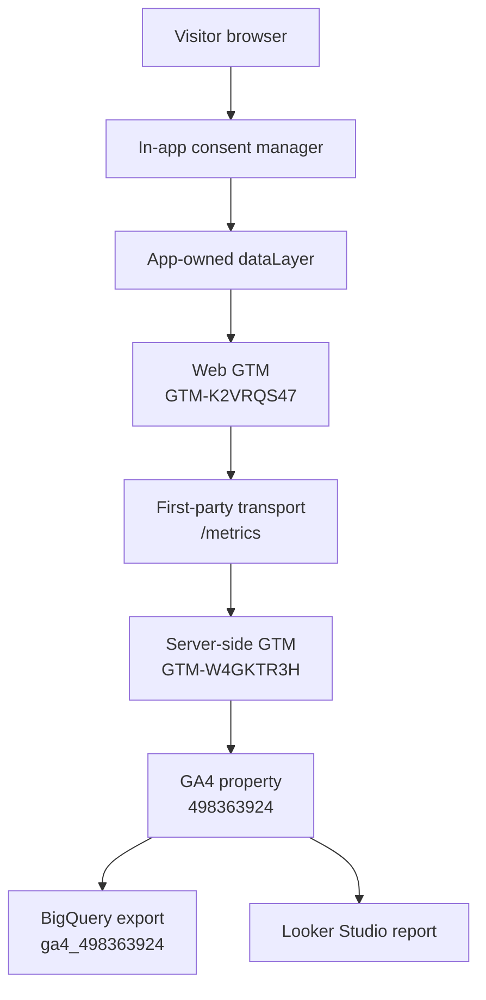

<div className="flex flex-wrap gap-2">
  <span className="inline-flex items-center rounded-md border px-2 py-0.5 text-xs font-medium">GA4</span>
  <span className="inline-flex items-center rounded-md border px-2 py-0.5 text-xs font-medium">GTM</span>
  <span className="inline-flex items-center rounded-md border px-2 py-0.5 text-xs font-medium">Server-side GTM</span>
  <span className="inline-flex items-center rounded-md border px-2 py-0.5 text-xs font-medium">BigQuery</span>
  <span className="inline-flex items-center rounded-md border px-2 py-0.5 text-xs font-medium">Looker Studio</span>
  <span className="inline-flex items-center rounded-md border px-2 py-0.5 text-xs font-medium">Consent Mode</span>
  <span className="inline-flex items-center rounded-md border px-2 py-0.5 text-xs font-medium">Codex workflow</span>
</div>

This started as a deceptively simple request: install the right Google analytics tooling, audit the existing implementation, make the `dataLayer` genuinely rich, make consent behave properly, and then push the whole stack all the way through to warehousing and reporting.

The final result is not just "GA4 installed." It is a complete measurement system:

- a site-owned, typed analytics contract
- a persistent consent manager
- first-party GTM delivery from `https://rajeevg.com/metrics`
- a rebuilt web GTM container
- a rebuilt server-side GTM container on Cloud Run
- a live GA4 property with promoted custom definitions
- a BigQuery export link
- a cleaned Looker Studio reporting surface
- a documented audit trail with production proof

This post is the long version of how that was done.

## The short version

<div className="not-prose my-8 grid gap-4 md:grid-cols-2 xl:grid-cols-4">
  <div className="rounded-2xl border bg-card p-4 shadow-sm">
    <p className="text-[11px] font-semibold uppercase tracking-[0.22em] text-muted-foreground">Web container</p>
    <p className="mt-2 text-lg font-semibold">`GTM-K2VRQS47`</p>
    <p className="mt-2 text-sm leading-6 text-muted-foreground">Clean web GTM rebuild, published live, pointing at the first-party server endpoint.</p>
  </div>
  <div className="rounded-2xl border bg-card p-4 shadow-sm">
    <p className="text-[11px] font-semibold uppercase tracking-[0.22em] text-muted-foreground">Server container</p>
    <p className="mt-2 text-lg font-semibold">`GTM-W4GKTR3H`</p>
    <p className="mt-2 text-sm leading-6 text-muted-foreground">Server-side GTM running on Cloud Run and serving collection through `/metrics`.</p>
  </div>
  <div className="rounded-2xl border bg-card p-4 shadow-sm">
    <p className="text-[11px] font-semibold uppercase tracking-[0.22em] text-muted-foreground">GA4 property</p>
    <p className="mt-2 text-lg font-semibold">`498363924`</p>
    <p className="mt-2 text-sm leading-6 text-muted-foreground">Promoted custom dimensions and metrics for the app-owned event schema.</p>
  </div>
  <div className="rounded-2xl border bg-card p-4 shadow-sm">
    <p className="text-[11px] font-semibold uppercase tracking-[0.22em] text-muted-foreground">Warehouse</p>
    <p className="mt-2 text-lg font-semibold">`personal-gws-1:ga4_498363924`</p>
    <p className="mt-2 text-sm leading-6 text-muted-foreground">BigQuery export linked to the live stream, ready for warehouse-side analysis and QA.</p>
  </div>
</div>

If you want the implementation source of truth, the canonical repo docs are:

- [Analytics Contract](https://github.com/Rajeev-SG/rajeevg.com/blob/main/docs/analytics.md)
- [Google Tagging Stack Audit](https://github.com/Rajeev-SG/rajeevg.com/blob/main/docs/google-tagging-stack.md)

## What the site now measures

The most important design choice was that the application, not GTM, owns the measurement vocabulary.

That means every event carries stable context such as:

- `browser_session_id`
- `page_view_id`
- `page_view_sequence`
- page metadata like `page_type`, `site_section`, `content_id`, `content_tags`
- device and viewport state
- referrer classification
- current consent state
- interaction-specific metadata like `selected_tags`, `search_term`, `destination`, `interaction_sequence`, and engagement summaries

This was the opposite of a thin "just fire page_view and click" implementation. The site now emits a stream that is useful in GA4 reports, clean to relay via server-side GTM, and structured enough to make sense in BigQuery later.

<div className="not-prose my-6 flex flex-wrap gap-2">
  <ArticleExplain term="dataLayer">The browser-side event queue that GTM listens to. In this setup the app owns the schema and pushes structured events into `window.dataLayer`, instead of asking GTM to infer context from the DOM.</ArticleExplain>
  <ArticleExplain term="First-party path">A same-site endpoint such as `https://rajeevg.com/metrics`. It makes GTM delivery and GA collection look like they come from the site itself before the request is relayed upstream.</ArticleExplain>
  <ArticleExplain term="sGTM">Server-side Google Tag Manager. The browser sends to a first-party endpoint, then the Cloud Run-hosted server container relays or transforms measurement traffic.</ArticleExplain>
</div>

## The architecture



The critical improvement here is the first-party transport layer. The browser loads GTM from `rajeevg.com`, not from Google as the primary script origin, and collection is sent to the same first-party path before being relayed by server-side GTM.

## The sequence of the work

This was not a one-shot setup. It unfolded in phases.

| Phase | Goal | Main outcome |
| --- | --- | --- |
| 1 | Make the site instrumentation worth preserving | Rich app-owned `dataLayer` contract |
| 2 | Make consent explicit and durable | In-app consent manager plus Consent Mode propagation |
| 3 | Move collection to a first-party path | `/metrics` transport wired through Next.js rewrites |
| 4 | Rebuild GTM rather than patching a messy legacy workspace | Clean web and server containers published live |
| 5 | Promote event parameters into reporting surfaces | GA4 custom dimensions and metrics created |
| 6 | Link warehousing and reporting | BigQuery link and Looker Studio report |
| 7 | Prove the result in production | Browser evidence, network proof, and docs |

The agent path changed by phase rather than using one tool for everything:

| Phase | Agent tools used | Why they mattered |
| --- | --- | --- |
| App instrumentation | repo-local shell, `rg`, `apply_patch`, `pnpm` | Best for reading the existing Next.js codebase, editing the event contract, and validating the app directly |
| Google admin work | Chrome DevTools MCP, logged-in Chrome, GTM MCP | Needed because the work depended on the already authenticated Google sessions and live GTM/GA interfaces |
| Cloud and warehouse checks | `gcloud`, `bq`, analytics MCP | Best for proving the server container, project, and dataset state from system-of-record outputs |
| Final proof | Playwright, `curl`, Vercel CLI | Needed repeatable production checks for consent behavior, network transport, and deployment state |

## Phase 1: rebuild the dataLayer first

Before touching the Google admin surfaces, the site had to become explicit about what it meant by a page, a click, a section view, a search interaction, and an engaged session.

The heart of that is `src/lib/analytics.ts`.

```ts
export function getPageAnalyticsContext(pathname = window.location.pathname): AnalyticsPayload {
  const pageTitle = document.title.replace(/\s+[|•-]\s+.*$/, "").trim() || document.title
  const heading = document.querySelector("main h1")
  const contentSlug = getContentSlug(pathname)
  const routeDepth = pathname.split("/").filter(Boolean).length

  return compactPayload({
    page_title: pageTitle,
    page_path: pathname,
    page_location: window.location.href,
    page_type: getPageType(pathname),
    site_section: getSiteSection(pathname),
    route_depth: routeDepth,
    content_slug: contentSlug,
    content_title: sanitizeAnalyticsText(heading?.textContent),
    query_string: window.location.search || undefined,
    ...getReferrerContext(),
    ...getPageMetadataAttributes(),
  })
}
```

A few things are worth calling out here:

- page metadata is derived centrally, so event producers do not all invent their own page naming
- page roots can declare `data-analytics-page-*` metadata and have it automatically merged into all events
- context is captured once and shared, rather than reassembled ad hoc in every component

That shared contract then feeds every event push:

```ts
export function pushDataLayerEvent(
  event: string,
  payload: AnalyticsPayload = {},
  options: AnalyticsEventOptions = {}
) {
  if (typeof window === "undefined") return

  const defaultContext = {
    ...getRuntimeAnalyticsContext(),
    ...getPageAnalyticsContext(),
  }

  const eventPayload = compactPayload({
    event,
    event_source: "site_app",
    event_timestamp: new Date().toISOString(),
    ...defaultContext,
    ...options.context,
    ...payload,
  })

  window.dataLayer = window.dataLayer || []
  window.dataLayer.push(eventPayload)
}
```

This is the point where the implementation moved from "Google tags on a website" to "a site with a real analytics domain model."

## Phase 2: make consent a real state machine

The second major shift was that consent could not be treated as an afterthought. It needed:

- default denied analytics storage
- always-denied ad consent
- persistent visitor choice
- rehydration on return visits
- explicit eventing when preferences change

The consent model lives in `src/lib/consent.ts`.

```ts
export function createConsentState(options: {
  analyticsStorage: ConsentChoice
  source: ConsentSource
  updatedAt?: string
}): ConsentState {
  return {
    analytics_storage: options.analyticsStorage,
    ad_storage: "denied",
    ad_user_data: "denied",
    ad_personalization: "denied",
    functionality_storage: "granted",
    security_storage: "granted",
    updated_at: options.updatedAt ?? new Date().toISOString(),
    source: options.source,
  }
}
```

And the UI plus Google propagation sits in `src/components/consent-manager.tsx`:

```ts
const updateConsent = (analyticsStorage: ConsentChoice, source: ConsentSource) => {
  const nextConsentState = createConsentState({ analyticsStorage, source })

  persistConsentState(nextConsentState)
  applyGoogleConsentState(nextConsentState)
  setConsentState(nextConsentState)
  setIsBannerOpen(false)

  pushDataLayerEvent("consent_state_updated", {
    consent_source: source,
    consent_preference: analyticsStorage,
    consent_updated_at: nextConsentState.updated_at,
  })
}
```

The important nuance is that this is consent-aware tracking, not absolute zero-network tracking. Because GTM loads with Consent Mode defaults set to denied, Google can still send cookieless pings before analytics storage is granted.

That matters enough to say plainly:

> This setup respects storage consent, but it still allows Consent Mode v2 style modeled measurement traffic before analytics storage is granted.

<ArticleFigure
  src="/images/blog/analytics-stack/consent-banner-card.png"
  alt="Consent banner on rajeevg.com"
  eyebrow="Consent"
  title="The live consent gate on the site"
  caption="This is the actual banner the visitor sees. It defaults analytics storage to denied, keeps advertising-related consent denied, and makes the consent choice explicit before storage is granted."
/>

<ArticleFigure
  src="/images/blog/analytics-stack/evidence-consent-granted.png"
  alt="Consent state and cookies after analytics are accepted"
  eyebrow="Proof"
  title="What changed after explicit consent"
  caption="In a fresh production browser session, granting consent persisted a consent object to localStorage and created the expected GA cookies. That is the difference between pre-consent and post-consent state in concrete terms."
/>

## Phase 3: first-party GTM delivery through `/metrics`

The next architectural decision was to stop treating Google-hosted GTM as the primary delivery path.

Instead, the site now injects GTM from a configurable origin and rewrites a first-party path to the live server container.

The bootstrap lives in `src/components/tag-manager-script.tsx`:

```ts
export function TagManagerScript({ gtmId, scriptOrigin }: TagManagerScriptProps) {
  const normalizedOrigin = normalizeScriptOrigin(scriptOrigin)

  return (
    <>
      <Script id="google-tag-manager" strategy="afterInteractive">
        {`
          (function(w,d,s,l,i,u){
            w[l]=w[l]||[];
            w[l].push({'gtm.start': new Date().getTime(), event:'gtm.js'});
            var f=d.getElementsByTagName(s)[0],
              j=d.createElement(s),
              dl=l!='dataLayer'?'&l='+l:'';
            j.async=true;
            j.src=u + '/gtm.js?id=' + i + dl;
            f.parentNode.insertBefore(j,f);
          })(window,document,'script','dataLayer',${JSON.stringify(gtmId)},${JSON.stringify(normalizedOrigin)});
        `}
      </Script>
    </>
  )
}
```

And the first-party relay is wired in `next.config.ts`:

```ts
async rewrites() {
  const sgtmUpstreamOrigin = process.env.SGTM_UPSTREAM_ORIGIN

  if (!sgtmUpstreamOrigin) {
    return []
  }

  return [
    {
      source: "/metrics/:path*",
      destination: `${upstreamOrigin}/:path*`,
    },
  ]
}
```

That gives the site a stable endpoint:

- GTM script delivery: `https://rajeevg.com/metrics/gtm.js?id=GTM-K2VRQS47`
- GA4 collection relay: `https://rajeevg.com/metrics/g/collect`

That is the "first-party" part in concrete terms.

## Phase 4: rebuild GTM instead of extending the old mess

One of the most important judgment calls in this whole session had nothing to do with code. The existing GTM workspace looked untrustworthy: paused items, contamination from older tags, and enough warning noise that it was not a good foundation for a clean server-side setup.

So the decision was not to keep patching the old container. The decision was to rebuild on clean containers.

### Live web GTM

<ArticleFigure
  src="/images/blog/analytics-stack/gtm-web-version.png"
  alt="Published web GTM container version"
  eyebrow="Web GTM"
  title="Published clean web container"
  caption="The rebuilt web container was published as a clean version rather than layered onto the legacy container. Its job is to bootstrap the Google tag and point transport at the first-party server endpoint."
/>

### Live server-side GTM

<ArticleFigure
  src="/images/blog/analytics-stack/gtm-server-version.png"
  alt="Published server-side GTM container version"
  eyebrow="Server GTM"
  title="Published clean server container"
  caption="The server container handles the relay side of the stack. It serves dependencies for the web container and forwards GA4 traffic after it reaches the first-party `/metrics` path."
/>

The server container was configured with:

- a GA4 client managed in JavaScript mode
- a GA4 relay tag
- dependency serving for the web container
- a server URL aligned with `https://rajeevg.com/metrics`

This is one of the quiet but high-leverage moves in the implementation. It makes the browser transport cleaner, gives more control over collection, and lays groundwork for later transformations, filtering, or enrichment.

## Proof that it actually behaved correctly

This part matters. It is easy to write a nice narrative about analytics infrastructure. It is harder, and much more useful, to prove what the browser actually did in a fresh session.

For this pass the evidence was captured against the live production article URL in a clean Playwright context, then cross-checked against the app-owned `dataLayer` and the first-party `/metrics` requests.

<div className="not-prose my-6 flex flex-wrap gap-2">
  <ArticleExplain term="Playwright">Used here as the repeatable proof tool. It opened the live site in a clean browser context, captured requests, inspected storage and cookies, clicked the consent UI, and saved the resulting evidence to JSON.</ArticleExplain>
  <ArticleExplain term="Chrome DevTools MCP">Used separately for the logged-in Google admin screenshots, because those depended on the already authenticated Chrome session rather than a fresh automated browser.</ArticleExplain>
  <ArticleExplain term="Consent Mode">Google’s consent signaling layer. In this implementation it starts denied, can still send cookieless modeled-measurement pings, and switches to granted storage only after an explicit action.</ArticleExplain>
</div>

<div className="not-prose grid gap-5 lg:grid-cols-2">
  <ArticleFigure
    src="/images/blog/analytics-stack/evidence-consent-default.png"
    alt="Pre-consent proof showing denied consent and no cookies"
    eyebrow="Evidence"
    title="Before consent"
    caption="Fresh browser context, zero analytics cookies, no stored consent object, and `htmlConsent: denied`."
    imgClassName="max-h-[28rem]"
  />
  <ArticleFigure
    src="/images/blog/analytics-stack/evidence-consent-granted.png"
    alt="Post-consent proof showing granted consent and GA cookies"
    eyebrow="Evidence"
    title="After consent"
    caption="After clicking `Allow analytics`, the site persisted consent in localStorage and wrote the expected GA cookies."
    imgClassName="max-h-[28rem]"
  />
  <ArticleFigure
    src="/images/blog/analytics-stack/evidence-datalayer-before.png"
    alt="Pre-consent dataLayer evidence"
    eyebrow="Evidence"
    title="The dataLayer before consent"
    caption="The first events are the default denied consent call, GTM bootstrap, and a `page_context` event whose shared dimensions already show `analytics_consent_state: denied`."
    imgClassName="max-h-[34rem]"
  />
  <ArticleFigure
    src="/images/blog/analytics-stack/evidence-datalayer-after.png"
    alt="Post-consent dataLayer evidence"
    eyebrow="Evidence"
    title="The dataLayer after consent"
    caption="Once consent is granted, the site emits `consent_state_updated` and then replays `page_context` with `analytics_consent_state: granted` plus `consent_rehydrated: true`."
    imgClassName="max-h-[34rem]"
  />
</div>

<ArticleFigure
  src="/images/blog/analytics-stack/evidence-network-requests.png"
  alt="Network evidence showing first-party GTM and collection requests"
  eyebrow="Evidence"
  title="First-party transport proof"
  caption="The live browser session hit `https://rajeevg.com/metrics/gtm.js` successfully and sent GA4 collection requests through the same first-party path. The captured request parameters show the denied-state collect request and the later granted-state request."
  imgClassName="max-h-[30rem]"
/>

That evidence came from a saved proof artifact:

- [analytics-article-evidence-20260324/proof.json](https://github.com/Rajeev-SG/rajeevg.com/blob/main/output/acceptance/analytics-article-evidence-20260324/proof.json)

The most important takeaways from the proof run were:

- before consent, there were no GA cookies and no stored consent object
- before consent, the app still emitted a denied-state `page_context` event
- after consent, the app persisted a granted consent object and wrote the expected `_ga` cookies
- the first-party `/metrics` transport worked for both GTM delivery and GA collection
- the browser-side event stream visibly recorded the consent transition instead of hiding it inside GTM

## Phase 5: promote the schema into GA4 reporting

Getting events into GA4 is only half the story. If the event parameters stay unpromoted, the nicest `dataLayer` in the world still feels second-class inside GA reporting.

So the site event vocabulary was promoted into GA4 custom definitions:

- 17 custom dimensions
- 14 custom metrics

That includes dimensions like:

- `page_type`
- `site_section`
- `content_group`
- `content_type`
- `content_id`
- `content_tags`
- `viewport_category`
- `analytics_consent_state`
- `selected_tags`
- `search_term`

And metrics like:

- `route_depth`
- `query_param_count`
- `interaction_sequence`
- `engaged_seconds_total`
- `interaction_count`
- `section_views_count`
- `max_scroll_depth_percent`
- `max_article_progress_percent`

<ArticleFigure
  src="/images/blog/analytics-stack/ga-custom-definitions.png"
  alt="GA4 custom definitions page"
  eyebrow="GA4"
  title="Custom dimensions and metrics promoted into the property"
  caption="This is what turns the raw event contract into something actually explorable in GA4, rather than leaving the best metadata stranded in unregistered parameters."
/>

## Phase 6: connect warehousing and reporting

With the measurement contract and transport layer in place, the next move was to wire the back half of the stack.

### Cloud Run for server-side GTM

<ArticleFigure
  src="/images/blog/analytics-stack/cloud-run-sgtm.png"
  alt="Cloud Run service for server-side GTM"
  eyebrow="Cloud Run"
  title="The live sGTM runtime"
  caption="The live server-side GTM container runs on Cloud Run in `europe-west2`. This is the upstream origin that the site's `/metrics` path rewrites to."
/>

The current service details were verified directly:

```yaml
metadata:
  name: sgtm-live
status:
  latestReadyRevisionName: sgtm-live-00002-jzs
  traffic:
  - latestRevision: true
    percent: 100
    revisionName: sgtm-live-00002-jzs
  url: https://sgtm-live-6tmqixdp3a-nw.a.run.app
```

### BigQuery linkage

The project and dataset checks are straightforward:

```bash
$ gcloud config get-value project
personal-gws-1

$ bq ls --project_id=personal-gws-1
    datasetId
 ---------------
  ga4_498363924
```

At the GA Admin layer, the property is linked to the BigQuery dataset and attached to the live stream. At the time of the main audit, the remaining caveat was export latency: the link was active, but landing tables had not yet appeared during the same validation window.

That is not a misconfiguration. It is normal GA4 export timing behavior.

### Looker Studio

<ArticleFigure
  src="/images/blog/analytics-stack/looker-dashboard-focused.png"
  alt="Looker Studio report connected to GA4"
  eyebrow="Looker Studio"
  title="The cleaned reporting surface"
  caption="This crop keeps the useful part of the screenshot: the report page structure, the live GA4 connection, and the promoted `Analytics Consent State` field. The charts are still sparse because the implementation was newly activated, but the report surface and mapped dimensions are real."
  imgClassName="max-h-[34rem]"
/>

The report was trimmed and organized into pages that match the site:

- `Overview`
- `Audience & Devices`
- `Acquisition & Content`
- `Engagement & Key Pages`

That is a subtle but important step. Generic dashboards create noise very quickly. The goal here was not to have a dashboard, but to have one that matches how this site is actually used.

## The AI-assisted workflow layer

This project also became a useful case study in what an AI-native engineering workflow looks like when it is used carefully rather than theatrically.

<div className="not-prose my-6 flex flex-wrap gap-2">
  <ArticleExplain term="MCP">Model Context Protocol. In practice here, it meant the agent could use purpose-built tool servers for Google analytics, gcloud, GTM, Chrome DevTools, and other systems rather than pretending every task is just text generation.</ArticleExplain>
  <ArticleExplain term="CDP">Chrome DevTools Protocol. It matters when you need the already logged-in browser state, which was crucial for Google admin pages and Looker Studio.</ArticleExplain>
  <ArticleExplain term="Skill">A reusable local workflow instruction set. Skills were used to force better behavior around things like acceptance proof, design proof, and deployment instead of relying on vague "be thorough" prompts.</ArticleExplain>
  <ArticleExplain term="CLI">The terminal was still the backbone. `gcloud`, `bq`, `git`, `gh`, `pnpm`, and `codex mcp list` all mattered because stateful systems are easier to verify when their exact output is visible.</ArticleExplain>
</div>

What mattered about the workflow was not the novelty of "AI did it." What mattered was the division of labor:

- the site code was changed locally and validated like normal software
- live Google admin surfaces were inspected in a real logged-in browser
- platform state was checked through CLIs and admin APIs
- repo-local docs were updated as part of the implementation rather than left for later

That mix turned out to be the right one. The code changes alone would not have been enough, and the admin clicking alone would not have produced a durable system.

The important thing is that the agent did not use one tool for all of this. It switched between:

- repo-local coding tools when the job was changing the site
- live browser tools when the job depended on authenticated Google state
- CLIs when the job was proving Cloud Run, BigQuery, or deployment status
- repeatable browser automation when the job was acceptance proof rather than exploration

## The audit findings that mattered most

A good implementation write-up should not pretend everything was frictionless. These were the most important findings from the actual audit.

### 1. Consent Mode still sends cookieless pings

This was expected, but it is important enough to repeat.

With GTM present and Consent Mode defaults denied, Google can still issue cookieless pings before analytics storage is granted. That preserves modeled measurement while avoiding analytics storage, but it is not the same thing as hard-blocking all Google network traffic until accept.

### 2. Rebuilding GTM was the right call

Trying to rehabilitate a noisy, warning-filled, legacy GTM workspace would have made the stack harder to trust. A clean rebuild created a much clearer mental model.

### 3. The app-owned schema is the real asset

Containers, dashboards, and warehouse links can all be changed later. The durable thing is the site-owned event vocabulary and consent behavior. That is what makes the rest of the stack coherent.

### 4. BigQuery linkage and BigQuery readiness are not the same moment

The export link can be fully correct before any warehouse tables appear. That lag should be expected and documented rather than mistaken for a broken integration.

## The exact stack as shipped

| Layer | Live value |
| --- | --- |
| Site | `https://rajeevg.com` |
| Measurement ID | `G-675W3V0C78` |
| Web GTM container | `GTM-K2VRQS47` |
| Server GTM container | `GTM-W4GKTR3H` |
| First-party path | `https://rajeevg.com/metrics` |
| Live sGTM service | `https://sgtm-live-6tmqixdp3a-nw.a.run.app` |
| GCP project | `personal-gws-1` |
| BigQuery dataset | `personal-gws-1:ga4_498363924` |
| Looker Studio report | `b599834d-939c-4f4d-8b93-b5e3ccab699f` |

The Codex-side MCP config that supported this work currently resolves to:

```text
analytics_mcp  enabled
gcloud         enabled
gtm_mcp        enabled
chrome_devtools enabled
playwright      enabled
```

Those were verified locally with:

```bash
$ codex mcp list
analytics_mcp    ... enabled
gcloud           ... enabled
gtm_mcp          ... enabled
chrome_devtools  ... enabled
playwright       ... enabled
```

## The repo surfaces that matter most

If I wanted to explain this system to a future me in five file paths, they would be:

- [src/lib/analytics.ts](https://github.com/Rajeev-SG/rajeevg.com/blob/main/src/lib/analytics.ts)
- [src/lib/consent.ts](https://github.com/Rajeev-SG/rajeevg.com/blob/main/src/lib/consent.ts)
- [src/components/consent-manager.tsx](https://github.com/Rajeev-SG/rajeevg.com/blob/main/src/components/consent-manager.tsx)
- [src/components/tag-manager-script.tsx](https://github.com/Rajeev-SG/rajeevg.com/blob/main/src/components/tag-manager-script.tsx)
- [next.config.ts](https://github.com/Rajeev-SG/rajeevg.com/blob/main/next.config.ts)

And if I wanted the operational record, it would be:

- [docs/analytics.md](https://github.com/Rajeev-SG/rajeevg.com/blob/main/docs/analytics.md)
- [docs/google-tagging-stack.md](https://github.com/Rajeev-SG/rajeevg.com/blob/main/docs/google-tagging-stack.md)
- [output/acceptance/analytics-stack-20260323/live-proof.json](https://github.com/Rajeev-SG/rajeevg.com/blob/main/output/acceptance/analytics-stack-20260323/live-proof.json)

## What I would extend next

The stack is complete enough to be useful right now, but the next obvious upgrades are clear.

- Add a warehouse-backed QA page once BigQuery export tables are fully populated.
- Add more derived session and content models in BigQuery for analysis that is awkward in raw GA4.
- Build a reporting page focused specifically on consent state and instrumentation quality.
- Expand outbound click and portfolio interaction modeling if the site becomes more conversion-oriented.

## Why I think this was worth doing properly

A lot of analytics implementations stop at "the tag fired." That is the beginning, not the end.

What I wanted here was a system that could answer better questions later:

- what kinds of pages get engaged reading rather than drive-by traffic?
- which site sections pull people deeper?
- which tags, searches, and projects actually lead to navigation?
- how much of the session data is happening under granted analytics storage versus denied modeled measurement?
- can the same event vocabulary survive browser analytics, server-side relay, warehouse export, and dashboarding without translation chaos?

That is why this implementation was worth doing end to end.

It is a consented analytics setup, but it is also a publishing and product-systems setup. The site now knows more about how it is being used, and just as importantly, it knows that in a way that is explicit, documented, and portable across layers.
