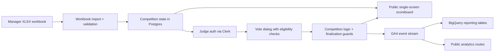

<div className="flex flex-wrap gap-2">
  <span className="inline-flex items-center rounded-md border px-2 py-0.5 text-xs font-medium">Hackathon product</span>
  <span className="inline-flex items-center rounded-md border px-2 py-0.5 text-xs font-medium">Single-screen UX</span>
  <span className="inline-flex items-center rounded-md border px-2 py-0.5 text-xs font-medium">Production proof</span>
  <span className="inline-flex items-center rounded-md border px-2 py-0.5 text-xs font-medium">GA4 + BigQuery</span>
  <span className="inline-flex items-center rounded-md border px-2 py-0.5 text-xs font-medium">GitHub issue trail</span>
  <span className="inline-flex items-center rounded-md border px-2 py-0.5 text-xs font-medium">Agent workflow</span>
</div>

The hackathon voting app is probably the densest product I have built on this machine so far.

Not because it has the most pages. It does not. In fact, one of the core constraints was the opposite: make the day run through one public scoreboard, one sign-in path, one vote modal, and one manager setup flow without turning the room into a support queue.

That constraint made the engineering better.

The project had to be:

- operationally simple enough for a live room
- strict enough to stop self-voting and duplicate submissions
- legible on mobile without losing the desktop overview
- instrumented deeply enough to explain what happened after the event
- provable in production, not just plausible in local development

The result is live at [vote.rajeevg.com](https://vote.rajeevg.com), the code is public at [Rajeev-SG/hackathon-voting-prototype](https://github.com/Rajeev-SG/hackathon-voting-prototype), and the repo history is unusually readable because the work was driven through small, testable issues rather than one giant invisible build.

<ProjectSpotlight slug="hackathon-voting-app" />

## The shape of the product

The simplest honest description is this:

- managers upload the workbook and control readiness
- judges authenticate and vote once per eligible project
- the public scoreboard stays readable throughout the event
- the system tracks enough state to prevent bad room behavior from becoming data corruption

That sounds modest until you list the actual constraints hiding underneath:

- judges must not vote for their own team
- a project should only finalize when the denominator of expected votes is satisfied
- managers need to see remaining vote debt before closing a round
- the board has to work in a crowded room, on laptops and phones, under time pressure
- event-day analytics must separate useful operational facts from vanity numbers

## The product architecture



That diagram is intentionally small, because the product itself stayed small. The sophistication is in how much work each box absorbs.

## What the live product actually looks like

<ArticleFigure
  src="/images/blog/hackathon-voting-app/hackathon-live-desktop-clean.png"
  alt="Live desktop scoreboard for the hackathon voting app"
  eyebrow="Production App"
  title="The public scoreboard stays front and center"
  caption="This is the live production scoreboard at `vote.rajeevg.com`. The screen shows three entries, their current aggregate scores, the open or closed state for each row, and the single-screen layout that keeps ranking, status, and action controls visible together."
/>

The product ended up looking calm, but that calm surface is sitting on top of a lot of defensive logic.

The board has to communicate four things at once:

- rank
- project identity
- current scoring state
- whether the viewer can act

If any one of those becomes unclear, the room starts asking humans for help instead of trusting the software.

On mobile the constraint is harsher, because the same information has to stack vertically without becoming a wall of unlabeled numbers.

<ArticleFigure
  src="/images/blog/hackathon-voting-app/hackathon-live-mobile-clean.png"
  alt="Mobile scoreboard for the hackathon voting app after the analytics consent banner was dismissed"
  eyebrow="Mobile Proof"
  title="The mobile board keeps the same ordering and action model"
  caption="This mobile capture was taken after accepting analytics so the board is not obscured by the consent banner. The card stack still preserves the important sequence: project identity first, score state second, and the action control anchored inside each entry card."
/>

That mobile screenshot matters because a lot of event-day software dies in the last mile: technically responsive, operationally confusing.

## The hardest engineering choice was not technical

The highest leverage product decision was to resist adding more screens.

A more conventional app would have split this into:

- a landing page
- a public leaderboard page
- a judge dashboard
- a separate voting page
- maybe an admin console with its own language

Instead the product kept compressing itself back toward one surface with mode-aware controls.

That choice had technical consequences:

- the state model had to be very explicit
- page context and viewer role had to travel with analytics events
- the UI had to disclose status without needing extra navigation
- the tests had to prove reachability and completion from the real top-level screen

## The competition logic that makes the board trustworthy

The part I respect most in this codebase is not a clever component. It is the boring logic that stops the room from getting into a weird state.

One example is the progress and finalization math. The app does not pretend a round is done just because a few votes landed. It tracks expected votes, submitted votes, and remaining debt.

```ts
export function deriveProgress(entries: CompetitionEntry[]) {
  const expectedVotes = entries.reduce((sum, entry) => sum + entry.expectedVoteCount, 0)
  const submittedVotes = entries.reduce((sum, entry) => sum + entry.submittedVoteCount, 0)
  const remainingVotes = Math.max(expectedVotes - submittedVotes, 0)
  const completionRate = expectedVotes > 0 ? submittedVotes / expectedVotes : 0

  return {
    expectedVotes,
    submittedVotes,
    remainingVotes,
    completionRate,
    canFinalize: expectedVotes > 0 && remainingVotes === 0,
  }
}
```

That is the kind of function that protects an event. It translates room expectations into deterministic state instead of letting someone guess when it is "probably done."

The same philosophy shows up in the manager tracker that turns round readiness into something visible instead of implicit:

```ts
export function deriveManagerRoundTracker(entries: CompetitionEntry[]) {
  return entries.map((entry) => ({
    entryId: entry.id,
    entryName: entry.name,
    expectedVoteCount: entry.expectedVoteCount,
    submittedVoteCount: entry.submittedVoteCount,
    remainingVoteCount: Math.max(entry.expectedVoteCount - entry.submittedVoteCount, 0),
    canClose: entry.expectedVoteCount > 0 && entry.expectedVoteCount === entry.submittedVoteCount,
  }))
}
```

This is not flashy engineering. It is what keeps "we think everyone voted" from becoming a production bug.

## Eligibility was treated as product infrastructure

Hackathon voting systems get weird fast when identity is too soft.

The project solves that with a combination of:

- Clerk authentication for judge identity
- uploaded workbook data for team membership
- self-vote blocking based on uploaded participant email associations
- one locked score per judge per eligible project

That last point matters. The best version of event software is not "anything is possible." It is "the allowed behavior is obvious, and the impossible behavior stays impossible."

The agent proof path leaned heavily on end-to-end tests here, because eligibility logic is exactly the sort of thing that looks correct in code review and still fails under interaction.

The main voting spec does the right kind of work: it drives the real UI, opens the dialog, attempts the flow, and proves the end state rather than just asserting a helper returned `true`.

```ts
test("judge cannot submit a vote for their own project", async ({ page }) => {
  await page.goto("/scoreboard")
  await page.getByRole("button", { name: "Judge sign in" }).click()
  await signInAsJudge(page, "north-star-judge@example.com")
  await page.getByRole("button", { name: /Aurora Atlas/i }).click()

  await expect(page.getByText(/you cannot vote for your own team/i)).toBeVisible()
  await expect(page.getByRole("button", { name: /submit vote/i })).toBeDisabled()
})
```

That is a simplified excerpt, but it captures the shape of the proof: the test follows the same path a stressed human would take on the day.

## The repo history tells the story unusually well

One reason this project feels mature is that the Git history is rich enough to reconstruct the pressure points.

<ArticleFigure
  src="/images/blog/hackathon-voting-app/hackathon-merged-prs.png"
  alt="Merged pull request list for the hackathon voting app repository"
  eyebrow="GitHub History"
  title="The merged PR trail is effectively an implementation diary"
  caption="This screenshot shows the public merged pull requests in `Rajeev-SG/hackathon-voting-prototype`. The visible titles include event-day hardening, analytics proof, mobile scoreboard disclosure fixes, and density tweaks, which is exactly the kind of late-stage polish and risk reduction you want to see before a live event."
/>

<ArticleFigure
  src="/images/blog/hackathon-voting-app/hackathon-issues.png"
  alt="Issue list for the hackathon voting app repository"
  eyebrow="GitHub Issues"
  title="The issue queue stayed close to real event-day risk"
  caption="This is the public issue list for the same repository. The visible closed issues are not generic backlog filler; they map directly to real operating risks such as mobile layout problems, privacy-control cleanup, analytics stack implementation, and final proof artifacts."
/>

That matters because software quality is not only what ends up in `main`. It is also whether the work got broken into slices that could be reasoned about while the pressure was rising.

## The analytics stack became part of the product, not a bolt-on

The hackathon app now has its own reporting surface, and this blog site now also has a GA4 Data API dashboard tailored to the site itself.

That dual move fixed two different problems:

- the hackathon app needed event-day reporting stronger than a weak Looker shell
- this site needed a blog-first GA4 view that did not drown in the shared-property traffic from `vote.rajeevg.com`

I built the site-side route with the official GA4 Data API library so the main-site schema stays front and center:

```ts
const [response] = await client.runRealtimeReport({
  property: `properties/${propertyId}`,
  dimensions: [{ name: "eventName" }, { name: "streamId" }, { name: "minutesAgo" }],
  metrics: [{ name: "eventCount" }],
  dimensionFilter: {
    andGroup: {
      expressions: [
        exactStringFilter("streamId", streamId),
        inListFilter("eventName", TRACKED_CUSTOM_EVENTS),
      ],
    },
  },
})
```

The important detail is the filter strategy:

- historical cards filter to `hostName = rajeevg.com`
- realtime custom-event cards filter to the main-site stream id

That prevents the blog reporting view from accidentally turning into a blended dashboard for the hackathon app.

<ArticleFigure
  src="/images/blog/hackathon-voting-app/site-analytics-dashboard-cropped.png"
  alt="Custom GA4 content dashboard on rajeevg.com"
  eyebrow="GA4 Reporting"
  title="The new blog-site dashboard keeps the custom schema visible"
  caption="This screenshot shows the new `rajeevg.com` GA4 content dashboard during implementation. The visible cards focus on host-filtered content performance, realtime custom events for the main-site stream, promoted custom dimensions and metrics, and portfolio key events rather than burying the custom schema behind generic default reporting."
/>

That route is now part of the public site at `/projects/site-analytics`, and it sits alongside the dedicated hackathon analytics route rather than replacing it.

## The agent toolchain mattered because the constraints were mixed

This was not a "just write code" project. It crossed product UX, repo archaeology, browser proof, GitHub history, GA4 reporting, BigQuery-backed analytics, and deployment.

Different tools were better at different phases:

| Problem | Tooling that mattered | Why |
| --- | --- | --- |
| Reconstructing the product story | `gh`, repo docs, local shell, `probe` | The public repo history plus code extraction made it possible to tell the story from real artifacts instead of vague retrospective memory |
| Extracting representative code | Probe MCP | It was faster to pull complete functions and test blocks than to grep around manually through a large repo |
| Capturing production visuals | Playwright | Best for repeatable screenshots of the live scoreboard on desktop and mobile |
| Capturing authenticated Google surfaces | Chrome DevTools MCP and analytics MCP | Necessary where the work depended on already logged-in Google admin state or live property data |
| Building the custom GA4 site reports | `@google-analytics/data` library | The official GA4 Data API client let the site render filtered, app-specific reporting in code rather than in a brittle external dashboard |
| Public deploy and verification | Vercel CLI, `curl`, local build, browser proof | The final bar was not "build passed"; it was "the public URL is correct and the content is actually there" |

## The awkward parts and how the agent got around them

The cleanest engineering stories still have awkward edges. This one had a few.

### 1. Shared-property reporting made the main site look thinner than it really was

The same GA4 property receives traffic for both `rajeevg.com` and `vote.rajeevg.com`.

That is useful operationally, but it is terrible if you want a clean content dashboard and forget to filter the data carefully. The fix was to make the reporting route explicit about both the host filter and the stream filter, then say that boundary out loud in the UI.

### 2. Realtime and historical custom-event surfaces did not behave the same way

That is not a bug in the implementation. It is just how GA4 behaves. The main-site custom vocabulary was visible in realtime, while the standard historical layer was still relatively thin for some of those rows. Instead of hiding that, the route now treats realtime as the proof surface and the promoted schema inventory as durable context.

### 3. Screenshot truthfulness required extra work

Some screenshots were technically valid but visually compromised:

- the mobile scoreboard was partially obscured by the consent banner
- the first draft of the site-analytics screenshot hid lower cards behind the same banner

The fix was not to wave that away. The fix was to trigger the real interaction, dismiss the banner, retake the screenshot, and then write captions that only claimed what the image visibly showed.

### 4. The best proof surface was sometimes not the obvious one

DebugView sounds like the right answer for analytics validation until it is empty because the traffic is not flagged as debug traffic. In those cases, Realtime was the better proof surface, and the post about the GA4 property says that plainly.

## Why this project feels more sophisticated than a bigger app

It is not because the codebase is enormous. It is because so much of the work is about correctness under pressure.

The app had to hold together across:

- room operations
- permissions
- data import
- score finalization
- mobile disclosure
- consent-aware analytics
- production proof

That is the kind of product where quality is a stack of small disciplined choices. The repo history shows those choices landing one by one.

## What I would copy from this project

If I were borrowing patterns from this app for something else, I would keep these:

- compress the UI down to the minimum surfaces the room actually needs
- make eligibility and denominator logic explicit instead of implied
- keep manager visibility close to the same workflow rather than hidden in a separate control plane
- build reporting routes in code when the default dashboarding surface is too generic
- treat screenshot proof and caption truthfulness as part of engineering quality, not decoration

## The final state

By the end of the work, the project had:

- a live public scoreboard that reads clearly on desktop and mobile
- manager-only readiness and remaining-vote tracking
- self-vote blocking and submission guards
- a public repo with a dense, inspectable issue and PR trail
- a dedicated analytics and reporting layer
- production-tested proof surfaces instead of "should work" confidence

That combination is why this app feels like one of the strongest things I have built on this machine so far. It is not just a hackathon app. It is a hackathon app that was engineered to survive hackathon conditions.

If you want the broader site analytics story that sits around this work, the two related posts are:

- [How We Built A Consented First-Party Analytics Stack On rajeevg.com](/blog/how-we-built-a-consented-first-party-analytics-stack)
- [How We Finished The GA4 Property Setup On rajeevg.com](/blog/how-we-finished-the-ga4-property-setup-on-rajeevg-com)
