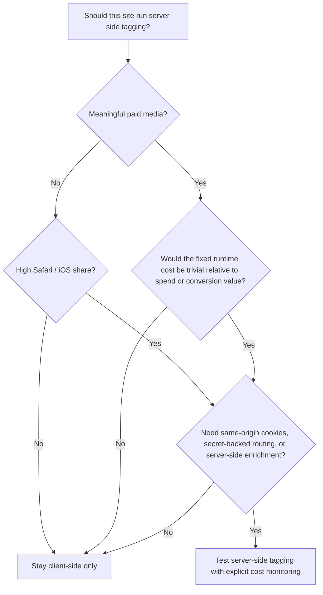

<div className="flex flex-wrap gap-2">
  <span className="inline-flex items-center rounded-md border px-2 py-0.5 text-xs font-medium">GA4</span>
  <span className="inline-flex items-center rounded-md border px-2 py-0.5 text-xs font-medium">GTM</span>
  <span className="inline-flex items-center rounded-md border px-2 py-0.5 text-xs font-medium">Server-side tagging</span>
  <span className="inline-flex items-center rounded-md border px-2 py-0.5 text-xs font-medium">Cloud Run</span>
  <span className="inline-flex items-center rounded-md border px-2 py-0.5 text-xs font-medium">Cost analysis</span>
</div>

Server-side tagging is not snake oil, and it is not automatically a bad idea. But it is also not free, not operationally neutral, and not something I would now recommend by default for every small content site.

`rajeevg.com` is a good case study because I did the full build, ran it live, audited the bill, then shut it down. That creates a much better question than "is server-side tagging good?" The better question is:

> When does the extra control and first-party context justify the fixed infrastructure cost and operational drag?

For this site, the answer was "not yet."

## The bill, in plain English

<div className="not-prose my-8 grid gap-4 md:grid-cols-2 xl:grid-cols-4">
  <div className="rounded-2xl border bg-card p-4 shadow-sm">
    <p className="text-[11px] font-semibold uppercase tracking-[0.22em] text-muted-foreground">Measured period</p>
    <p className="mt-2 text-lg font-semibold">23-31 March 2026</p>
    <p className="mt-2 text-sm leading-6 text-muted-foreground">The server-side stack was only live for the tail end of the month, not for a full billing cycle.</p>
  </div>
  <div className="rounded-2xl border bg-card p-4 shadow-sm">
    <p className="text-[11px] font-semibold uppercase tracking-[0.22em] text-muted-foreground">Cloud Run subtotal</p>
    <p className="mt-2 text-lg font-semibold">£8.42</p>
    <p className="mt-2 text-sm leading-6 text-muted-foreground">Almost the entire March bill for the active project came from Cloud Run, not GA4 or BigQuery.</p>
  </div>
  <div className="rounded-2xl border bg-card p-4 shadow-sm">
    <p className="text-[11px] font-semibold uppercase tracking-[0.22em] text-muted-foreground">Dominant SKU</p>
    <p className="mt-2 text-lg font-semibold">Instance CPU</p>
    <p className="mt-2 text-sm leading-6 text-muted-foreground">`Services CPU (Instance-based billing) in europe-west2` accounted for `£8.40` net, or `£11.54` before discounts.</p>
  </div>
  <div className="rounded-2xl border bg-card p-4 shadow-sm">
    <p className="text-[11px] font-semibold uppercase tracking-[0.22em] text-muted-foreground">Full-month run rate</p>
    <p className="mt-2 text-lg font-semibold">about £31 net</p>
    <p className="mt-2 text-sm leading-6 text-muted-foreground">Extrapolated from the observed `722,493.5` billed CPU seconds, which is about `8.36` days of always-on runtime.</p>
  </div>
</div>

<ArticleFigure
  src="/images/blog/when-not-to-use-server-side-tagging/cloud-run-billing-cost-table-viewport.png"
  alt="Google Cloud billing cost table showing Cloud Run instance-based CPU charges"
  eyebrow="Billing evidence"
  title="The Cloud Run bill was mostly one instance-based CPU row"
  caption="This screenshot from the March 2026 billing table shows the selected Cloud Run rows. The key detail is visible in the middle of the table and the blue summary bar: the instance-based CPU SKU contributed `£11.54` gross, `-£3.14` in discount, and `£8.40` subtotal. The request-based CPU row lower down rounds to `£0.00`."
/>

The uncomfortable truth is that the bill was not driven by meaningful request volume. It was mostly driven by keeping the server-side tagging runtime warm.

That distinction matters:

- request-based CPU: effectively zero
- request-based memory: effectively zero
- requests: effectively zero
- network egress: pennies
- instance-based CPU: the whole story

Google's own Cloud Run documentation is explicit here: if you keep minimum instances running, they incur billing cost even when they are idle, and with instance-based billing you are billed for the full instance lifecycle rather than only active request time. Google's server-side tagging docs are also explicit that same-origin serving is useful because it can give you a first-party context and more durable cookies. That benefit is real. The mistake is pretending the benefit is free. [Cloud Run minimum instances](https://docs.cloud.google.com/run/docs/configuring/min-instances), [same-origin custom domain guidance](https://developers.google.com/tag-platform/tag-manager/server-side/custom-domain)

## Why this happened on this stack

Historically, the live setup looked like this:


And the site code had to keep that relay path alive:

```ts
async rewrites() {
  const sgtmUpstreamOrigin = process.env.SGTM_UPSTREAM_ORIGIN

  if (!sgtmUpstreamOrigin) {
    return []
  }

  return [
    {
      source: "/metrics/:path*",
      destination: `${upstreamOrigin}/:path*`,
    },
  ]
}
```

That snippet is from the historical configuration that existed immediately before the April 2026 rollback. It is small, but it implies a lot:

- a Cloud Run service has to exist
- GTM has to be published correctly on both web and server containers
- the relay path has to stay healthy
- previews and debugging are more complicated
- cost no longer scales only with traffic

For a large media buyer or a consent-heavy ecommerce site, that trade can be worth it. For a small portfolio and blog, the extra moving parts are much easier to feel than the upside.

## The site-fit test for rajeevg.com

The live GA4 property makes the mismatch pretty obvious.

<ArticleFigure
  src="/images/blog/when-not-to-use-server-side-tagging/site-analytics-dashboard-top.png"
  alt="Public GA4 site analytics dashboard for rajeevg.com"
  eyebrow="Live site data"
  title="The main site is still small, desktop-heavy, and mostly content traffic"
  caption="This public host-filtered dashboard for `rajeevg.com` shows `825` page views and `176` active users in the current 30-day window. It also shows a desktop-heavy audience and a blog-led content pattern, which matters when deciding whether a warm server-side stack is economically justified."
/>

For the last 28 days of `rajeevg.com` traffic, filtered to the main host:

| Metric | Observed value | Why it matters |
| --- | --- | --- |
| Sessions | `284` | This is a small traffic base for a dedicated always-on tagging runtime |
| Users | `176` | The audience is still modest and highly inspectable without server-side enrichment |
| Page views | `825` | Useful, but not large enough to amortize warm infra gracefully |
| Event count | `6,974` | Rich measurement does not automatically mean server-side tagging is justified |
| Direct share | `83.5%` | The site is not currently a paid acquisition machine |
| Safari share | `4.6%` | Same-origin durability helps most when privacy-constrained browser share is materially higher |
| iOS share | `4.6%` | Same logic as Safari; the current exposure is real but small |
| Mobile share | `27.1%` | Mobile matters, but the audience is still mostly desktop |
| Paid channels visible in GA4 | `0` rows | There was no visible Paid Search or Paid Social footprint in the reporting window |

That last line is the big one.

If a site is not spending meaningfully on paid acquisition, server-side tagging has less opportunity to pay for itself. It may still be useful for data governance, server-only enrichment, or multi-destination routing, but the classic "recover more attributable conversions" case is much weaker when there is little or no paid media to improve.

## Why I would not use server-side tagging here

For `rajeevg.com` specifically, four signals all pointed in the same direction.

### 1. The cost was mostly fixed, not demand-driven

The March bill shows very little request-driven consumption and a lot of instance-based CPU time. That is the wrong cost shape for a site this size.

If your infra bill rises mainly because you chose to keep a service warm, that cost behaves more like rent than like usage.

### 2. The privacy upside was real, but small relative to the audience mix

Google recommends same-origin serving for server-side tagging because it helps unlock first-party benefits like more durable cookies. WebKit, meanwhile, has long made Safari hostile to third-party cookies and cross-site tracking behavior. Those two things fit together cleanly: if a large share of your users are on Safari or iOS, same-origin server-side transport can be worth serious testing. [Google custom domain guidance](https://developers.google.com/tag-platform/tag-manager/server-side/custom-domain), [WebKit on third-party cookie blocking](https://webkit.org/blog/10218/full-third-party-cookie-blocking-and-more/)

But this site is not there yet. Safari and iOS were both only about `4.6%` of sessions in the measured window.

### 3. The channel mix did not justify the extra attribution machinery

The site was overwhelmingly direct and referral traffic. There were no visible paid channel rows in the last 28 days. That means the practical business value of squeezing a few more durable identifiers out of the setup was limited.

### 4. The live client-side setup was already good

This is easy to miss. The decision was not "server-side tagging or chaos." The decision was "server-side tagging or a clean client-side stack with good consent behavior, a rich event schema, promoted GA4 custom definitions, and a useful reporting surface."

That matters because the alternative was already competent.

## When server-side tagging does make sense

This is the part that is easy to oversimplify. I would not describe server-side tagging as overkill in general. I would describe it as something that starts making sense once the upside clearly dominates the fixed cost and operational load.

Here is my current rule-of-thumb framework. These thresholds are my recommendation from the observed cost profile on this site plus the official Google and WebKit guidance above, not vendor-promised cutoffs.

| Signal | I would usually stay client-side only when... | I would start testing server-side tagging when... |
| --- | --- | --- |
| Paid media | paid traffic is absent or small | paid media is a real channel and the warm infra cost is under about `1%` of monthly ad spend |
| Safari + iOS share | combined share is in the low single digits | combined share is above about `20%`, and I would take it much more seriously above about `30%` |
| Conversion value | missed attribution is annoying but not economically painful | each recovered lead or sale is worth enough that a `£30-£50` monthly runtime is trivial |
| Data control needs | simple GA4 and light pixels are enough | you need server-only secrets, event filtering, PII scrubbing, enrichment, or vendor fan-out |
| Ops tolerance | you want the lowest-maintenance setup | you are comfortable owning Cloud Run, GTM web + server containers, routing, and proof workflows |

Another way to say it:



## My recommendation for this site

For `rajeevg.com`, I would stay client-side only until at least one of these becomes true:

- paid media becomes a meaningful ongoing acquisition channel
- Safari and iOS together become a much larger share of the audience
- the site needs server-only routing, enrichment, or destination control that the client cannot safely handle
- the revenue or lead value at stake makes a warm tagging runtime economically invisible

Until then, the better trade is:

- strong client-side GTM
- direct GA4 collection
- explicit consent mode handling
- promoted custom dimensions and metrics
- warehouse export where needed
- no always-on tagging server to babysit

That is exactly where the live site now sits.

## The operational lesson

The deeper lesson is not just about tagging. It is about architecture fit.

Server-side tagging shines when:

- the business already has measurement pressure
- privacy-constrained traffic is large enough to matter
- the site needs server-side control for technical reasons
- the team is willing to own the extra surface area

It feels bad when:

- traffic is still small
- paid media is light or absent
- the client-side setup is already disciplined
- the fixed infra cost is more noticeable than the measurement upside

That was the situation here, and the bill made it obvious.

## Sources

- [Cloud Run minimum instances and billing](https://docs.cloud.google.com/run/docs/configuring/min-instances)
- [Server-side GTM same-origin custom domain guidance](https://developers.google.com/tag-platform/tag-manager/server-side/custom-domain)
- [Server-side tagging introduction](https://developers.google.com/tag-platform/tag-manager/server-side/intro)
- [WebKit on full third-party cookie blocking](https://webkit.org/blog/10218/full-third-party-cookie-blocking-and-more/)
