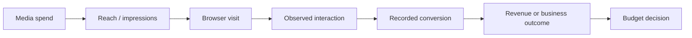
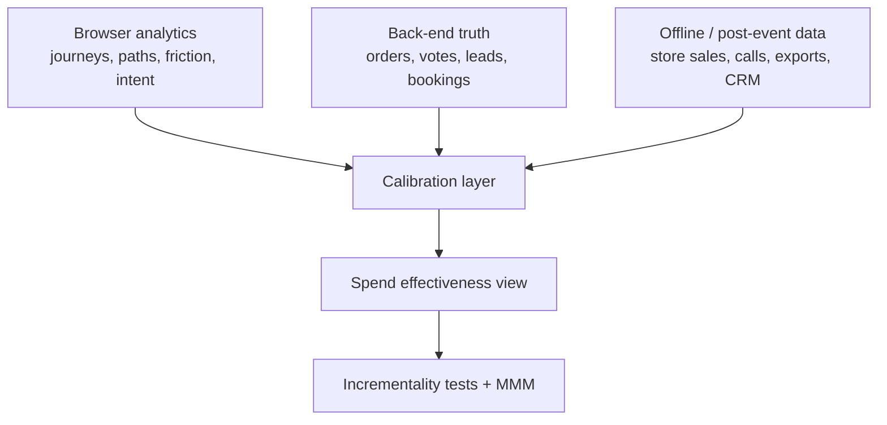

  Measurement strategy
  Consent mode
  GA4 modeled data
  Back-end truth
  Offline conversions
  Hard quant case study

The simplest question in analytics is usually the one that causes the most trouble:

> Did the spend work?

That looks like it should be answerable from a dashboard. In practice it often is not.

Browsers block or partition identifiers. Consent banners suppress or downgrade observable data. GA4 can model some missing behavior in the reporting UI, but not every surface supports that modeled layer. Warehouses can be correctly linked and still remain empty. Meanwhile the actual business outcome may live somewhere else entirely: a database row, a CRM stage change, an in-store transaction, a phone call, or a file exported after the event.

That is why measurement gets questioned so quickly. Different systems are often answering slightly different questions, using different identity rules, with different latency, and with different tolerance for missing data.

The cleanest way to explain that is with a real example.

## The short version

  

    
Persisted votes

    
297

    
The live voting app’s source-of-truth API returned `297` stored votes on the hackathon event day.

  

  

    
GA4 raw submits

    
172

    
GA4 recorded `172` `vote_submitted` events for `vote.rajeevg.com` on March 25, 2026.

  

  

    
GA4 clean submits

    
163

    
After removing explicit test rows and malformed entry rows, only `163` submit events matched real competition entries.

  

  

    
Raw BigQuery tables

    
0

    
The GA4 export link was enabled for both daily and streaming export, yet `ga4_498363924` still had no landed raw tables.

  

That means three things at once:

- the browser telemetry was useful, but incomplete
- the back-end ledger was the only trustworthy completed-outcome count
- the warehouse layer could not help, because the raw export never materialized

<ArticleFigure
  src="/images/blog/measurement-reality/measurement-fracture.svg"
  alt="Four conflicting measurement answers from the same hackathon day"
  eyebrow="Hard Quant"
  title="One event day, four different stories"
  caption="The numbers in this article come from the live hackathon setup on March 25, 2026: the public summary endpoint at `vote.rajeevg.com`, direct GA4 Data API queries against property `498363924`, and direct BigQuery checks against `personal-gws-1:ga4_498363924` and `personal-gws-1:hackathon_reporting`."
/>

## The event day that makes the problem obvious

The hackathon is a useful case because the “real answer” was unusually clear.

The live public summary endpoint on the voting app returned:

- `297` total votes
- `37` participating judges
- `9` entries
- `1916` total points
- `6.45` average score

That back-end snapshot is the system of record because it reports what the application actually stored, not what a browser happened to emit.

GA4, queried directly for `hostName = vote.rajeevg.com` on **March 25, 2026**, returned these top event counts:

| Event | Count | What it means |
| --- | ---: | --- |
| `competition_state_snapshot` | `2318` | Operational heartbeat noise, not a business outcome |
| `vote_dialog_viewed` | `342` | Vote modal opened |
| `vote_score_selected` | `339` | Score button clicked |
| `page_context` | `221` | Page-level context event |
| `vote_submit_started` | `172` | Submit path entered |
| `vote_submitted` | `172` | Browser-observed submit event |
| `judge_auth_completed` | `19` | Sign-in completion observed by GA4 |

The real pressure point is `vote_submitted`.

On the same day:

- back-end stored votes: `297`
- raw GA4 `vote_submitted`: `172`
- clean real-entry GA4 `vote_submitted`: `163`
- raw BigQuery export tables: `0`

That is not a small discrepancy. If someone treated GA4 submit events as the truth, they would understate the actual completed vote count by `125` votes in the raw view and by `134` votes in the cleaned real-entry view.

The coverage math is blunt:

- raw GA4 coverage: `172 / 297 = 57.9%`
- clean real-entry GA4 coverage: `163 / 297 = 54.9%`
- missing coverage versus the ledger: `45.1%`

There was also visible telemetry contamination inside GA4 itself:

- explicit test rows: `4`
- malformed submit rows: `5`
- non-production or malformed share of raw submit events: `9 / 172 = 5.2%`

That is exactly how measurement starts to raise questions. The UI is live, the data is flowing, and yet the “most obvious” headline number is not the business-correct answer.

## Why the consent split looks strange but is still correct

One of the easiest ways to get confused is to compare a consent-state metric with a conversion metric as if they are both counting people.

They usually are not.

For the same hackathon day, `page_context` split like this:

- `177` denied
- `44` granted

That is a **page-level event split**, not a people split.

So the right reading is:

- observed consent rate inside that event stream: `44 / 221 = 19.9%`
- observed denied share inside that event stream: `177 / 221 = 80.1%`

But a single visitor can contribute more than once. Someone can land with denied consent, then grant consent later, and generate both states across separate `page_context` events.

That is why event-level consent metrics are useful for understanding measurement conditions, but dangerous if someone mistakes them for a clean user count.

  <ArticleExplain term="Observed data">Data GA4 can tie to usable identifiers because the browser allowed that level of observation. In consent-aware setups, this is the part of the measurement stream with the richest identity continuity.</ArticleExplain>
  <ArticleExplain term="Modeled data">Data GA4 estimates in some reporting surfaces when consented traffic is strong enough to train a model. This is not the same as raw event export.</ArticleExplain>
  <ArticleExplain term="Back-end ledger">The application’s own stored outcome data. In the hackathon this means votes actually written to the database, not just submit clicks seen in the browser.</ArticleExplain>
  <ArticleExplain term="Offline conversion">A meaningful business outcome that happens outside the browser and is later imported or reconciled, such as a finalized score workbook, store purchase, phone sale, or test drive.</ArticleExplain>

## How browser technology and consent distort measurement

The mechanism is not mysterious. It is just stacked.

### 1. The browser reduces identifier continuity

Cross-site analytics has always depended on some form of durable identity. That might be a third-party cookie, a same-site cookie linked through redirects, or a chain of browser-stored identifiers that survive long enough to stitch sessions together.

Modern browsers are deliberately hostile to that pattern.

- Apple’s WebKit says [full third-party cookie blocking](https://webkit.org/blog/10218/full-third-party-cookie-blocking-and-more/) removes statefulness in cookie blocking and also applies a [7-day cap on all script-writeable storage](https://webkit.org/blog/10218/full-third-party-cookie-blocking-and-more/).
- Firefox says Standard Enhanced Tracking Protection blocks [cross-site tracking cookies](https://support.mozilla.org/en-US/kb/enhanced-tracking-protection-firefox-desktop), and Strict blocks [all cross-site cookies](https://support.mozilla.org/en-US/kb/enhanced-tracking-protection-firefox-desktop).
- MDN explicitly lists [collecting analytics across multiple sites](https://developer.mozilla.org/en-US/docs/Web/Privacy/Guides/Third-party_cookies) as one of the use cases that third-party cookies historically powered, and also notes that developers need to reduce reliance on them because blocked cookies break assumptions.

That matters because spend-effectiveness proof often requires continuity:

- ad exposure to visit
- visit to lead
- lead to customer
- customer back to revenue

If identifier continuity weakens, the chain becomes more inferential and less observed.

### 2. Consent changes what GA4 can know

Consent is not just a legal banner. It changes the structure of the dataset.

Google’s own GA4 documentation says that when users decline consent, Analytics is missing data, and [behavioral modeling for consent mode](https://support.google.com/analytics/answer/11161109?hl=en) uses machine learning to estimate behavior from similar users who did accept analytics cookies.

That changes the question from “what happened?” to two separate questions:

- what was directly observed?
- what was estimated inside a reporting surface?

Google also states that when users do not grant consent, events are not associated with a persistent user identifier, which means GA4 may see a set of events but cannot reliably tell whether that was one user or many. That is why counts like `first_visit` and `session_start` can inflate under denied consent.

### 3. Consent mode only helps if the tags still load

This is the part many teams miss.

Google’s guidance on [unblocking tags when using consent mode](https://support.google.com/analytics/answer/12962079?hl=en) says tags should load in all cases. If consent is denied, those tags can still communicate non-identifying signals like consent state and country, which improve conversion modeling and enable behavioral modeling.

If teams block tags entirely until consent is granted, they are not just being “more compliant.” They are also removing the signals that make modeled reporting possible.

This is also why first-party collection and server-side tagging need to be described honestly. They can improve delivery resilience and give you more control over the transport path, but they do not override browser privacy controls and they do not turn a denied-consent visit into a fully observed identified user.

### 4. GA4 UI numbers and BigQuery numbers are not supposed to match perfectly

Google says in its own comparison guide that [some discrepancies between Analytics and BigQuery are normal](https://support.google.com/analytics/answer/13578783?hl=en) because the two systems have access to different data and use different assumptions.

Two of the biggest ones are:

- GA4 reports can use reporting identities beyond device ID, while [BigQuery export is device-ID based](https://support.google.com/analytics/answer/13578783?hl=en).
- [Behavioral modeled data is not supported in data export, including BigQuery export](https://support.google.com/analytics/answer/11161109?hl=en).

That means a team can compare the GA4 interface against BigQuery, see a mismatch, and think something is broken when part of the difference is structural.

## Why this makes digital marketing spend effectiveness harder to prove

Spend effectiveness is usually judged on some version of this chain:

The problem is that different systems become authoritative at different points in that chain.

- ad platforms are strong on spend, delivery, and click logs
- browser analytics is strong on on-site behavior and pathing
- back-end systems are strong on completed transactions
- offline systems are strong on the commercial outcome that happens after the session ends

If you force one layer to answer every question, you get avoidable arguments.

The hackathon numbers show that clearly. If someone used browser analytics alone to assess performance, the competition would appear to have only `163` clean vote submissions tied to real entries. The app itself had already stored `297` votes. That is not a rounding issue. That is a strategic difference in what the systems are measuring.

For real paid media programs, the equivalent gaps show up as:

- tracked leads lower than CRM-qualified leads
- ecommerce tags lower than settled orders
- online form fills lower than booked appointments
- ad-platform conversions lower than store sales
- web conversions lower than phone sales

And even when every system is behaving correctly, they can still disagree on timing. One platform may credit the click date, another may report the conversion date, and the CRM may only show the opportunity once a salesperson updates it. That makes “this week worked better than last week” harder to defend than many dashboards imply.

So the question “did the spend work?” rarely has a single-surface answer.

## How GA4 modeled data actually works

GA4’s modeled layer is often talked about loosely, so it helps to be precise.

Google says [behavioral modeling for consent mode](https://support.google.com/analytics/answer/11161109?hl=en) is designed for sites and apps that are missing data from users who opt out. The model uses observed behavior from similar consented users to estimate some of the missing behavior from unconsented users.

A few details matter a lot:

- it exists to estimate missing behavior caused by consent loss
- it appears in some reporting surfaces when the property is eligible
- it is tied to the property’s reporting identity, especially `Blended`
- it is not available in every surface
- it is not exported to BigQuery

Google also publishes the eligibility thresholds. To become eligible, a property must collect:

- at least `1,000` daily events with `analytics_storage='denied'` for at least `7` days
- at least `1,000` daily users with `analytics_storage='granted'` for at least `7` of the previous `28` days

That threshold is important because it explains why modeled data is not some magic escape hatch for smaller properties.

The hackathon host slice is nowhere near that scale on its own. On the event day examined here, the clearest consent-state split I could observe for `vote.rajeevg.com` was only `221` `page_context` events in total, with `44` granted and `177` denied. That is useful for diagnosis, but it is nowhere close to Google’s published thresholds for robust behavioral modeling eligibility.

So when smaller teams say “GA4 will model the missing data anyway,” the honest answer is often: maybe not, and certainly not everywhere.

## Why back-end source-of-truth data often differs from GA4

Back-end systems and browser analytics do not fail in the same places.

Back-end outcome data is usually stronger for completed business truth because it is written at the moment the transaction is committed. But it is weaker on upstream behavior.

Browser analytics is usually stronger for pathing and interaction context because it lives in the session, but it is weaker on final truth.

That difference is structural:

- the browser can fire an event before the write succeeds
- the write can succeed even if the browser event is blocked, delayed, malformed, or dropped
- custom parameters can be missing even when the core event arrives
- test traffic can pollute browser telemetry without changing production business truth
- consent-denied traffic can remain observable only in a reduced, cookieless form

The hackathon data shows all of those forces in a compact way.

| Layer | Number | Why it differs |
| --- | ---: | --- |
| Persisted votes in the app DB | `297` | Final stored outcome |
| Raw GA4 `vote_submitted` | `172` | Browser-observed submits, including non-production and malformed rows |
| Clean real-entry GA4 submits | `163` | Real entries only, after isolating test and malformed rows |
| Explicit test GA4 submit rows | `4` | Telemetry pollution |
| Malformed GA4 submit rows | `5` | Missing slug or name on the event payload |

This is why I prefer treating back-end source-of-truth data as the answer to “how many completed outcomes happened?” and browser analytics as the answer to “what happened around that outcome?”

  

    
Back-end answer

    
How many completed outcomes really happened?

    
In the hackathon case, that answer lives in the voting database and the public summary snapshot. If the app stored `297` votes, the business-correct total is `297`, even if browser telemetry saw fewer submits.

  

  

    
Browser answer

    
What did the session look like on the way to that outcome?

    
GA4 is still valuable here. It tells you that `342` vote dialogs opened, `339` scores were selected, and only `163` clean real-entry submits were observed. That is pathing and telemetry context, not the final ledger.

  

## Why offline and post-event data still matter

The hackathon had a small but useful offline-style analogue: the finalized score workbook that could be exported after the round. That file is not better than the database, but it is a practical audit artifact outside the live browser session.

In normal commercial measurement, the offline layer is usually much more important:

- a dealership test drive
- an in-store purchase
- a call-center conversion
- a signed contract
- a branch appointment that later becomes revenue

Google’s own offline conversion guidance for Ads exists because this gap is normal. Its documentation on [offline conversion uploads](https://support.google.com/google-ads/answer/15081888?hl=en) explains that uploads have timing constraints, deduplication rules, and matching rules. For example, uploads more than `90` days after the associated last click are not imported.

That is a useful reminder: even when you have offline data, it arrives later, matches imperfectly, and has operational rules of its own.

So the realistic measurement challenge is not just “capture more browser data.” It is “join delayed business outcomes back to the most reliable upstream signals you have.”

## Why a blended measurement stack is usually more realistic

<ArticleFigure
  src="/images/blog/measurement-reality/source-mix-calibration.svg"
  alt="Three-source measurement calibration model using browser analytics, back-end truth, and offline data"
  eyebrow="Measurement Design"
  title="A defensible effectiveness read usually comes from calibration, not one dashboard"
  caption="Browser analytics, back-end source-of-truth data, and offline or post-event outcomes answer different questions. The useful move is to calibrate them, not force one layer to behave like all the others."
/>

The stack I trust most looks like this:

Each layer plays a different role:

| Layer | Best for | Common failure |
| --- | --- | --- |
| Browser analytics | pathing, click behavior, page friction, content engagement | consent loss, blocked identifiers, modeled assumptions, export differences |
| Back-end truth | completed transactions, booked outcomes, final eligibility checks | thin channel context, weaker exposure information |
| Offline or post-event data | revenue realization, store or call outcomes, delayed commercial proof | matching lag, upload windows, CRM hygiene, duplicate handling |
| Warehouse or modeled reporting layer | normalization, joining, QA, trend views | dependent on exports actually landing and on the assumptions of each input |

The point is not to average them. The point is to let each one answer the question it is actually built for.

## One important point people often miss: blending sources still does not prove causality

Even a beautifully reconciled dashboard is not the same as causal proof.

That is the next uncomfortable step.

Google’s own [Meridian documentation](https://developers.google.com/meridian/docs/post-modeling/model-fit) says the primary goal of marketing mix modeling is accurate estimation of causal marketing effects, but also says direct validation of causal inference is difficult and requires well-designed experiments. Google’s [Meridian overview](https://developers.google.com/meridian/docs/basics/about-the-project) describes MMM as a privacy-safe aggregated technique and explicitly notes that it can be calibrated with experiments and other prior information. Google Ads’ own [Experiments documentation](https://developers.google.com/google-ads/api/docs/experiments/experiments) exists for the same reason: sometimes the only credible way to answer “did this spend cause the lift?” is to run a controlled comparison.

So there are really two layers of proof:

1. **Measurement calibration**
   Make the browser, back-end, warehouse, and offline surfaces line up as honestly as possible.

2. **Causal validation**
   Use experiments, holdouts, lift studies, or MMM to test whether the spend actually created incremental outcomes.

That second layer is the one many teams skip because the dashboard feels concrete enough. It often is not.

## The BigQuery lesson from this case

There is one more reason I wanted this article to be quantitative rather than theoretical.

In this hackathon setup, the GA4 BigQuery link itself was correctly configured:

- property `498363924` had a live BigQuery link
- daily export was enabled
- streaming export was enabled
- the export stream list included the hackathon web stream

But direct BigQuery checks still showed:

- `ga4_498363924`: `0` raw export tables
- `hackathon_reporting`: `8` modeled tables, all at `0` rows

Google’s own [BigQuery export setup documentation](https://support.google.com/analytics/answer/9823238?hl=en) says data should usually begin flowing within `24` hours and documents failure modes such as service-account problems, organization policy conflicts, billing issues, and quota problems.

That is another useful measurement lesson:

configured infrastructure is not the same as populated infrastructure.

If the raw warehouse layer is empty, the warehouse cannot validate the browser layer. It becomes another thing that needs validating.

## What I think is the defensible answer

If you want a measurement story that survives scrutiny, the workflow is usually:

- use browser analytics to understand reach, pathing, friction, and assisted behavior
- use the back-end ledger to answer “how many completed outcomes really happened?”
- use offline or post-event records to connect those outcomes to real commercial value
- use warehouses and modeled layers to normalize, join, and QA the above
- use experiments or MMM when the real question is causality, not just reporting

That is more complicated than pointing at one conversion card in GA4.

It is also more honest.

On the hackathon day in this article, the honest answer was not:

- “GA4 says 172 so the answer is 172”

It was:

- the browser observed `172` submit events
- only `163` were clean real-entry submit events
- the application actually stored `297` votes
- the consent state was mostly denied in the clearest page-level consent split we could observe
- the BigQuery export path was linked but empty

That is not a failure of measurement. That is measurement behaving like the real world.

## Sources

- [Google Analytics Help: Behavioral modeling for consent mode](https://support.google.com/analytics/answer/11161109?hl=en)
- [Google Analytics Help: Compare Analytics reports and data exported to BigQuery](https://support.google.com/analytics/answer/13578783?hl=en)
- [Google Analytics Help: Set up BigQuery Export](https://support.google.com/analytics/answer/9823238?hl=en)
- [Google Analytics Help: Unblock Google tags when using consent mode](https://support.google.com/analytics/answer/12962079?hl=en)
- [WebKit: Full Third-Party Cookie Blocking and More](https://webkit.org/blog/10218/full-third-party-cookie-blocking-and-more/)
- [Firefox Help: Enhanced Tracking Protection in Firefox for desktop](https://support.mozilla.org/en-US/kb/enhanced-tracking-protection-firefox-desktop)
- [MDN: Third-party cookies](https://developer.mozilla.org/en-US/docs/Web/Privacy/Guides/Third-party_cookies)
- [Google Ads Help: Guidelines for importing offline conversions](https://support.google.com/google-ads/answer/15081888?hl=en)
- [Google Meridian: About Meridian](https://developers.google.com/meridian/docs/basics/about-the-project)
- [Google Meridian: Assess the model fit and the results](https://developers.google.com/meridian/docs/post-modeling/model-fit)
- [Google Ads API: Create experiments](https://developers.google.com/google-ads/api/docs/experiments/experiments)
