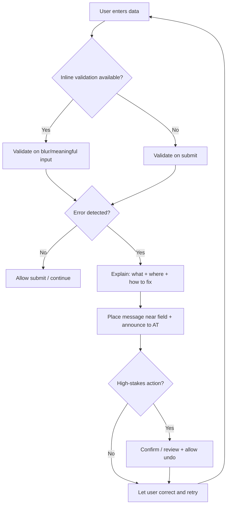

# A Definitive Cross‑Platform UX/UI Rulebook for Building Good Interfaces

## Executive summary

No single “official” set of UX/UI rules can guarantee a good interface in every context, because platform conventions, user needs, and constraints differ; even official platform guidance explicitly notes there’s no single navigation design that works for every app. citeturn5search6 The most reliable way to minimise the chance of a bad interface is to combine: (a) evidence‑based usability heuristics (for identifying and preventing common failure modes), (b) official platform human interface guidelines and design systems (for “native” conventions and expected behaviours), (c) formal accessibility standards and patterns (for inclusive operability and robustness), (d) performance and responsiveness targets (for “felt” quality), and (e) continuous validation through user research and measurable outcomes. citeturn0search0turn6search7turn0search6turn4search4turn3search5

This document consolidates those sources into a single, actionable rule set with an explicit conflict‑resolution order, plus a mapping table across iOS, Android/Material, Windows/Fluent, macOS, web, and major design systems (Carbon, Polaris), and a pattern playbook with “good vs bad” examples. The checklist is designed to be used as a *Definition of Done* for design and implementation, and to drive objective review via heuristic evaluation, accessibility testing, and usability metrics. citeturn0search0turn3search4turn3search0turn6search7turn3search5

## Source hierarchy and conflict resolution

A “single rulebook” only works if it also tells you what to do when rules conflict. The following precedence order is the safest synthesis of the official sources and industry practice:

**Accessibility and safety constraints first.** Conformance requirements for perceivable, operable, understandable, and robust interfaces are non‑negotiable for many products, and WCAG 2.2 defines concrete success criteria for focus visibility, target size, dragging alternatives, consistent help, redundant entry, and accessible authentication—areas that often directly affect UI pattern choices. citeturn6search7turn0search1turn0search17turn10search7

**Then platform conventions (native feel and expected behaviour).** Official platform guidance exists to ensure experiences align with what users already know on that platform (e.g., Apple platform guidance in the Human Interface Guidelines; Windows guidance aligned to Fluent; Material guidance for Android and responsive environments). citeturn0search3turn5search18turn1search8turn5search6

**Then your product’s design system (consistency at scale).** A design system is explicitly about managing design at scale through standards and reusable components/patterns, reducing redundancy while maintaining consistency across pages/channels. citeturn3search11 Design systems commonly embed accessibility requirements directly into component implementations to make consistency and remediation easier. citeturn1search3turn9search14turn1search2

**Then evidence‑based usability heuristics (broad failure‑mode prevention).** The classic 10 usability heuristics remain a widely used evaluation framework (visibility of system status; match to real world; user control; consistency; error prevention; recognition vs recall; efficiency; minimalist design; error recovery; help/documentation). citeturn0search0turn0search4

**Finally, local optimisation through research and measurement.** UX research methods and usability metrics exist to validate whether your interface actually works for your users and tasks (e.g., success rate, time on task, satisfaction metrics like SUS/SEQ, and qualitative usability testing with think‑aloud). citeturn3search0turn3search4turn3search12turn3search5turn3search9

## Consolidated UX/UI rule set and checklist

The rules below are written as **MUST / SHOULD / AVOID**, intended to be actionable for both designers and developers. Each rule is grounded in one or more of the prioritised sources.

### Non‑negotiable rules

**Make system status continuously legible (feedback).** Every user action that triggers processing MUST produce clear feedback, and any meaningful wait MUST be communicated using an appropriate loading/progress pattern (determinate when progress is known; indeterminate when unknown), without blocking interaction unless necessary. citeturn0search0turn4search6turn4search3turn4search27

**Design for error prevention and recovery, not blame.** Prevent slips with constraints and suggestions; when errors occur, messages MUST be plain language, describe the problem, and suggest a constructive next step. citeturn0search24turn0search4turn9search1turn9search7

**Never rely on colour alone to convey meaning.** States (error/success/warning/selection/focus) MUST be communicated with additional cues (text, iconography, affordances) and adequate contrast. citeturn11search26turn6search7turn11search11

**Meet minimum contrast and focus requirements.** Text contrast MUST meet WCAG thresholds (typically 4.5:1 for normal text, 3:1 for large text), and UI component boundaries/states (including focus indicators) MUST remain perceivable and not obscured. citeturn6search7turn6search3turn0search1turn0search5

**Keyboard and assistive‑technology operability MUST be first‑class.** Interactive UI MUST be operable via keyboard where applicable, avoid keyboard traps, and expose correct semantics (name/role/value) so custom widgets remain interoperable with assistive technologies; when building rich widgets, follow ARIA APG patterns rather than inventing keyboard behaviour. citeturn0search2turn0search6turn0search26turn2search17turn6search7

**Forms MUST be self‑evident, labelled, and repairable.** Inputs MUST have clear labels and instructions, errors MUST identify the field and provide correction suggestions when possible, and high‑stakes actions (legal/financial/data submission) MUST be reversible/checked/confirmable. citeturn1search6turn10search6turn10search11turn10search3turn10search30

**Motion MUST be meaningful and optional.** Animation MUST support comprehension (relationships, transitions, outcomes), avoid gratuitous or frequent motion, and respect reduced‑motion preferences. citeturn6search0turn6search1turn6search2turn6search4turn6search9

**Responsive/adaptive behaviour MUST be intentional.** Layout MUST respect platform constraints (safe areas, effective pixels, window size classes/breakpoints) and remain usable across target device sizes/orientations. citeturn13search2turn4search31turn13search32turn13search3

**Write for clarity, accessibility, and localisation.** Microcopy MUST use plain language, avoid jargon, and be written with accessibility and localisation in mind; error text MUST be specific and actionable. citeturn9search0turn9search7turn9search1

**Optimise perceived and real performance.** Interfaces MUST feel responsive: set measurable targets for loading, responsiveness, and stability (web: LCP/INP/CLS) and design UI patterns that reduce the perceived cost of waiting. citeturn4search4turn4search0turn4search5turn4search27

### Strong defaults that prevent common UI failure modes

**Prefer recognition over recall.** Keep options visible, use sensible defaults, and minimise memory burden (especially in forms and navigation). citeturn0search0turn0search4

**Use platform‑native navigation paradigms.** For top‑level destinations on mobile, constrain to the recommended range (commonly 3–5) and use the platform’s standard patterns; for Windows, choose navigation patterns based on information architecture needs and avoid trapping users in deep hierarchies. citeturn5search2turn5search17turn5search8turn5search6

**Put errors next to the field and summarise when necessary.** Inline placement shortens the fix loop; for long forms, also provide a top summary that links to fields. citeturn10search6turn10search23

**Use tokens for colour/typography/spacing instead of hard‑coded values.** Tokens are explicitly intended to create consistency and scalability across platforms (colour, typography, spacing) and to support theming and accessibility updates without redesigning UI. citeturn11search1turn11search19turn12search1turn13search0

**Use a deliberate spacing system.** Adopt a consistent spacing ramp/grid (e.g., Carbon’s 2×/spacing scale, Fluent’s 4px base ramp, Material’s responsive layout grid) to enforce rhythm, hierarchy, and scannability. citeturn13search0turn13search1turn13search3turn13search10

**Use typography to express hierarchy, not decoration.** Prefer platform default fonts and type scales; support dynamic text sizing where the platform offers it, and ensure text remains legible across sizes and densities. citeturn5search0turn12search2turn12search0turn12search3

**Icons should be recognisable and (usually) labelled.** Use consistent icon sets and sizes; whenever an icon represents navigation or a critical action, provide a text label or accessible name so meaning is not ambiguous. citeturn7search4turn7search6turn7search3turn7search1

**Be careful with modals.** Use modal dialogs only when you must interrupt; ensure focus is trapped correctly, the dialog is dismissible when appropriate, and users can return to context without losing work. citeturn2search34turn2search17turn2search3

**Internationalise from the start.** Support RTL mirroring where applicable, avoid concatenated strings, and respect locale formatting for dates/numbers; test with pseudolocalisation/RTL early to avoid late‑stage layout breakage. citeturn8search1turn8search2turn8search9turn8search4

### Anti‑patterns to avoid

**Placeholder‑only labels.** Placeholder text MUST NOT be the only label, because it disappears on input and increases recall burden; treat visible labels as the default. citeturn1search6turn10search7turn10search11

**“Invalid input” without guidance.** Error messages that don’t say what to fix or how to fix it increase failure and frustration; provide suggestions where known. citeturn9search7turn10search3turn10search23

**Excess motion in frequent interactions.** Repeated, decorative motion distracts and can cause discomfort; replace with subtle, purposeful transitions and respect reduced‑motion preferences. citeturn6search0turn6search4turn6search9

**Navigation bloat at the top level.** Too many primary destinations forces scanning and decision fatigue; use information architecture methods (card sorting/tree testing) to structure content and reduce top‑level choices. citeturn3search2turn3search14turn5search8

**Focus indicators obscured by sticky UI or overlays.** Ensure keyboard focus remains visible and not hidden by author‑created content. citeturn0search1turn0search5turn6search7

### Reference flows (Mermaid)

**Form submission and error recovery loop**



**Design‑system change lifecycle (governance and versioning)**

```mermaid
flowchart LR
  A[Need identified] --> B[Proposal / RFC]
  B --> C[Design + a11y review]
  C --> D[Prototype + usability check]
  D --> E[Implement component + docs]
  E --> F[Regression tests: visual + a11y + perf]
  F --> G[Release (semver) + changelog]
  G --> H[Adoption support + deprecation plan]
  H --> I[Measure impact + iterate]
```

## Platform and design‑system mapping across ecosystems

The table below compares where guidance *converges* (shared principles) and where it *diverges* (platform norms and component behaviour). The intent is not to memorise every rule, but to know which “authority” to use per decision.

image_group{"layout":"carousel","aspect_ratio":"16:9","query":["iOS tab bar example screenshot","Android Material navigation bar example","Windows 11 command bar UI example","macOS sidebar navigation UI example"],"num_per_query":1}

| Topic | iOS & macOS (Apple HIG) | Android & Material | Windows & Fluent | Web (WCAG/ARIA + performance) | Carbon | Polaris |
|---|---|---|---|---|---|---|
| Navigation | Emphasises platform‑native patterns and consistent Apple‑platform behaviour via HIG. citeturn0search3turn0search23 | Top‑level destinations commonly expressed via bottom navigation / tabs / drawers; guidance explicitly frames when to use each. citeturn5search8turn5search2turn5search5 | Explicitly states there’s no single navigation design; provides principles to choose (linear vs hub vs single page etc.). citeturn5search6 | Navigation must be keyboard and AT operable; semantics and current location should be conveyed programmatically (e.g., ARIA patterns). citeturn0search6turn2search17turn6search7 | Encourages consistent patterns and accessible implementations within the system’s components and patterns. citeturn3search11turn9search14 | Polaris provides application layout patterns and navigational components intended to keep experiences predictable for merchants. citeturn1search3turn1search15 |
| Layout & responsiveness | Prioritises adaptable UI through safe areas, margins, and guides; supports dynamic type and layout adaptability. citeturn13search2turn5search0turn5search36 | Formalises responsive layout grids, breakpoints, and (in Material 3) window size classes. citeturn13search3turn13search32turn13search6 | Uses responsive vs adaptive concepts; emphasises effective pixels and responsive techniques across window sizes. citeturn4search31turn4search31 | Responsive design must preserve usability across viewport sizes, zoom, and text resizing as part of accessibility. citeturn6search7turn11search38 | Provides a spacing scale and 2× grid model to systematise layout across products. citeturn13search0turn13search10 | Polaris encourages reuse of its components for consistent layout and accessible markup. citeturn1search3turn1search35 |
| Typography | Encourages legibility and hierarchy; supports Dynamic Type (system text sizing). citeturn5search0turn5search7 | Uses type scales with semantic roles/tokens; typography guides hierarchy and readability. citeturn12search0turn12search7 | Recommends a single font throughout UI (e.g., Segoe UI Variable) for legibility across sizes/densities; Fluent aligns to Segoe and baseline rhythm. citeturn12search2turn12search3turn12search6 | Text must meet contrast and reflow expectations; semantics and headings/labels matter for understanding. citeturn6search7turn10search7 | Carbon’s typographic system uses tokens calibrated around IBM Plex and supports hierarchy for different “productive vs expressive” contexts. citeturn12search1turn12search5turn12search14 | Polaris provides content fundamentals and component copy guidance to keep language consistent and scannable. citeturn9search11turn9search7 |
| Colour & contrast | System colours adapt across appearances; guidance covers colour usage and dark mode contrast. citeturn5search1turn5search24turn5search4 | Material explicitly addresses colour contrast and tokenised roles; warns improper combinations can break accessibility. citeturn11search0turn11search8turn6search7 | Fluent requires WCAG AA contrast ratios and uses a token system for consistency; Windows has explicit accessible text requirements. citeturn11search34turn11search1turn11search14 | WCAG defines contrast thresholds, non‑text contrast, and focus visibility constraints. citeturn6search7turn6search3turn0search1 | Carbon uses role‑based colour tokens and explicitly links component boundary/state contrast to WCAG non‑text contrast. citeturn11search3turn11search11turn11search15 | Polaris positions reuse of components as a path to more consistent accessibility; error messages warn against jargon and encourage specific next steps. citeturn1search3turn9search7 |
| Motion | Advises avoiding adding motion to frequent interactions and reducing potentially uncomfortable effects; supports reduced‑motion expectations. citeturn6search0turn6search4 | Motion should highlight relationships, availability, and outcomes; Material 3 formalises motion language. citeturn6search1turn6search8 | Fluent motion emphasises functional, natural, consistent motion; Windows supports natural motion animations. citeturn6search2turn6search15 | Respect `prefers-reduced-motion`; avoid motion that can cause harm or confusion. citeturn6search9turn6search7 | Carbon and IBM accessibility guidance emphasise perceivable/operable patterns and testing; motion choices must not impede users. citeturn9search14turn9search33 | Polaris content and component reuse reduces inconsistency; for motion specifics, teams typically rely on platform/web a11y preferences. citeturn1search3turn9search11 |
| Forms & error handling | Recommends dynamic validation to prevent frustration and reduce late corrections. citeturn10search8 | Text fields should communicate state clearly with labels, assistive text, and validation; Material 3 recommends error icons to improve visibility. citeturn10search1turn10search5 | Windows distinguishes message types (error vs warning vs confirmation) and provides guidelines for writing clear error messages. citeturn9search1turn9search27turn10search2 | WCAG Input Assistance requires identifying errors, labelling inputs, suggesting corrections, and adding safeguards for high‑stakes actions. citeturn10search7turn10search11turn10search3turn10search23 | Carbon explicitly recommends visible labels, accessible inline errors, and programmatic error states for assistive tech. citeturn1search6turn1search2turn9search33 | Polaris error messages: explain what’s wrong and what to do, be specific, avoid jargon like “invalid”, and help users avoid mistakes. citeturn9search7 |
| Iconography | Supports using SF Symbols and/or glyph icons with clear meaning; provides icon guidance and symbol library. citeturn7search4turn7search0turn7search16 | Uses Material Symbols; icon guidance covers consistency and clarity across styles/weights. citeturn7search1turn7search13turn7search9 | Fluent iconography defines icon collections and usage; system icons are open‑source and used for UI commands/status. citeturn7search6turn7search10 | Icons must have accessible names and must not be the only means of conveying state/meaning. citeturn6search7turn0search26 | Carbon defines icon sizing/alignment guidance and stresses consistency across product UI. citeturn7search3turn7search7 | Polaris promotes consistent component usage (including icons in components) to keep UI predictable and accessible. citeturn1search3turn1search35 |

## Pattern playbook with good vs bad examples

This section gives “rules in action” using patterns repeatedly referenced across the prioritised sources, and grounded by cross‑design‑system examples (component.gallery) and accessibility patterns (ARIA APG). citeturn2search0turn0search6turn0search0

### Navigation structures

**Good pattern:** A small number of clearly labelled top‑level destinations (often 3–5 on mobile), persistent visibility of current location, and information architecture validated with card sorting and tree testing. citeturn5search2turn5search8turn3search2turn3search14

**Bad pattern:** Overloaded primary nav with many peers, inconsistent labels, and deep hierarchies without obvious “back to top” paths—leading to disorientation and recall burden. citeturn0search0turn5search6turn3search14

**Component.gallery grounding:** The “Navigation” component category exists precisely because navigation containers repeat across systems; reviewing multiple implementations helps you align with conventions rather than inventing a bespoke pattern. citeturn2search2turn2search7

### Dialogs and modals

**Good pattern:** Use modals only when interruption is necessary; trap focus within the modal; provide a clear close/cancel path; avoid using modals for routine or frequent interactions. citeturn2search34turn2search17turn2search3

**Bad pattern:** Unnecessary modals for ordinary tasks; keyboard focus leaks behind dialog; Esc/close behaviour inconsistent; dismissing loses user input. citeturn2search17turn0search0turn9search1

**Component.gallery grounding:** The “Modal” definition emphasises that it blocks returning to underlying content until the user interacts; treat that as a warning label: use sparingly. citeturn2search3

### Forms, validation, and error recovery

**Good pattern:** Visible labels, helper text when needed, validation timed to user intent (often on blur or submit; immediate for constrained fields like password rules), inline error placement near fields, explicit suggestions, and safeguards for high‑stakes submissions. citeturn1search6turn10search8turn10search6turn10search3turn10search30

**Bad pattern:** Placeholder‑only “labels”; generic errors; errors displayed far from fields; colour‑only error states; requiring users to re‑enter previously provided data without necessity (WCAG 2.2 adds redundant entry constraints). citeturn1search6turn9search7turn0search1turn0search5

**Design‑system grounding:** Carbon explicitly advises labels as default and provides accessible error patterns and programmatic error state conveyance; Polaris provides concrete rules for error microcopy (specific, avoid jargon, tell user what to do). citeturn1search6turn1search2turn9search7turn9search33

### Date selection

**Good pattern:** Use a date picker when the date is not memorable or needs browsing; allow direct typing; for memorable dates like date of birth, prefer structured date input fields. citeturn2search8turn2search15turn2search1

**Bad pattern:** Forcing a calendar UI for date‑of‑birth or other memorable dates, causing excessive tapping and navigation. citeturn2search8turn2search15

### Loading and progress feedback

**Good pattern:** Clear “loading” states; choose determinate vs indeterminate indicators correctly; in longer waits, estimate remaining time or progress, and avoid freezing the UI without communicating why. citeturn4search6turn4search3turn4search27

**Bad pattern:** Silent delays, spinners with no context for long operations, or blocking overlays for tasks that could be non‑blocking. citeturn4search27turn0search0

### Motion and reduced motion

**Good pattern:** Motion explains relationships and outcomes, avoids excessive animation in frequent interactions, and respects user preferences (`Reduce Motion` / `prefers-reduced-motion`). citeturn6search0turn6search1turn6search9turn6search4

**Bad pattern:** Decorative motion that adds cognitive load or discomfort, or motion that’s required to understand state changes with no alternative. citeturn6search4turn6search0turn6search7

## Measurement, research, and continuous improvement

A “rules‑only” approach reduces obvious mistakes, but the official and evidence‑based stance across UX practice is that you still need to validate with real users and observable outcomes. NN/g’s usability testing guidance emphasises observing users performing tasks (often with think‑aloud) to uncover behaviours and friction, rather than relying on opinions. citeturn3search5turn3search9turn3search30

### Research methods to select by question

Use a small “core toolkit” and expand as needed:

**Task usability testing (qualitative) is the default diagnostic tool.** Use moderated sessions for deep probing; unmoderated for scale, speed, and broader coverage when tasks are clear. citeturn3search5turn3search1turn3search17

**Information architecture methods:** card sorting to design groupings and labels; tree testing to evaluate findability of a proposed navigation structure. citeturn3search2turn3search10turn3search14

### Metrics/KPIs to operationalise “good UI”

Use a balanced set of performance and perception metrics:

**Success rate (task completion) is the most direct usability outcome metric.** citeturn3search0  
**Time on task and error rate measure efficiency and friction.** citeturn3search4turn3search0  
**Satisfaction metrics (SUS after test; SEQ after each task) complement performance metrics, but don’t assume satisfaction perfectly correlates with objective performance.** citeturn3search12turn3search8  
**Web performance KPIs:** Core Web Vitals define target thresholds for loading (LCP), responsiveness (INP), and stability (CLS), and INP formally replaced FID in March 2024; treat these as part of UX quality on the web. citeturn4search4turn4search5turn4search1turn4search0

### Practical “definition of done” for a feature

A feature should not be considered complete until:

It passes a heuristic review anchored in the 10 usability heuristics. citeturn0search0turn0search8  
It meets WCAG‑aligned accessibility checks for interaction, focus, contrast, labelling, and error recovery (and uses ARIA APG patterns for complex widgets). citeturn6search7turn0search6turn10search23  
It meets performance and responsiveness expectations for the platform (web: vitals; Windows/iOS: responsiveness and loading communication). citeturn4search4turn4search7turn4search6  
It has been tested with representative users using task scenarios, and results are summarised with at least success rate + top usability issues. citeturn3search5turn3search0turn3search4

## Design system governance, versioning, and recommended resources and templates

### Governance and versioning principles

Design systems are operational products: to remain consistent and safe, they need governance, contribution workflows, and a release process. NN/g explicitly teaches establishing sustainable governance and contribution models, embedding accessibility into component specs/testing, and creating feedback loops that drive system evolution. citeturn3search3

A minimal governance model that scales:

**A clear scope and ownership model:** define what the system covers (components, patterns, content standards, tokens) and who decides changes. citeturn3search11turn3search3  
**Contribution criteria:** require evidence (user need), accessibility review, and quality before inclusion—mirroring established design‑system contribution criteria approaches. citeturn3search23  
**Release discipline:** publish changelogs, deprecations, and migration guidance; keep accessibility requirements updated to evolving standards (e.g., WCAG 2.2 additions reflected in organisational checklists). citeturn9search14turn0search1turn0search5turn1search3

### Templates you can use immediately

These templates are intentionally concise and map back to the rule set above.

**Component specification template (for a design system)**  
Include: purpose; when to use/when not to use; anatomy; states; interactions (mouse/touch/keyboard); content rules (labels, errors); accessibility semantics; contrast requirements; responsive behaviour; motion rules; telemetry events; test cases; examples. This structure aligns with how ARIA APG documents patterns (behaviour + keyboard), how WCAG frames requirements (perceivable/operable/understandable/robust), and how mature systems document form errors and accessibility. citeturn0search6turn10search7turn1search2turn9search14

**Design critique checklist (fast review)**  
Check: system status visibility; consistency; affordance clarity; error prevention; error recovery; labels and instructions; keyboard focus; contrast; motion reduced; responsive layout; localisation readiness; performance budget. Grounding: Nielsen heuristics + WCAG + platform guidelines. citeturn0search0turn6search7turn13search2turn5search6

**Usability test plan template (task‑based)**  
Define: goals; target users; scenarios/tasks; success criteria; metrics (success rate/time/SEQ/SUS); method (moderated/unmoderated); recruitment; analysis plan. Grounding: NN/g usability testing and metrics guidance. citeturn3search5turn3search17turn3search0turn3search12

### Recommended primary resources (prioritised)

The following are the most “load‑bearing” references underpinning this rulebook:

Nielsen’s 10 usability heuristics and related guidance on errors, progress indicators, and modality. citeturn0search0turn10search6turn4search27turn2search34  
Official platform and design‑system guidance: Apple Human Interface Guidelines (layout, typography, colour, motion, accessibility, writing), Material guidance (navigation, layout grids, accessibility, motion, colour contrast), Windows/Fluent guidance (navigation basics, responsiveness, progress controls, typography), Carbon (forms, accessibility, tokens, spacing, icons, content), Polaris (accessibility foundations, content and error messages). citeturn0search3turn5search0turn5search1turn6search0turn9search0turn5search8turn13search3turn6search11turn5search6turn4search31turn4search3turn12search2turn1search2turn9search14turn13search0turn7search3turn9search7turn1search3  
WCAG 2.2 (plus Understanding docs) and WAI‑ARIA (spec + Authoring Practices Guide). citeturn6search7turn0search1turn0search26turn0search6turn2search17  
Component comparison and pattern grounding via component.gallery (definitions and cross‑system examples). citeturn2search0turn2search3turn2search1turn2search2