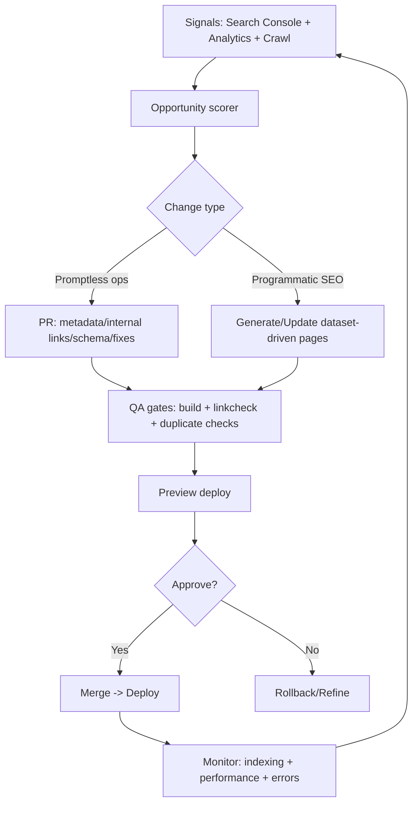
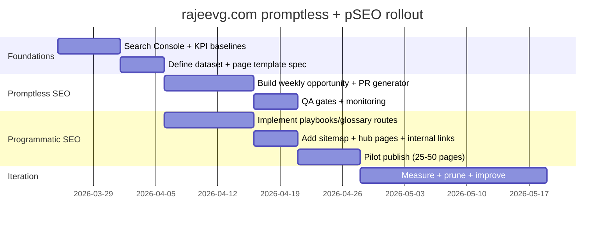

# Promptless SEO and Programmatic SEO for rajeevg.com

## Executive summary

Promptless SEO is an emerging, non-standard term used in the industry to describe SEO work that runs through *deterministic*, automation-first pipelines with *little or no manual prompt-writing*—often by encoding “prompts” (or eliminating them) behind reusable wrappers, schemas, and QA gates. One clear example of the “promptless” framing is tooling that generates “SEO content” via predefined “wrappers” rather than ad‑hoc prompt engineering. citeturn27search3turn27search19

Programmatic SEO (pSEO) is much more established: it’s the practice of generating *many* SEO landing pages using templates + structured data to target long-tail keyword patterns at scale. citeturn23search4turn23search0turn23search8

For rajeevg.com specifically, your current stack (Next.js App Router + Velite typed content layer + MDX, deployed on Vercel per the site/project documentation) is already a strong foundation for *safe, high-quality* automation: you have a typed schema for posts, a build-time content pipeline, and a dynamic Next.js sitemap implementation plus a permissive robots policy pointing to the sitemap. citeturn8view1turn9view0turn15view7turn18view0turn19view0turn24search0

The recommended strategy is to treat “promptless” as the operating system (continuous SEO operations: monitoring → prioritisation → controlled changes → QA → deploy), and pSEO as a *bounded* output channel (generate a limited, high-value set of data-driven pages). This is important because Google’s spam policies explicitly target “scaled content abuse” (large amounts of low-value/unoriginal content created primarily to manipulate rankings) and also list “doorway” patterns such as substantially similar pages that funnel users. citeturn10search1turn23search1turn23search5turn27search0

A low-effort, highly automated plan for rajeevg.com is therefore:

- **Promptless SEO (operations loop):** automate opportunity detection (Search Console), metadata/internal-link suggestions, and repeatable QA, all delivered as GitHub PRs with gates. Use fixed templates (“wrappers”) rather than hand-crafted prompts, and keep human approval for publish. citeturn12search4turn26search3turn27search3turn24search1  
- **Programmatic SEO (bounded page system):** add one new pSEO section (e.g., `/playbooks/*` or `/glossary/*`) generated from a single structured dataset + strict quality rules; include only canonical URLs in the sitemap (as Google recommends sitemaps for canonical signalling) and avoid thin/duplicative pages. citeturn11search0turn10search0turn18view0

## Concepts and core principles

Promptless SEO is best understood as *workflow design*, not a single tactic. Across “promptless” tools and descriptions, the shared idea is: replace manual prompt crafting with reusable, production-grade “wrappers” or deterministic pipelines (encode governance once; run the same standard every time). citeturn27search3turn27search19

Core principles of promptless SEO:

- **Determinism over improvisation:** the system should produce repeatable outputs (e.g., titles, descriptions, internal link maps, content blocks) from structured inputs, rather than relying on human prompt iteration. citeturn27search3turn27search19  
- **Closed-loop operation:** measure in Search Console/analytics → decide → change → QA → deploy → measure again (treat SEO as ongoing operations). Search Console is explicitly positioned as a tool to submit sitemaps/URLs, monitor index coverage, and understand how Search sees your pages. citeturn12search11turn12search1turn12search2  
- **Quality gates as first-class:** automation without gates leads to low-value scale, which is exactly what Google’s scaled-content and doorway policies are meant to reduce. citeturn10search1turn23search1turn23search2  
- **Schema + structured outputs when appropriate:** structured data helps Google understand page content (and is required for some rich result features), but must follow Google’s structured data guidelines and content/spam policies. citeturn11search6turn28search3

Programmatic SEO is a publishing strategy. Multiple mainstream SEO sources converge on the same definition: use templates + data to generate many pages targeting long-tail keywords/patterns. citeturn23search4turn23search0turn23search8

Core principles of programmatic SEO:

- **Start from a repeatable query pattern (“keyword formula”):** e.g., `[tool] + [task]`, `[concept] + [checklist]`, `[system] + [troubleshooting]` (but only where you can provide unique value per variant). citeturn23search4turn23search0  
- **Structured dataset is the “fuel”:** pSEO succeeds when you have a trustworthy dataset (internal or external) that can populate pages with genuinely useful, non-duplicative information. citeturn23search4turn11search0  
- **Template + modular content blocks:** pages need a consistent UX/SEO skeleton, plus modular blocks that vary meaningfully by row (not just keyword swaps). citeturn23search8turn11search0  
- **Canonicalisation and crawl control:** list canonical URLs in sitemaps; consolidate duplicates; keep internal links crawlable and consistent. citeturn11search0turn11search2turn10search0

## Differences and recommended use-cases

### Comparison table

| Dimension | Promptless SEO | Programmatic SEO |
|---|---|---|
| Primary goal | Reduce manual SEO ops work; run continuous improvements reliably | Publish many query-matched landing pages efficiently |
| Core mechanism | Deterministic automation pipelines + QA gates (often “wrappers”) citeturn27search3turn27search19 | Templates + structured data → pages at scale citeturn23search4turn23search0 |
| Typical inputs | Existing content, Search Console/analytics data, site crawl data citeturn12search11turn12search4turn12search1 | Keyword patterns, dataset (CSV/JSON/DB), content blocks, templates citeturn23search4turn11search0 |
| Outputs | PRs/changes: metadata, internal links, schema, fixes; dashboards and alerts citeturn12search11turn25search3 | New indexable pages + sitemap entries + internal links citeturn10search0turn18view0 |
| Main risk | Silent drift/over-automation without QA; wrong changes at scale | Thin/duplicative pages → indexation issues or spam-policy risk citeturn10search1turn23search1turn23search5 |
| Best use-cases | Small team, limited time, ongoing optimisation; content refresh and technical hygiene | Sites with real datasets: directories, libraries, comparisons, inventories citeturn23search0turn23search4 |
| Fit for rajeevg.com | Excellent as the “ops layer” (site already code-driven + CI-friendly) citeturn9view0turn24search1 | Good if constrained to a *small*, high-value page system tied to your expertise/data citeturn23search4turn10search1 |

### Practical guidance on when to use which

Promptless SEO is the better first investment when you already have a code-centric site and want compounding improvements: it can continuously tighten crawlability, internal linking, canonical signals, metadata, and structured data, while using Search Console feedback loops to prioritise. citeturn11search2turn11search0turn12search4turn26search3

Programmatic SEO is best when you can honestly answer: “Does each new page add unique value?” This matters because Google explicitly frames scaled content abuse as generating many pages primarily to manipulate rankings rather than help users, and doorway guidance includes “substantially similar pages” closer to search results than a clear browseable hierarchy. citeturn10search1turn23search1turn23search2

## Workflows, required inputs, outputs, and KPIs

### Typical workflow for promptless SEO

Promptless SEO is a *pipeline*:

1. **Collect signals:** Search Console performance + indexing reasons, plus crawl data (optional), plus error monitoring. citeturn12search4turn12search1turn25search3  
2. **Prioritise opportunities:** e.g., pages with high impressions but low CTR, or queries where average position is close to page 1. Search Console defines impressions/clicks/position/CTR and exposes them in the Performance report. citeturn12search0turn12search4  
3. **Generate deterministic changes:** titles/meta descriptions, internal link insertions, schema additions, “answer-first” sections, pruning/noindex decisions, etc. (Prefer rules + templates; if using LLMs, keep prompts fixed behind wrappers.) citeturn23search2turn27search3turn11search6  
4. **QA gates:** lint/build, link checks, duplication checks, preview deploy.  
5. **Publish via PR:** merge to main → deploy.  
6. **Measure and roll back if needed:** shifts in indexing status, performance metrics, errors. citeturn12search1turn12search4turn12search2

Promptless SEO required inputs:

- Search Console property access (for performance + indexing diagnostics + URL inspection). citeturn12search11turn12search2  
- Site URL inventory or sitemap (for crawl scope). Google documents how to build a sitemap and notes Google ignores `<priority>` and `<changefreq>`. citeturn10search0turn11search0  
- A change mechanism (Git/CI, CMS API, etc.). For rajeevg.com this is natively Git-based. citeturn9view0turn24search1

Promptless SEO outputs:

- Versioned updates (PRs) to templates/metadata/internal links; technical fixes; dashboards/alerts.

Promptless SEO KPIs:

- Search Console: clicks, impressions, average position, CTR (definitions documented by Google). citeturn12search0turn12search4  
- Indexing: page indexing status reasons (“Why pages aren’t indexed”) and URL Inspection diagnostics. citeturn12search1turn12search2  
- Engagement: GA4 engagement rate is defined as engaged sessions / sessions, and engaged sessions have specific criteria. citeturn12search3  
- Reliability: error rate and performance signals (e.g., monitoring via a tool like Sentry). citeturn25search3

### Typical workflow for programmatic SEO

A standard pSEO workflow (across multiple reputable SEO guides) is:

1. **Find a keyword pattern** you can serve with a dataset and a consistent page type. citeturn23search4turn23search0  
2. **Build/validate the dataset** (CSV/JSON/DB), including keys, slugs, update timestamps, and a “uniqueness payload” that makes each page helpful. citeturn11search0turn23search4  
3. **Design the template** (layout, headings, structured data, internal links). citeturn11search6turn11search2  
4. **Generate pages and URLs** through your framework/cms, enforcing canonicals and avoiding duplicates. Canonical guidance is explicit: Google chooses canonicals for duplicate content; you can consolidate with `rel="canonical"` and by listing preferred canonicals in sitemaps. citeturn11search0turn11search4  
5. **Publish and include in sitemap** (canonical, indexable URLs only). citeturn10search0turn11search0  
6. **Monitor indexing and performance**, and prune pages that don’t earn impressions or get indexed due to quality. citeturn12search1turn10search1

pSEO required inputs:

- Keyword pattern + mapping to dataset rows. citeturn23search4turn23search0  
- A structured dataset with stable identifiers (slugs) and last-modified data for sitemap accuracy. citeturn10search7turn10search0turn18view0  
- Templates and routing rules (e.g., Next.js App Router supports sitemap and robots file conventions). citeturn10search9turn10search3turn27search13

pSEO outputs:

- Many pages, a discoverable hierarchy (hubs/index pages), updated sitemap, internal-link graph.

pSEO KPIs:

- Coverage and indexation rate (indexed / submitted); “Discovered/Crawled – currently not indexed” trends. citeturn12search1turn12search27  
- Search demand capture: number of pages earning impressions; distribution of clicks over the new section; CTR improvements. citeturn12search4turn12search0  
- Crawl efficiency (if scale increases): Google notes most sites don’t need crawl budget work; keeping sitemaps updated and checking index coverage is adequate unless you’re very large/frequently updated. citeturn28search0turn28search4

## Quality, policy, and risk controls

Any automation-heavy SEO strategy must be designed around Google’s policies and systems:

- **Scaled content abuse:** Google defines it as generating many pages primarily to manipulate rankings and not help users, regardless of how it’s created. citeturn10search1turn23search5turn27search28  
- **Doorway abuse:** examples include generating pages to funnel users, or creating substantially similar pages that sit closer to search results than a clear browseable hierarchy. citeturn23search1  
- **People-first content:** Google’s guidance emphasises content created to benefit people, not manipulate rankings. citeturn23search2turn23search6  
- **Canonicalisation:** Google documents how to specify canonical URLs and notes sitemaps can help signal preferred canonicals. citeturn11search0turn11search4  
- **Sitemaps:** Google documents sitemap building and explicitly says Google ignores `<priority>` and `<changefreq>`. citeturn10search0  
- **Structured data:** Google states it uses structured data to understand page content, but eligibility for rich results depends on following technical and quality guidelines and not violating content/spam policies. citeturn28search3turn11search6

Practical guardrails for both promptless SEO and pSEO:

- **Indexability gating:** default new programmatic pages to `noindex` until they pass QA thresholds (content completeness, uniqueness checks, internal links, no duplication). Use `index` only when the page is genuinely ready. (This is a conservative operational practice aligned with avoiding low-value scale). citeturn10search1turn23search2  
- **Uniqueness payload requirement:** each page must include unique, helpful content beyond variable substitution (e.g., examples, pitfalls, code, decision guidance). This directly mitigates the “substantially similar pages” risk. citeturn23search1turn10search1  
- **Prune or consolidate:** pages that remain not indexed or deliver no impressions after a defined window should be improved, merged, or de-indexed to avoid index bloat. citeturn12search1turn10search1  
- **Human approval at publish:** even in “promptless” systems, keep a PR review step for any changes that affect many URLs. citeturn24search1

## rajeevg.com audit and prerequisite checklist

### What appears to be already in place

From the public site and repository:

- **Framework/CMS model:** Next.js App Router site with Velite as a typed content layer and MDX for long-form posts. citeturn8view1turn9view0turn15view7  
- **Hosting/deployment:** Vercel is repeatedly referenced as the deployment platform for the site and related projects; the repo is connected to a Vercel deployment. citeturn8view1turn9view0turn24search0  
- **Content schema:** posts collection includes `title`, `slug`, `date`, optional `updated`, optional `description`, `draft`, `tags`, etc., and maps to `/blog/{slug}`. citeturn15view7  
- **Sitemap:** `src/app/sitemap.ts` generates a sitemap including `/`, `/about`, `/projects`, `/blog`, `/privacy`, and all visible posts with `lastModified`. citeturn18view0turn21view0  
- **robots.txt:** a static `public/robots.txt` allows all crawling and declares `Host` and `Sitemap`. citeturn19view0  
- **Build-time content automation:** `next.config.ts` shows Velite is invoked in dev mode to build/watch content. citeturn15view0turn15view2  
- **Canonical strategy for homepage:** site config includes a `homeCanonicalStrategy` (“self” vs “latest-post”) and `NEXT_PUBLIC_SITE_URL`. citeturn22view0

### Concise audit checklist of prerequisites

Where rajeevg.com is already known, it’s marked; where not directly verifiable from public sources, it’s marked **unspecified**.

- **CMS/content source**
  - Code-driven MD/MDX via Velite collections: **present**. citeturn15view7turn9view0
  - Editorial UI (headless CMS) for non-dev publishing: **unspecified / not currently indicated**.

- **Hosting and build/deploy**
  - Vercel deploy + preview environments: **present**. citeturn8view1turn24search0
  - CI runner (GitHub Actions): **available via GitHub; current workflows unspecified**. citeturn24search1

- **Indexing discovery**
  - `robots.txt` at root referencing sitemap: **present**. citeturn19view0
  - Dynamic sitemap generation: **present**. citeturn18view0
  - Search Console property verification: **unspecified** (not publicly confirmable).

- **URL patterns**
  - Blog index: `/blog`: **present**. citeturn8view0turn18view0
  - Blog posts: `/blog/[slug]`: **present** (derived from schema and routes). citeturn15view7turn18view0
  - Static pages: `/about`, `/projects`, `/privacy`: **present**. citeturn18view0turn8view2turn8view1
  - Proposed pSEO section: **not yet present** (to be added).

- **Templates**
  - Next.js layout + MDX components: **present**. citeturn9view0
  - SEO metadata APIs exist in Next.js for static/dynamic metadata: **available**. citeturn27search5turn10search19

- **Data sources for programmatic pages**
  - Post metadata/tags from Velite: **present**. citeturn15view7
  - External datasets (CSV/JSON feeds, APIs): **unspecified** (to be chosen for pSEO).

## Highly automated implementation plan for rajeevg.com

### Architecture overview

The key is to use your existing strengths: typed content, Git-based publishing, clean routing, and sitemap support.

Mermaid diagram of the combined strategy:



This loop is designed to operationalise “people-first” content: automation proposes changes, but you keep a quality gate before changes hit production. citeturn23search2turn10search1turn24search1

### Recommended tools/services with cost/effort notes

The table below prioritises low operational overhead (SaaS where it matters, self-host where it’s genuinely simpler).

| Category | Recommendation | Pros | Cons | Cost/effort (rough) |
|---|---|---|---|---|
| Hosting/deploy | entity["company","Vercel","deployment platform"] | Excellent Next.js support; simple preview deploys; clear plan tiers citeturn24search0turn24search33 | Usage-based overages possible at scale citeturn24search20 | Low effort; Hobby free, Pro starts at $20/user/mo citeturn24search0turn24search20 |
| Repo/CI | entity["company","GitHub","code hosting"] | Native PR workflow; Actions for automation; free plan available citeturn24search1turn24search5 | Actions cost/quotas can apply on private repos; pricing changes happen citeturn24search17 | Low effort; Free plan $0 citeturn24search1 |
| Crawling/auditing | entity["company","Screaming Frog","seo crawler vendor"] SEO Spider | Deep technical auditing; free crawl up to 500 URLs; paid removes cap citeturn24search7turn24search3 | Desktop tool; requires operator time | Low effort; free/£199 per year licence citeturn24search7turn24search15 |
| Automation/orchestration | entity["company","n8n","automation platform"] | Flexible workflows; can self-host; good for scheduled jobs citeturn25search0 | Self-host adds ops overhead; cloud pricing based on executions citeturn25search0turn25search4 | Medium effort (self-host) or low effort (cloud); pricing varies citeturn25search0 |
| Automation/orchestration (alt) | entity["company","Zapier","automation platform"] | Broad app integrations; low-code workflows citeturn25search1 | Task-based pricing can get expensive at volume | Low effort; paid tiers vary citeturn25search1turn25search13 |
| Monitoring | entity["company","Sentry","monitoring platform"] | Error monitoring + alerts; free tier exists citeturn25search3 | Needs instrumentation | Low effort; free tier available citeturn25search3 |
| Optional headless CMS | entity["company","Sanity","headless cms"] | Strong editorial UI; free plan exists; scales to teams citeturn29search0 | Adds CMS complexity; overkill if you like Git/MDX | Medium effort; Free + paid per-seat plans citeturn29search0 |
| Optional headless CMS | entity["company","Contentful","headless cms"] | Free tier; enterprise-grade CMS platform citeturn29search1 | Cost can escalate on paid plans; adds platform dependency | Medium effort; Free tier exists citeturn29search1 |

Notes on why these choices fit rajeevg.com: your site already uses Git-based publishing and has a working sitemap/robots setup; the best “automation ROI” is therefore PR-driven automation (GitHub) and minimal additional infrastructure. citeturn18view0turn19view0turn24search1

### Step-by-step setup for Promptless SEO on rajeevg.com

This approach assumes: no prior SEO automation jobs beyond your current build/deploy.

#### Set up the signal layer

- Verify and configure Search Console (prerequisite) so you can use:
  - Performance report metrics (clicks, impressions, CTR, position). citeturn12search4turn12search0  
  - Page indexing status reasons. citeturn12search1  
  - URL Inspection to validate indexing/structured-data issues and request indexing for specific URLs (with quotas). citeturn12search2turn12search5

- Connect Search Console to GA4 (optional but useful for mapping search → engagement). citeturn26search19turn12search3

#### Build the “promptless” change generator

Implement a weekly job that:

1. Pulls Search Console data via the Search Analytics API (query/page dimensions). citeturn26search3turn26search7  
2. Computes opportunity scores, for example:
   - High impressions, CTR below site median.
   - Average position 8–20 (close to page 1).
3. Produces deterministic recommendations:
   - Title tag variants based on page type rules.
   - Meta descriptions built from the page’s excerpt + “what you’ll learn” lines.
   - Internal link suggestions using your existing tag graph (`tags` field in Velite). citeturn15view7turn11search2  
4. Writes these changes as a PR that updates:
   - MDX frontmatter fields (description, updated date).
   - Site templates for metadata generation (if centralised).
   - Optional JSON-LD blocks, following Google’s structured data guidelines. citeturn11search6turn28search3

This is “promptless” because the job is driven by metrics + templates, not manual prompting. The workflow concept (wrappers replacing prompt-writing) is aligned with “promptless content generation” descriptions. citeturn27search3turn26search3

#### Promptless internal linking automation

Google explicitly documents that links help Google find pages and are a relevancy signal; it also provides link best practices. citeturn11search2

Implement a rule-based internal linking pass that:

- Ensures every blog post links to:
  - 1–2 “hub” pages (see pSEO section below),
  - 3–5 related posts (by shared tags),
  - 1 project page when relevant.

Avoid link spam: keep links genuinely relevant and crawlable. citeturn11search2

#### Promptless canonicalisation & duplication checks

- Enforce one canonical URL per content unit, and list only preferred canonicals in the sitemap (Google notes sitemaps are a simple way to define canonicals at scale). citeturn11search0turn18view0  
- For rajeevg.com, you already have a home canonical strategy in config; keep it on “self” unless you have a strong reason otherwise. citeturn22view0

#### Hreflang stance

rajeevg.com appears to be single-language and single-locale. Hreflang is only relevant if you publish localized variants and need to signal relationships between them; Google documents hreflang for localized versions. citeturn11search5

### Step-by-step setup for Programmatic SEO on rajeevg.com

The safest pSEO play for a personal site is **small-scale, high-signal pSEO**: 25–150 pages, each meaningfully useful, tightly linked to your expertise and existing posts.

#### Choose one pSEO page type and dataset

Good fits for rajeevg.com include:

- **“Playbooks”** (workflow checklists): e.g., “Server-side GTM consent mode: implementation checklist”, “GA4 BigQuery export QA”, “DebugView troubleshooting matrix”.
- **“Glossary + applied examples”**: terms like “server-side tagging”, “GA4 session”, “BigQuery partitioning”, each with: definition, when to use, pitfalls, a concrete mini-example, and “related posts”.

These are aligned with pSEO’s template+data model, but avoid the classic spam trap of near-identical location pages. citeturn23search4turn10search1turn23search1

Create a dataset (e.g., `data/playbooks.json`) with strict fields:

- `slug` (stable, unique)
- `title`
- `summary` (1–2 sentences, must be non-generic)
- `problem` / `when_to_use`
- `steps[]` (actionable)
- `pitfalls[]`
- `evidence_links[]` (internal URLs to your posts/projects)
- `last_updated` (ISO date)

#### Implement pages in Next.js with strict metadata + canonicals

Next.js supports metadata APIs for SEO and special file conventions for `sitemap` and `robots`. citeturn27search5turn27search13turn27search1

Create a route like: `src/app/playbooks/[slug]/page.tsx` with:

- Static params from the dataset
- `generateMetadata` using dataset fields
- JSON-LD (`WebPage` + `BreadcrumbList`, and optionally `HowTo` only if the page truly matches the schema expectations and reflects visible content). Google’s structured data policies emphasise accuracy and that markup must represent visible primary content. citeturn11search6turn28search3

#### Update sitemap generation to include programmatic pages

You already generate sitemap entries in `src/app/sitemap.ts`. Extend it to include `/playbooks/{slug}` and set `lastModified` from the dataset. citeturn18view0

Also keep in mind Google’s guidance on sitemaps and canonicals: include preferred canonicals in the sitemap. citeturn11search0turn10search0

#### Internal linking and hierarchy

Avoid doorway-like “search-first pages with no browseable structure”. Provide:

- `/playbooks` index page (browseable, filterable)
- Tag/category hub pages (e.g., `/playbooks/analytics`, `/playbooks/gtm`)
- Cross-links from blog posts into the relevant playbooks and back. Doorway guidance explicitly calls out substantially similar pages closer to search results than a clear browseable hierarchy. citeturn23search1

### Code snippets and pseudocode

#### Programmatic page generation (Node.js script that writes MDX)

```js
// scripts/generate_playbooks_mdx.js
// Reads data/playbooks.json and writes content/playbooks/<slug>.mdx
import fs from "node:fs";
import path from "node:path";

const data = JSON.parse(fs.readFileSync("data/playbooks.json", "utf8"));
const outDir = "content/playbooks";

fs.mkdirSync(outDir, { recursive: true });

for (const pb of data) {
  // Guardrails (fail generation if missing required fields)
  if (!pb.slug || !pb.title || !pb.summary || !pb.steps?.length) {
    throw new Error(`Invalid playbook: ${pb.slug}`);
  }

  const frontmatter = `---
title: "${pb.title}"
slug: "${pb.slug}"
date: "${pb.created_at ?? pb.last_updated}"
updated: "${pb.last_updated}"
description: "${pb.summary}"
tags: ${JSON.stringify(pb.tags ?? [])}
draft: ${pb.draft ?? false}
---`;

  const body = `
# ${pb.title}

## What this is for
${pb.summary}

## When to use it
${pb.when_to_use ?? ""}

## Steps
${pb.steps.map((s, i) => `${i + 1}. ${s}`).join("\n")}

## Common pitfalls
${(pb.pitfalls ?? []).map((p) => `- ${p}`).join("\n")}

## Related reading on rajeevg.com
${(pb.evidence_links ?? []).map((u) => `- ${u}`).join("\n")}
`;

  fs.writeFileSync(path.join(outDir, `${pb.slug}.mdx`), `${frontmatter}\n${body}\n`);
}

console.log(`Generated ${data.length} playbooks`);
```

This style leverages your existing Velite/MDX pipeline (you’d add a `playbooks` collection in `velite.config.ts` similarly to `posts`). citeturn15view7turn27search14turn27search2

#### Sitemap generation (extend your existing Next.js sitemap.ts)

```ts
// src/app/sitemap.ts (conceptual extension)
import type { MetadataRoute } from "next";
import { site } from "@/lib/site";
import { getVisiblePosts, getPostEffectiveDate } from "@/lib/posts";
import { getPlaybooks } from "@/lib/playbooks"; // load JSON or Velite collection

export default function sitemap(): MetadataRoute.Sitemap {
  const base = site.siteUrl.replace(/\/$/, "");

  const playbooks = getPlaybooks().map((pb) => ({
    url: `${base}/playbooks/${pb.slug}`,
    lastModified: new Date(pb.last_updated),
  }));

  return [
    { url: `${base}/`, lastModified: new Date() },
    { url: `${base}/about`, lastModified: new Date() },
    { url: `${base}/projects`, lastModified: new Date() },
    { url: `${base}/blog`, lastModified: new Date() },
    { url: `${base}/privacy`, lastModified: new Date() },
    ...getVisiblePosts().map((p) => ({
      url: `${base}/blog/${p.slug}`,
      lastModified: new Date(getPostEffectiveDate(p)),
    })),
    ...playbooks,
  ];
}
```

This matches your current pattern and stays aligned with Google sitemap guidance. citeturn18view0turn10search0

#### Automated publishing (GitHub Actions PR-based publishing)

```yaml
# .github/workflows/pseo-generate.yml (conceptual)
name: Generate programmatic pages
on:
  schedule:
    - cron: "0 6 * * 1" # weekly
  workflow_dispatch: {}

jobs:
  build-pages:
    runs-on: ubuntu-latest
    steps:
      - checkout repo
      - setup node
      - npm ci
      - run: node scripts/generate_playbooks_mdx.js
      - run: npm test && npm run build
      - create PR with generated changes (no direct push to main)
```

PR-based output keeps a human gate before publishing, which is a practical way to prevent scaled low-quality output from reaching production. citeturn10search1turn24search1

### Templates for content and metadata

#### Programmatic page content template (human-readable)

Use a fixed template that forces usefulness:

- H1: `{Primary keyword / concept}`
- Intro (2–3 sentences): what it is + who it’s for + what outcome it enables
- “When to use this” (decision criteria)
- “How to do it” (steps / checklist)
- “Common pitfalls” (real mistakes)
- “Worked example” (mini case)
- “Related content on rajeevg.com” (internal links)
- Optional: “References” (link to official docs *only where needed*)

This design explicitly creates per-page uniqueness (pitfalls, examples, decisions), not just swapped nouns—key to avoiding “substantially similar pages” and scaled low-value output. citeturn23search1turn10search1turn23search2

#### Metadata template rules

- Title tag: `{Concept} – {Outcome} | Rajeev G.` (≤ ~60 chars target, but prioritise clarity)
- Meta description: `{1-line value} + {credible specificity} + {who it’s for}`
- Canonical: always self URL; ensure internal links use canonical URLs consistently. citeturn11search0turn11search4  
- Open Graph: use deterministic default OG unless you have per-page images (your site config already defines a default OG image). citeturn22view0turn27search5

### Examples of “promptless” workflows (minimal/no prompts)

1. **Wrapper-based outline generation**
   - Input: dataset row (`title`, `problem`, `steps`, `pitfalls`, `related_links`)
   - Output: MDX draft in the template above
   - Implementation: fixed code template + optional LLM call where the *prompt is embedded in code* and never edited by a human.

   This mirrors the “wrappers instead of manual prompt writing” idea used in promptless tooling descriptions. citeturn27search3turn27search19

2. **Search Console-driven refresh suggestions**
   - Input: Search Analytics API rows: `{page, query, impressions, ctr, position}` citeturn26search3turn12search0  
   - Deterministic outputs:  
     - Add an “answer-first” block for the top query cluster  
     - Rewrite title with a fixed formula that includes the dominant query phrase  
     - Add 3 internal links from thematically related posts (tag overlap)

3. **Indexing triage bot**
   - Input: Page Indexing report reasons + URL list. citeturn12search1  
   - Output: GitHub issue/PR to fix root causes (noindex/robots conflicts, duplicate canonicals, thin pages).

## Testing, monitoring, rollback, and outcome forecasts

### Testing and QA strategy

Automated QA gates to include before any merge:

- **Build check:** `npm run build` must pass (ensures Next.js routes and rendering are valid).  
- **Link integrity:** run a link checker over the built site (internal 200s, no orphan hubs).
- **Duplicate detection:** assert unique `title` + canonical per generated page; flag near-duplicate body hashes.
- **Structured data validation:** validate JSON-LD syntax; follow Google structured data guidelines (accuracy + visible content). citeturn11search6turn28search3  
- **Sitemap integrity:** ensure sitemap includes only canonical URLs; Google ignores `<priority>` and `<changefreq>` so focus on correct URLs and `lastmod` accuracy. citeturn10search0turn10search7turn18view0

### Monitoring and alerting

- **Search Console weekly review:** indexing issues and performance trends (clicks/impressions/CTR/position). citeturn12search4turn12search1turn12search0  
- **URL Inspection spot checks:** new templates/routes (especially after major template changes). citeturn12search2  
- **Error monitoring:** capture runtime/template errors (Sentry is a low-effort fit). citeturn25search3  
- **Crawl scaling watch:** if you materially increase URL count, monitor crawl stats; Google notes most sites don’t need crawl budget management beyond keeping sitemaps updated and checking index coverage, unless very large or rapidly changing. citeturn28search0turn28search4

### Rollback strategies

- **Fast rollback (recommended):** revert the PR that introduced low-quality pages or template problems, redeploy.  
- **Soft rollback:** switch affected pSEO section to `noindex` while you repair quality issues.  
- **Sitemap rollback:** remove problematic URLs from sitemap generation (keep canonical sitemap clean). citeturn11search0turn12search1

### Estimated timeline, effort, and expected outcomes/risks

This assumes one technical operator (you) and focuses on minimal manual input.



Expected outcomes (directional, not guaranteed):

- **Promptless SEO:** improved CTR and better query-to-page alignment on existing posts (especially where impressions are high but CTR low), plus reduced technical/indexing friction. These metrics are directly measurable in Search Console. citeturn12search4turn12search0  
- **Programmatic SEO (bounded pages):** incremental long-tail impressions/clicks as new pages get discovered and indexed; initial indexing may be selective, and low-value pages can remain “Crawled/Discovered – currently not indexed,” which is why pruning and uniqueness requirements matter. citeturn12search1turn12search27turn10search1

Key risks and mitigations:

- **Risk: scaled low-value output → policy trouble.** Mitigation: strict uniqueness payload, noindex gating, PR approval, and early pilot limits (25–50 pages). citeturn10search1turn23search1turn23search2  
- **Risk: duplicate/canonical confusion → indexation loss.** Mitigation: canonical discipline + sitemap listing preferred canonicals (Google explicitly recommends this). citeturn11search0turn11search4  
- **Risk: automation changes too much too fast.** Mitigation: PR-based incremental delivery + rollback. citeturn24search1

A final practical warning: do **not** rely on “instant indexing” shortcuts for general content. Google’s Indexing API is explicitly limited to pages with JobPosting or BroadcastEvent markup in specific contexts, and routine indexing requests should use Search Console’s URL Inspection for a small number of URLs. citeturn26search0turn12search5